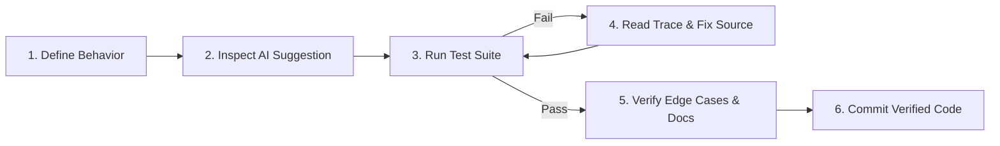

# AI-Assisted Development Workflow

> **Verification-first methodology.** This document outlines how AI-assisted development tools were integrated into Policy Copilot, focusing on strict human verification, deterministic testing, and metric validation.

---

## What I Use AI For

- **Brainstorming & Architecture Patterns:** Exploring implementation options for hybrid retrieval, reranking pipelines, and audit export schemas.
- **Debugging & Error Diagnostics:** Analyzing stack traces, edge-case failure modes, and type annotations.
- **Code Autocompletion & Boilerplate:** Accelerating repetitive tasks such as dataclass creation, CLI argparsing, and Streamlit component layouts.
- **Synthetic Data Generation:** Generating initial synthetic policy queries and candidate paragraphs for evaluation datasets.
- **Test-Case Expansion:** Suggesting additional edge-case test vectors for text normalization and token-overlap metrics.

---

## What I Do Not Trust Automatically

- **System Correctness:** AI code suggestions must pass explicit unit, integration, and regression tests.
- **Security & Secret Handling:** API keys and environment variables are strictly isolated; generated code is checked to prevent accidental secret logging.
- **Library & API Behavior:** API specifications for frameworks (SentenceTransformers, FAISS, Streamlit) are verified directly against documentation or source code.
- **Metric Claims & Benchmark Results:** Evaluation numbers, baseline accuracy, and confidence intervals are computed exclusively via reproducible Python evaluation scripts (`eval/` and `scripts/`).
- **Citation Verification Rules:** Deterministic algorithms (Jaccard overlap, exact numeric matching) are audited manually to prevent soft hallucination in grounding checks.

---

## Verification Loop

1. **Define Expected Behavior:** Establish clear input/output expectations and failure criteria before generating code.
2. **Inspect Generated Suggestion:** Read the proposed implementation line by line to verify logic and state handling.
3. **Run Automated Tests:** Execute the unit test suite (`pytest -q`) to catch regressions.
4. **Inspect Failures:** Analyze error tracebacks directly rather than repeatedly regenerating prompts.
5. **Check Documentation & Source:** Verify third-party library behavior against authoritative source code.
6. **Add Regression Tests:** Create dedicated test cases for any discovered edge case or bug before merging.
7. **Human Ownership:** Keep only code that I can explain, defend, and maintain.

---

## Examples from Policy Copilot

### 1. Reliability vs Usefulness Trade-off
Rather than concealing abstentions or low-coverage runs, the evaluation pipeline explicitly recorded and measured when safety gates suppressed useful answers (reducing coverage to 25.0% while achieving 0% response-level ungrounded output).

### 2. Public-Transfer Degradation
When evaluating the model on real-world government policy text (NCSC, ICO, ACAS), performance dropped from 73.4% Recall@5 to 52.1%. This limitation was documented, analyzed, and preserved as a core evaluation finding rather than smoothed over.

### 3. Extractive Fallback Mode
To guarantee offline reproducibility and resilience during API quota exhaustion (e.g., HTTP 429 rate limits), a deterministic Extractive Fallback Mode was built. It executes without LLM dependencies, achieving 100% citation precision by construction.

---

## Security & Secrets

- Secrets and API credentials are kept exclusively in local `.env` files and environment variables.
- Git hooks and `.gitignore` configurations prevent private keys from entering commit history.

---

## Human Judgement & Authorship

All final code, test suites, architecture decisions, evaluation metrics, and documentation were reviewed, edited, and approved by the author. Generative tools served as assistive utilities within an author-driven engineering workflow.
