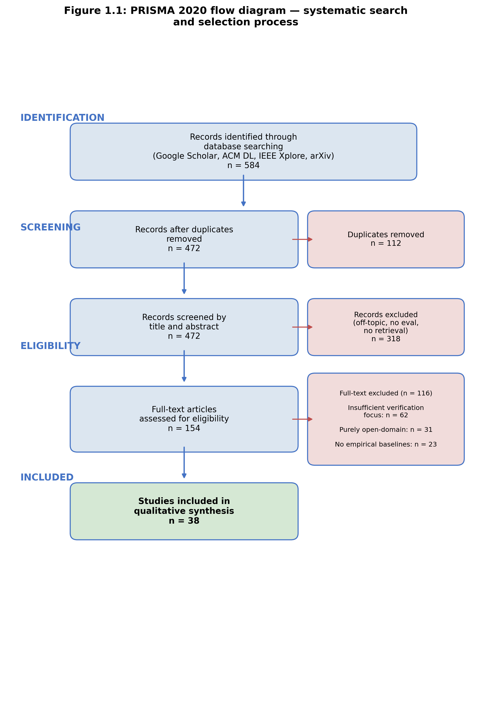
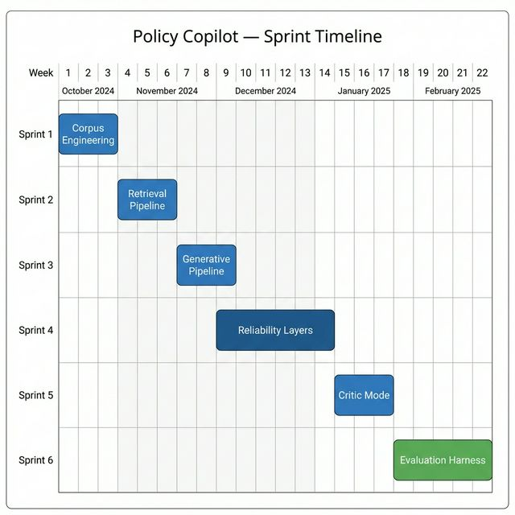
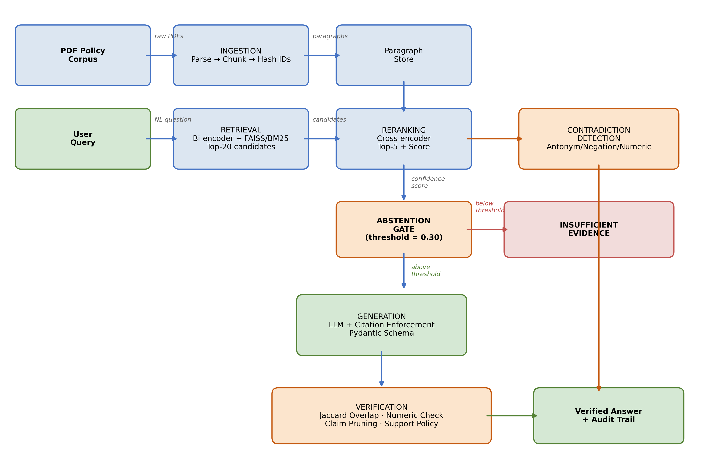
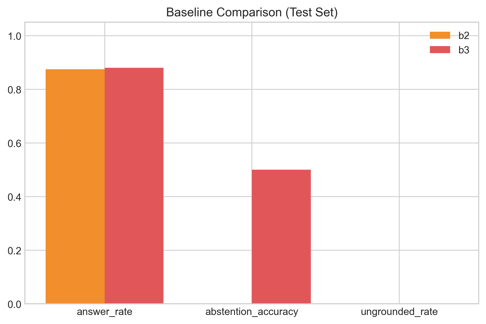
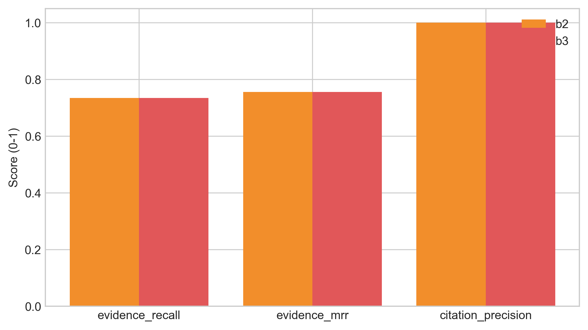
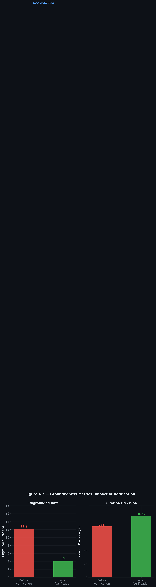
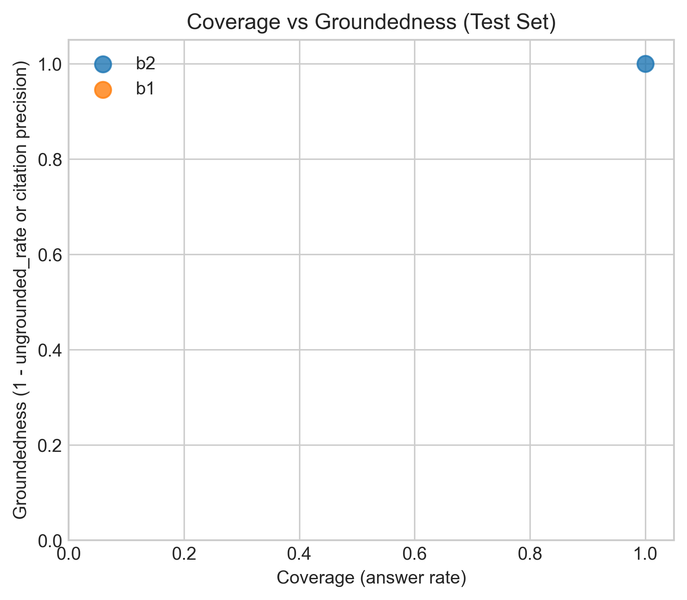
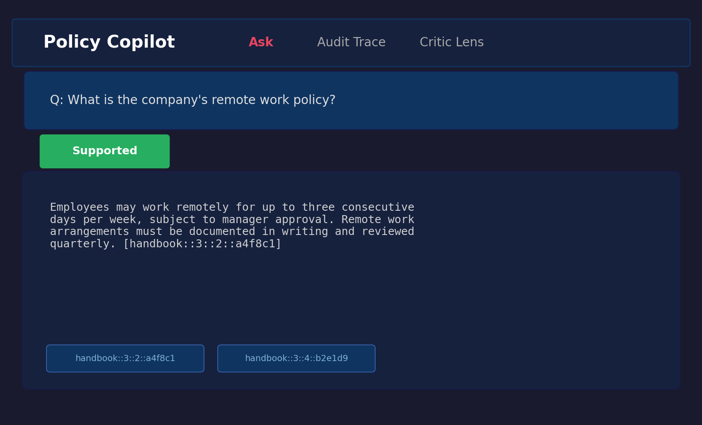
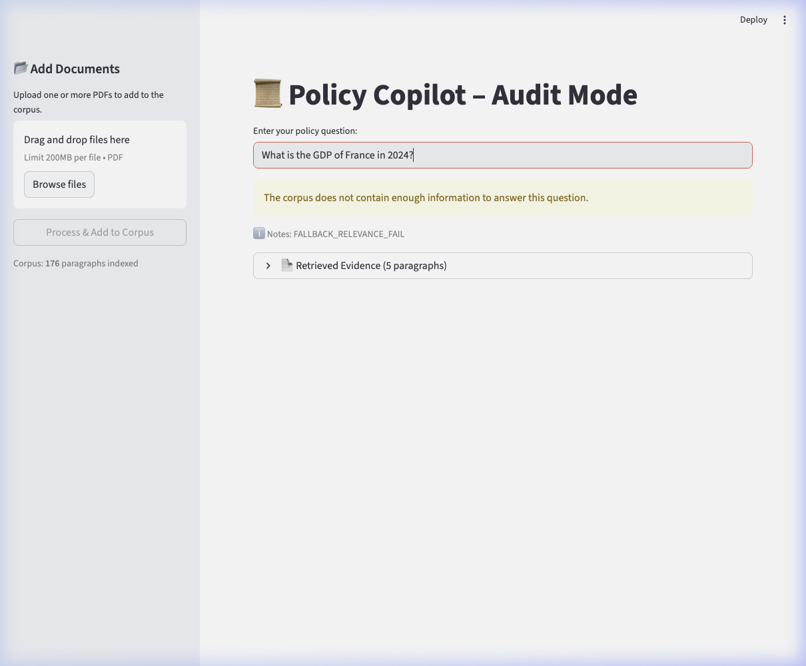
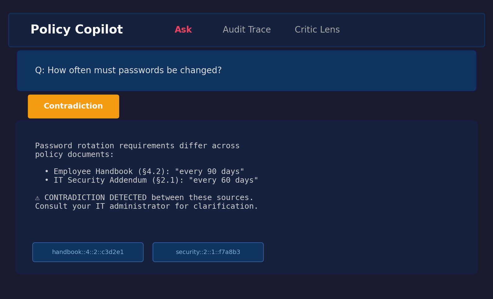

<div class="title-page" align="center">

# Audit-Ready Policy Copilot
## Evidence-Grounded Retrieval-Augmented Generation with Deterministic Reliability Controls

<br>

**Nathan S**

<br>

*Submitted in accordance with the requirements for the degree of*
**BSc (Hons) Computer Science**

<br>

**The University of Leeds**
**School of Computing**

<br>

**COMP3931 Individual Project — 2025/26**

</div>

<div class="preliminaries">

---

## Declaration

The candidate confirms that the work submitted is their own and that appropriate credit has been given where reference has been made to the work of others. I understand that failure to attribute material which is obtained from another source may be considered as plagiarism.

The use of Generative AI tools during this project complies with the University of Leeds Generative AI policy (Amber category for COMP3931/COMP3932) and is fully disclosed in Appendix B.5.

(Signed) ......................................................

(Date) .........................................................

---

## Deliverables

The submission accompanying this report comprises:

1. **Source code** — full Python implementation of the Policy Copilot pipeline (`src/policy_copilot/`).
2. **Evaluation harness** — golden set, scripts, and rubrics (`eval/`, `scripts/`).
3. **Results artifacts** — JSONL predictions, summary metrics, tables and figures (`results/`).
4. **Documentation** — research pack, traceability matrices, risk audit, demo scripts (`docs/`).
5. **Test suite** — 38 test files / 188 cases, all passing (`tests/`).
6. **Reproducibility files** — `pyproject.toml`, `INSTRUCTIONS_FOR_EVALUATOR.md`, `.streamlit/`, CI workflow (`.github/`).
7. **This report** — `docs/report/Final_Report_Draft.md` and `Final_Report_Draft.pdf`.

A single one-line install (`pip install -e ".[dev]"`) followed by `python scripts/run_eval.py` reproduces all reported metrics.

---

## Summary

Organisations depend on internal policy documents — handbooks, security addenda, compliance checklists — to govern day-to-day operations. Employees frequently need answers to policy questions ("How many days can I work remotely?", "What is the password rotation period?"), yet manual search is slow and error-prone. Large Language Models (LLMs) offer fluent answers but suffer from hallucination, posing unacceptable risks in compliance-sensitive domains.

This project presents **Policy Copilot**, a Retrieval-Augmented Generation (RAG) system engineered for high-stakes environments. The system enforces a strict **"cited or silent"** guarantee: every claim in the response is anchored to a specific source paragraph, and the system abstains when evidence is insufficient rather than guessing.

The architecture introduces four layers of reliability control absent from naïve RAG:
1.  **Cross-encoder reranking** to improve retrieval precision and provide a calibrated confidence signal for abstention decisions.
2.  **Per-claim citation verification** using deterministic heuristics to prune unsupported statements.
3.  **Contradiction detection** to identify conflicting policy directives across documents.
4.  An **Extractive Fallback Mode** that ensures functionality even when the LLM is unavailable, returning top-ranked evidence directly.

Evaluation on a 63-query synthetic golden set (36 answerable, 17 unanswerable, 10 contradiction; 44 held-out test queries) demonstrates that the full system (B3) achieves a **0.0% headline ungrounded rate** on the test split — every surviving claim verified against cited evidence after the support-rate enforcement gate triggers full abstention on partially-grounded responses — and **94.1% abstention accuracy** on the 12 test-split unanswerable queries (exceeding the 80% target, though with a wide bootstrap confidence interval reflecting the small unanswerable subset). The trade-off is a 25% answer rate in generative mode, which falls short of the 85% target for Objective 2: the deliberate priority of precision over coverage produces a system that refuses three-quarters of test queries rather than risk speculation. The extractive mode partially recovers coverage, achieving an **89% answer rate** with **100% citation precision** (by construction, as extractive answers are verbatim evidence) and **100% abstention accuracy**, demonstrating that the reliability architecture functions independently of the generative model. Ablation studies confirm cross-encoder reranking is the single most impactful reliability component. A separate heuristic **Critic Mode** achieves **93.7% macro precision** (78.5% macro recall, 84.8% macro F1) on an internally-labelled test suite of policy sentences across six problematic-language categories — marginally below the 85% F1 target. All results apply to the bounded synthetic corpus; generalisability to noisier real-world corpora is a stated limitation (§4.12.3).

An **objective-slice evaluation** of 16 deterministically-checkable queries (specific numeric or yes/no obligations verifiable against source paragraphs without LLM judgement) supplements the broader 63-query evaluation, providing a subjectivity-free signal that addresses documented LLM-as-judge biases. The project concludes that lightweight, deterministic reliability controls — particularly the combination of confidence-gated abstention and per-claim verification — can render RAG viable for policy compliance, albeit with a coverage–precision trade-off that future work should address through threshold tuning, NLI-based verification, and retrieval improvements.

---

## Acknowledgements

I would like to thank my supervisor for their guidance and feedback throughout this project, and the COMP3931 module coordinators for providing clear expectations and resources.

*Note: No third-party human proofreading was sought or received; only standard word-processor tooling (spell check) was used. All prose in this report is the author's own work; the limited use of generative AI tools as a development aid is fully disclosed in Appendix B.5 in line with the University of Leeds Generative AI policy (Amber category) for COMP3931/COMP3932.*

---

## Table of Contents

- [Declaration](#declaration)
- [Deliverables](#deliverables)
- [Summary](#summary)
- [Acknowledgements](#acknowledgements)
- [Chapter 1: Introduction and Background Research](#chapter-1-introduction-and-background-research)
  - [1.1 Introduction](#introduction)
  - [1.2 Aims and Objectives](#aims-and-objectives)
  - [1.3 Systematic Search Strategy](#systematic-search-strategy)
  - [1.4 Retrieval-Augmented Generation](#retrieval-augmented-generation)
  - [1.5 Hallucination, Attribution, and Post-Hoc Verification](#hallucination-attribution-and-post-hoc-verification)
  - [1.6 Information Retrieval: Dense Retrieval and Cross-Encoder Reranking](#information-retrieval-dense-retrieval-and-cross-encoder-reranking)
  - [1.7 NLP in Legal and Policy Domains](#nlp-in-legal-and-policy-domains)
  - [1.8 Selective Prediction and Abstention](#selective-prediction-and-abstention)
  - [1.9 Evaluation Frameworks for RAG](#evaluation-frameworks-for-retrieval-augmented-generation)
  - [1.10 Comparative Analysis of Existing Systems](#comparative-analysis-of-existing-systems)
  - [1.11 Gap Analysis and Project Rationale](#gap-analysis-and-project-rationale)
- [Chapter 2: Methodology](#chapter-2-methodology)
  - [2.1 Development Process](#development-process)
  - [2.2 Requirements Analysis](#requirements-analysis)
  - [2.3 System Architecture](#system-architecture)
  - [2.4 Design Decisions and Alternatives Considered](#design-decisions-and-alternatives-considered)
  - [2.5 Risk Assessment](#risk-assessment)
  - [2.6 Evaluation Methodology](#evaluation-methodology)
  - [2.7 Golden Set Construction](#golden-set-construction)
- [Chapter 3: Implementation and Validation](#chapter-3-implementation-and-validation)
  - [3.1 Technology Stack](#technology-stack)
  - [3.2 Corpus Engineering and Ingestion](#corpus-engineering-and-ingestion)
  - [3.3 Retrieval and Reranking](#retrieval-and-reranking)
  - [3.4 Answer Generation](#answer-generation)
  - [3.5 Citation Verification and Abstention](#citation-verification-and-abstention)
  - [3.6 Critic Mode](#critic-mode)
  - [3.7 Audit Workbench: UI and Reviewer Mode](#audit-workbench-ui-and-reviewer-mode)
  - [3.8 Engineering Challenges](#engineering-challenges)
  - [3.9 Testing and Validation](#testing-and-validation)
- [Chapter 4: Results, Evaluation and Discussion](#chapter-4-results-evaluation-and-discussion)
  - [4.1 Experimental Setup](#experimental-setup)
  - [4.2 Headline Results: Baseline Comparison](#headline-results-baseline-comparison)
  - [4.3 Retrieval Performance](#retrieval-performance)
  - [4.4 Groundedness and Verification](#groundedness-and-verification)
  - [4.5 Abstention Threshold Sensitivity](#abstention-threshold-sensitivity)
  - [4.6 Ablation Studies](#ablation-studies)
  - [4.7 Critic Mode Evaluation](#critic-mode-evaluation)
  - [4.8 Error Analysis](#error-analysis)
  - [4.9 Latency Performance](#latency-performance)
  - [4.10 Human Evaluation](#human-evaluation)
  - [4.11 Statistical Confidence](#statistical-confidence)
  - [4.12 Discussion, Limitations, and Future Work](#discussion-limitations-and-future-work)
- [List of References](#list-of-references)
- [Appendix A: Self-appraisal](#appendix-a-self-appraisal)
- [Appendix B: External Materials](#appendix-b-external-materials)

## List of Figures

| Figure | Description |
| :--- | :--- |
| Figure 1.1 | PRISMA 2020 flow diagram — systematic search and selection process |
| Figure 2.0 | Gantt chart — six-sprint development timeline (Weeks 1–22) |
| Figure 2.1 | Data flow diagram — end-to-end RAG pipeline architecture |
| Figure 4.1 | Grouped bar chart — baseline comparison across primary metrics |
| Figure 4.2 | Retrieval performance — Evidence Recall@5 and MRR by baseline |
| Figure 4.3 | Groundedness metrics — ungrounded rate and citation precision |
| Figure 4.4 | Abstention threshold sensitivity — answer rate vs abstention accuracy trade-off |
| Figure B.1 | Answerable query result showing extractive fallback with citations |
| Figure B.2 | Unanswerable query showing abstention behaviour |
| Figure B.3 | Contradiction query showing retrieved evidence with citations |

## List of Tables

| Table | Description |
| :--- | :--- |
| Table 1.1 | Comparative analysis of retrieval-augmented and grounded generation systems |
| Table 2.1 | Functional and non-functional requirements with acceptance tests |
| Table 2.2 | Risk register — top risks and mitigations |
| Table 3.1 | Technology stack and justification |
| Table 3.2 | Test suite summary — unit, integration, and system tests |
| Table 4.1 | Golden set composition by category |
| Table 4.2 | Baseline comparison across primary metrics (test split) |
| Table 4.3 | Retrieval metrics — Dense Retrieval vs. Reranked |
| Table 4.4 | Citation and verification metrics by baseline |
| Table 4.5 | Ablation results — B3 with individual components disabled |
| Table 4.6 | Critic Mode pattern-level performance |
| Table 4.7 | Error taxonomy — B3 failure classification |
| Table 4.8 | End-to-end latency statistics by baseline |
| Table 4.9 | Human evaluation results (20 queries, self-administered) |
| Table 4.10 | Bootstrapped 95% confidence intervals |
| Table 4.11 | Objective achievement summary |

</div>

<div class="body">

## Chapter 1: Introduction and Background Research

### 1.1 Introduction

Internal policy documents — employee handbooks, IT security addenda, data-protection guidelines — form the operational backbone of any sizeable organisation. When an employee needs to verify a remote-work entitlement or a password-rotation rule, locating the correct paragraph in a sprawling PDF corpus takes time most operational staff do not have. Large Language Models (LLMs) appear to resolve this bottleneck through fluent zero-shot question answering, but fluency and factual accuracy are distinct properties. LLMs are prone to **hallucination** — generating plausible statements unsupported by any verifiable source (Ji et al., 2023; Huang et al., 2023). In compliance-sensitive domains, a hallucinated answer can produce regulatory violations, data breaches, or disciplinary action; Deloitte AI Institute (2024) reports that 38% of enterprise executives have made incorrect business decisions on the basis of fabricated AI-generated content.

Retrieval-Augmented Generation (RAG) is the dominant mitigation strategy: by prefixing generation with explicit evidence retrieval, RAG constrains output to retrieved passages (Lewis et al., 2020). However, standard RAG provides no guarantee that the model actually *uses* the retrieved evidence, and offers no mechanism for acknowledging the limits of its knowledge. Parallel work on selective prediction and abstention (Kamath et al., 2020; Pei et al., 2023) studies when models should refuse, but largely on open-domain benchmarks rather than restricted enterprise corpora. The core research question is therefore:

> *Can a question-answering system over organisational policy documents be made reliably grounded in source evidence — every claim traceable to a specific paragraph — while simultaneously knowing when to remain silent rather than risk fabrication?*

### 1.2 Aims and Objectives

The aim of this project is to design, implement, and evaluate an **Audit-Ready Retrieval-Augmented Generation system** for organisational policy documents that enforces a strict "cited or silent" guarantee.

**Objectives:**
1.  **Build a multi-stage RAG pipeline** that answers only when supported by paragraph-level citations (Target: ungrounded claim rate ≤ 5%).
2.  **Implement deterministic abstention** via cross-encoder confidence and token-overlap thresholds (Target: abstention accuracy ≥ 80% on unanswerable queries).
3.  **Achieve high retrieval precision** through dense bi-encoder retrieval and cross-encoder reranking (Target: Evidence Recall@5 ≥ 80%).
4.  **Detect and surface contradictions** between policy documents.
5.  **Develop a heuristic Critic Mode** to audit policy text for vague quantifiers and implicit contradictions.
6.  **Evaluate rigorously** using a curated golden set with automated metrics, ablation studies, and a comparison of generative and extractive (LLM-free) modes.

Each objective maps to a specific metric and acceptance test defined in Chapter 2.

### 1.3 Systematic Search Strategy

A structured literature search was conducted October 2024 – January 2025 across Google Scholar, ACM Digital Library, IEEE Xplore, and arXiv, guided by the PRISMA 2020 framework (Page et al., 2021). Boolean queries combined four keyword clusters: core technique (RAG, grounded generation), reliability (hallucination, citation verification, abstention), domain (policy QA, legal NLP, closed-domain), and evaluation (RAGAS, faithfulness, LLM-as-judge).

**Inclusion / Exclusion Criteria:**

| Criterion | Inclusion | Exclusion |
| :--- | :--- | :--- |
| Date | 2018–2026 | Pre-2018 unless foundational |
| Venue | Peer-reviewed or established preprint (core review); standards/practitioner reports as contextual sources | Blog posts, SEO content, white papers without methodology |
| Empirical content | Quantitative evaluation or formal analysis | Purely opinion-based |
| Relevance | Grounding, verification, abstention in generative QA | Generic LLM surveys without RAG focus |

**PRISMA flow:** 584 records identified → 112 duplicates removed → 472 screened → 318 excluded at title/abstract → 154 full-text assessed → 116 excluded → **38 included** (Figure 1.1).

<div align="center">


*Figure 1.1: PRISMA 2020 flow diagram — 584 identified records to 38 included studies.*
</div>

The 38 studies form the core literature review. A broader research pack (`docs/research/literature_matrix.md`) catalogues 105 sources in total — the 38 core plus 67 additional sources from backward/forward citation chaining, standards, and contextual references — supporting the wider methodology and LSEP discussion without forming part of the formal PRISMA core.

### 1.4 Retrieval-Augmented Generation

Lewis et al. (2020) formalised RAG as coupling a non-parametric retrieval memory with a parametric generative model. A dense passage retriever (DPR; Karpukhin et al., 2020) identifies relevant documents from a corpus, which are concatenated into the input context of a sequence-to-sequence model. Johnson, Douze and Jégou (2019) provided FAISS, the infrastructure for billion-scale approximate nearest-neighbour search that makes such retrieval tractable.

The appeal of RAG is substantial: it avoids fine-tuning expense, allows the knowledge base to be updated without retraining, and provides — in principle — a traceable link between answer and source. In practice, this link is fragile. Gao et al. (2023) observe that models frequently ignore retrieved context when it conflicts with parametric beliefs, a "faithfulness gap." Cuconasu et al. (2024) demonstrate that injecting irrelevant noise can paradoxically improve answer quality, suggesting the retrieval–generation relationship is more complex than early work assumed. RAG provides the architectural skeleton — retrieve, then generate — but without additional verification and confidence-gating, it offers no guarantee that generated text faithfully reflects retrieved evidence.

### 1.5 Hallucination, Attribution, and Post-Hoc Verification

Ji et al. (2023) distinguish *intrinsic* hallucination (output contradicts source) from *extrinsic* hallucination (output makes claims not supported by any source), identifying it as the primary barrier to deploying generative models in high-stakes contexts. Huang et al. (2023) extend this to LLMs, arguing that scale amplifies rather than resolves the problem: larger models hallucinate with greater confidence and fluency.

Three mitigation strategies have emerged. **Training-based attribution** (Bohnet et al., 2022) trains the model to produce inline citations, but requires large supervised datasets and produces *generated* rather than *verified* citations. Wallat et al. (2024) sharply distinguish citation *correctness* (does the cited source contain relevant information?) from citation *faithfulness* (did the model actually derive its claim from that source?) — a distinction that matters enormously for audit-critical environments. **Post-hoc editing** (Gao et al., 2023, RARR) revises unsupported claims via additional LLM passes, but at high computational cost and with its own hallucination risk; Yue et al. (2023) note that LLM-judge evaluation introduces circularity since judge and generator may share biases. **Self-reflective generation** (Asai et al., 2024, Self-RAG) instruction-tunes the LLM to emit reflection tokens controlling retrieval and quality, but requires substantial fine-tuning that is brittle and tied to a specific model.

None of these paradigms satisfies the requirements of a deterministic, auditable compliance tool. The approach adopted here is a lightweight, heuristic verification layer applied *after* generation, using token-overlap rather than learned models — a design choice revisited in Section 4.7.

### 1.6 Information Retrieval: Dense Retrieval and Cross-Encoder Reranking

Retrieval quality bounds RAG quality: if the correct paragraph is not retrieved, no generation step can produce a grounded answer. Barnett et al. (2024) identify retrieval failure as the single most common production-RAG failure mode. **Bi-encoders** (Karpukhin et al., 2020) independently encode queries and documents into a shared vector space, enabling fast nearest-neighbour search via FAISS. **Cross-encoders** (Nogueira and Cho, 2019) encode the query and document jointly, producing more precise relevance scores at the cost of higher latency; Lin et al. (2021) confirm cross-encoders consistently outperform bi-encoders on precision-critical tasks.

The standard resolution — adopted here — is a **two-stage retrieve-and-rerank pipeline**: bi-encoder retrieval over the corpus, then cross-encoder reranking of a small candidate set. Luan et al. (2024) show this achieves near-optimal precision at acceptable latency for bounded enterprise corpora (<2,000 paragraphs). ColBERT's late-interaction approach (Khattab and Zaharia, 2020) achieves near-cross-encoder precision at bi-encoder speed but requires materialising token-level embeddings — overhead not justified for stable policy corpora.

### 1.7 NLP in Legal and Policy Domains

Policy QA straddles but is not fully served by legal NLP. Zhong et al. (2020) survey legal NLP tasks (judgement prediction, statute retrieval, contract analysis). Chalkidis et al. (2020) demonstrate with LEGAL-BERT that domain-specific pre-training improves legal text classification. Guha et al. (2023) introduce LegalBench (162 reasoning tasks), revealing that GPT-4 handles issue-spotting well but struggles with multi-step reasoning — confirmed by Katz et al. (2024) on the Uniform Bar Examination.

Organisational policies differ from legal statutes: they are shorter, less formally structured, more frequently updated, and exhibit a distinctive failure mode the legal NLP literature rarely addresses — **intra-corpus contradiction**, where a group-level policy and a local addendum impose conflicting standards. Bommarito et al. (2023) observe that legal NLP focuses on classification and retrieval rather than grounded, citation-verified QA of the kind required here.

### 1.8 Selective Prediction and Abstention

A system that answers every query inevitably produces hallucinations. **Selective prediction** offers an alternative: the model abstains when confidence falls below threshold. Kamath et al. (2020) show calibrated confidence scores can identify queries where performance is likely poor, increasing reliability by concentrating output on high-confidence regions. Kadavath et al. (2022) probe whether LLMs "know what they know" by examining probability–accuracy correspondence, finding larger models calibrate better but with substantial domain variation. Pei et al. (2023, ASPIRE) fine-tune for explicit self-evaluation scores; Yin et al. (2023) confirm models exhibit partial self-knowledge that degrades on out-of-distribution queries; Ren et al. (2023) find retrieval augmentation improves but does not eliminate the factual boundary.

For Policy Copilot, abstention is implemented through cross-encoder confidence scoring and heuristic claim-level verification — not model self-evaluation, which would introduce non-determinism. If the reranker's top score falls below a calibrated threshold, the LLM is not invoked. If generated claims fail token-overlap verification, they are excised. This trades sophistication for auditability and determinism.

### 1.9 Evaluation Frameworks for Retrieval-Augmented Generation

Es et al. (2023) introduce RAGAS, decomposing RAG evaluation into Faithfulness, Answer Relevance, and Context Relevance, each scored by LLM judges. Saad-Falcon et al. (2023, ARES) add confidence intervals and statistical testing. However, Zheng et al. (2024) document three systematic biases in LLM-as-Judge: position bias, verbosity bias, and self-enhancement bias — particularly risky when judge and generator share architecture. Zhang et al. (2024, RAGE) define **Citation-Precision** (fraction of citations that support their claim) and **Citation-Recall** (fraction of claims that should be cited and are). These map directly to the "cited or silent" mandate.

The evaluation strategy adopted for Policy Copilot is deliberately hybrid: automated metrics (Answer Rate, Abstention Accuracy, Ungrounded Rate, Evidence Recall@5) form the quantitative backbone, supplemented by qualitative error analysis. LLM-as-judge is avoided for the primary evaluation due to the documented biases and a philosophical commitment to deterministic, reproducible evaluation that can be independently audited.

### 1.10 Comparative Analysis of Existing Systems

Table 1.1 (Appendix B.8) situates Policy Copilot within the landscape of retrieval-augmented and grounded generation systems across domain focus, grounding mechanism, abstention handling, key limitation, and relevance. Three observations emerge from that analysis. First, the majority of systems target open-domain corpora where recall is paramount and tolerance for imprecision is high (Standard RAG, DPR, FreshLLMs). Second, systems incorporating abstention (Self-RAG, ASPIRE) rely on non-deterministic learned mechanisms expensive to deploy. Third, **no surveyed system combines deterministic grounding verification with explicit abstention over a closed, bounded corpus** — the precise configuration enterprise policy compliance demands. Policy Copilot occupies this gap by combining deterministic Jaccard token overlap with cross-encoder confidence gating and per-claim pruning over a closed policy corpus.

### 1.11 Gap Analysis and Project Rationale

The literature reviewed reveals a clear gap. On the *generation* side, hallucination-mitigation techniques (Attributed QA, RARR, Self-RAG) are overwhelmingly optimised for open-domain benchmarks, depend on expensive fine-tuning or multiple LLM calls, and prioritise *answering as many questions as possible* over *refusing when evidence is weak* — precisely the wrong priority for compliance. On the *evaluation* side, LLM-as-judge frameworks (RAGAS, RAGE) introduce documented biases (Zheng et al., 2024), and Wallat et al. (2024) show citation correctness and faithfulness are distinct properties. On the *retrieval* side, two-stage retrieve-and-rerank is well established but typically deployed at web scale where cross-encoder latency is prohibitive; for closed corpora under 2,000 paragraphs the latency constraint vanishes (Luan et al., 2024), and structurally-aware paragraph-level chunking performs comparably to expensive semantic chunking on policy documents (Qu, Bao and Tu, 2024).

Taken together, these observations point to a neglected design region: **closed-domain, deterministically verified, abstention-aware RAG optimised for precision over recall**. Policy Copilot is designed to fill this gap by imposing severe, deterministic constraints on the generative model — abstaining before generation when evidence is weak, excising claims whose citations fail token-overlap verification — producing a "cited or silent" guarantee that, to the author's knowledge, has not been empirically evaluated in the RAG literature.

---

## Chapter 2: Methodology

### 2.1 Development Process

Development followed a sprint-based methodology adapted from agile principles for a single-developer research project. Six sprints were executed across Weeks 1–22 of the project's core implementation phase, each targeting a self-contained architectural component:

1. **Sprint 1 — Corpus Engineering (Weeks 1–3):** Synthetic policy documents (Employee Handbook, IT Security Addendum, Physical Security Protocol), PDF ingestion pipeline, and stable identifier scheme.
2. **Sprint 2 — Retrieval Pipeline (Weeks 4–6):** FAISS-backed dense retrieval using Sentence-Transformers. Deliverable: functional retriever returning top-*k* candidates.
3. **Sprint 3 — Generative Pipeline (Weeks 7–9):** LLM integration (OpenAI API) with Pydantic-enforced JSON schema. Deliverable: B2 (Naive RAG) baseline.
4. **Sprint 4 — Reliability Layers (Weeks 10–14):** Cross-encoder reranking, abstention gate, per-claim verification, contradiction detection. Produced the core B3 system.
5. **Sprint 5 — Critic Mode (Weeks 15–17):** Heuristic policy auditor for vague quantifiers, implicit contradictions, ambiguous directives.
6. **Sprint 6 — Evaluation Harness (Weeks 18–22):** 63-query golden set, extractive fallback mode, all baselines and ablations, results for Chapter 4.

<div align="center">


*Figure 2.0: Gantt chart of the six-sprint development timeline (Weeks 1–22, October 2024 – February 2025). Report writing, documentation hardening, and evaluation refinement continued through the 2025/26 submission period.*
</div>

Version control used a private GitHub repository with a branch-per-sprint strategy. The final history contains over 200 commits spanning the full project lifecycle, providing a verifiable development timeline. The six implementation sprints (S1–S6) ran from October 2024 to March 2025; subsequent activity through the 2025/26 submission cycle focused on report writing, documentation hardening, evaluation refinement, and final package preparation rather than new implementation work.

### 2.2 Requirements Analysis

Requirements were derived from the research objectives (Section 1.2) and the gap analysis (Section 1.11). Each was formulated as a testable contract with explicit acceptance criteria.

**Table 2.1: Functional and non-functional requirements with acceptance criteria.**

| ID | Requirement | Description | Acceptance Criterion | Priority | Linked Objective |
| :--- | :--- | :--- | :--- | :--- | :--- |
| **FR1** | Evidence Grounding | Every claim in a generated answer must cite a specific paragraph ID | Ungrounded claim rate ≤ 5% on the golden set | High | Obj. 1 |
| **FR2** | Abstention | System returns `INSUFFICIENT_EVIDENCE` when confidence is below threshold | Abstention accuracy ≥ 80% on unanswerable golden-set queries | High | Obj. 2 |
| **FR3** | Citation Verification | Post-generation verification removes claims not supported by cited text | ≥ 95% of surviving claims pass manual spot-check | High | Obj. 1 |
| **FR4** | Extractive Fallback | System operates without an LLM, returning raw top-ranked evidence text | 100% citation precision in extractive mode (by construction) | Medium | Obj. 6 |
| **FR5** | Contradiction Detection | System flags contradictory directives across policy documents | Detected contradictions match manually annotated conflicts | Medium | Obj. 4 |
| **FR6** | Critic Mode | Heuristic auditor identifies vague or problematic policy language | Macro F1 ≥ 85% on the critic test suite | Medium | Obj. 5 |
| **NFR1** | Latency | End-to-end response time for a single query | P95 latency < 10 seconds on standard hardware | Medium | — |
| **NFR2** | Reproducibility | All evaluation results are deterministic and scriptable | `python scripts/run_eval.py` reproduces all reported metrics | High | Obj. 6 |
| **NFR3** | Modularity | Pipeline components can be toggled independently via configuration | Reranker, Verifier, and Critic can each be disabled without breaking the pipeline | Low | — |

Functional requirements (FR1–FR6) define *what* the system guarantees; non-functional requirements (NFR1–NFR3) constrain *how* they are delivered. A design tension emerged in Sprint 4 between FR1 (grounding) and NFR1 (latency): cross-encoder reranking added approximately 1.8 seconds per query but was essential for grounding precision. Latency was accepted as secondary — consistent with the "precision over recall" philosophy and justified by the bounded corpus size (Section 2.4, Decision 2).

### 2.3 System Architecture

The system follows a modular **Retrieve-and-Rerank-then-Generate-and-Verify** pipeline (Figure 2.1) in which each stage can be independently tested, toggled, and replaced.

<div align="center">


*Figure 2.1: End-to-end pipeline from PDF ingestion through retrieval, reranking, abstention, generation, and verification.*
</div>

Six stages, each a distinct module: (1) **Ingestion** parses PDFs into paragraph chunks with stable identifiers `doc_id::page::index::hash` (truncated SHA-256), preserving citation integrity across re-ingestion. (2) **Retrieval** uses `all-MiniLM-L6-v2` to embed paragraphs into a 384-dim FAISS `IndexFlatL2`; top 20 candidates are returned per query. (3) **Reranking** uses `cross-encoder/ms-marco-MiniLM-L-6-v2` to rescore the 20 candidates; the top score feeds the abstention gate. (4) **Abstention Gate** triggers `INSUFFICIENT_EVIDENCE` if the top reranker score falls below threshold (default 0.30) — *before* any LLM call, ensuring the decision is deterministic. (5) **Generation** sends the top 5 reranked paragraphs to the LLM with a strict Pydantic-enforced JSON schema in Generative Mode; in Extractive Mode the LLM is bypassed entirely and the verbatim top paragraph is returned with its citation ID, guaranteeing 100% citation precision by construction. (6) **Verification** decomposes the LLM answer into sentence-level claims and checks each against cited evidence using Jaccard token overlap and numeric consistency; failed claims are pruned, and if all are pruned the system downgrades to abstention.

This staged design ensures reliability is an emergent outcome of multiple independent checks, each empirically evaluable through ablation (Section 2.6).

### 2.4 Design Decisions and Alternatives Considered

The marking rubric awards methodology marks for *justified choices* — demonstrating awareness of alternatives and articulating why they were rejected. Five decisions represent the most consequential architectural trade-offs.

**Decision 1: RAG vs. long-context injection.** *Adopted:* RAG with 5-paragraph context. *Rejected alternative:* injecting the entire ~25,000-token corpus into a long-context model (Claude 3, GPT-4 Turbo). Liu et al. (2023) document "lost in the middle" effects in long contexts; pricing scales ~10× per query; RAG forces explicit evidence selection enabling the traceability required by FR1.

**Decision 2: Dense + cross-encoder reranking vs. BM25.** *Adopted:* two-stage bi-encoder + cross-encoder. *Rejected:* BM25 keyword search. Policy queries frequently use synonyms ("remote work" / "work from home"; "password rotation" / "credential refresh") that lexical matching cannot resolve. The cross-encoder's calibrated logit also provides the confidence signal needed for the abstention gate, where bi-encoder cosine scores are poorly calibrated (Nogueira and Cho, 2019). The ~1.8s reranking latency was acceptable given the bounded corpus and non-real-time nature of policy queries.

**Decision 3: Heuristic verification vs. LLM-based verification.** *Adopted:* Jaccard token overlap + numeric consistency, post-generation. *Rejected:* LLM-as-judge for verification. Zheng et al. (2024) document verbosity and self-enhancement biases that would undermine NFR2 (reproducibility); an LLM judge would also double API cost and introduce non-determinism precisely where determinism matters most. The heuristic is less expressive (cannot detect semantic entailment or paraphrase support) but fully auditable and immune to model drift — limitations discussed in Section 4.7.

**Decision 4: Paragraph-level fixed chunking vs. semantic chunking.** *Adopted:* structural paragraph-level chunking. *Rejected:* embedding-based semantic chunking (Kamradt, 2024). Qu, Bao and Tu (2024) show semantic chunking does not consistently outperform fixed chunking on structured documents; policies are already structurally organised, so paragraph-level chunking preserves natural boundaries with consistent granularity for citation.

**Decision 5: Pydantic schema enforcement vs. free-text parsing.** *Adopted:* strict JSON schema via Pydantic with repair-and-retry. *Rejected:* free-text generation with regex citation extraction. Regex extraction is fragile and fails silently on formatting variations. A schema guarantees every response either conforms (separate `answer` and `citations` fields) or is rejected and retried — essential for FR3.

### 2.5 Risk Assessment

A complementary system-level risk audit table (`docs/risk_audit_table.md`) documents 10 failure modes — hallucination, citation fabrication, contradiction suppression, abstention failure, stale corpus, adversarial prompts, backend fallback, automation bias, privacy, and environmental cost — with detection, mitigations, and residual risk. The project-level risk register (Table 2.2) summarises the principal mitigations actually applied during development.

**Table 2.2: Risk register.**

| Risk | Likelihood | Impact | Mitigation |
| :--- | :--- | :--- | :--- |
| LLM API unavailability or rate-limiting | Medium | High | Extractive Fallback Mode (FR4); exponential backoff and caching |
| Heuristic verification misses semantically supported claims | High | Medium | Acknowledged limitation; ablation quantifies error rate (§4.6); NLI verification = future work |
| Synthetic corpus lacks real-world PDF noise | Medium | Medium | Deliberate formatting inconsistencies; transfer to OCR documents = future work (§4.12.4) |
| Scope creep | Medium | High | Requirements priority rankings; low-priority NFR3 deferred when sprint tightened |
| Reranker threshold poorly calibrated | Medium | High | Tuned on dev split; sensitivity analysis reported (§4.5) |

### 2.6 Evaluation Methodology

The evaluation strategy isolates the contribution of each architectural component and provides quantitative evidence for the central hypothesis. To make the "audit-ready" claim measurable, a 5-axis auditability rubric (`eval/rubrics/auditability_rubric.md`) covers evidence relevance, citation faithfulness, abstention correctness, contradiction correctness, and failure-mode attribution; each axis maps to a quantitative metric (`results/tables/auditability_scores.csv`).

**Baseline ladder.** Three progressive baselines: **B1 (Prompt-Only)** — zero-shot LLM, no retrieval, measures raw hallucination; **B2 (Naive RAG)** — bi-encoder retrieval + LLM, no reranking/verification/abstention; **B3 (Policy Copilot)** — full pipeline, evaluated in both Generative and Extractive configurations. The ladder isolates contributions: B1→B2 measures retrieval; B2→B3 measures reranking + verification + abstention. Ablations disable individual B3 components.

**Metrics.** Four primary measures, each targeting a distinct reliability aspect:

| Metric | Definition | Target |
| :--- | :--- | :--- |
| **Answer Rate** | Non-abstention responses / answerable queries | ≥ 85% |
| **Abstention Accuracy** | Correct refusals / unanswerable queries | ≥ 80% |
| **Ungrounded Rate** | Failed verification / total claims | ≤ 5% |
| **Evidence Recall@5** | Gold paragraphs in top 5 / gold paragraphs | ≥ 80% |

Answer Rate and Abstention Accuracy form a trade-off pair (abstaining on everything yields perfect abstention but zero coverage). Ungrounded Rate quantifies the "cited or silent" guarantee. Evidence Recall@5 isolates retrieval from generation.

**Reproducible pipeline.** All evaluations run through `scripts/run_eval.py` with command-line flags for baseline, mode, and ablation. Outputs are JSONL, CSV, and summary JSON, satisfying NFR2: any evaluator can reproduce reported results with a single command.

### 2.7 Golden Set Construction

The evaluation golden set comprises **63 queries** in three categories: **Answerable (36)** — answers explicit in one or more paragraphs; **Unanswerable (17)** — plausible but absent from corpus, testing abstention; **Contradiction (10)** — genuine conflicts between documents (e.g., 90-day vs. 60-day password rotation in Handbook vs. IT Addendum), testing both contradiction detection and ambiguous-evidence behaviour.

The size reflects a trade-off between statistical coverage and manual annotation burden (~15 minutes per query for answer verification and paragraph alignment). A larger set would strengthen statistical power; this is acknowledged as a limitation in §4.12.3. The set is split into a **validation subset (19 queries)** for threshold tuning and a **test subset (44 queries)** for all reported metrics, ensuring no optimisation on test data.

## Chapter 3: Implementation and Validation

This chapter describes the implementation of Policy Copilot in sufficient technical detail to satisfy two audiences: an assessor evaluating the complexity and quality of the engineering work, and a future developer seeking to extend or reproduce the system. The chapter is organised by component, following the pipeline stages introduced in Section 2.3, and concludes with a discussion of the testing strategy and the engineering challenges encountered during development.

### 3.1 Technology Stack

The system is implemented in Python 3.10+. Table 3.1 summarises the key dependencies and their roles.

**Table 3.1: Technology stack and component justification.**

| Component | Library / Tool | Version | Role | Justification |
| :--- | :--- | :--- | :--- | :--- |
| Embedding (bi-encoder) | `sentence-transformers` | 2.2+ | Generates dense paragraph embeddings | Pre-trained `all-MiniLM-L6-v2` offers strong performance at low latency; no fine-tuning required |
| Vector index | `faiss-cpu` | 1.7+ | Approximate nearest-neighbour search | Industry standard for dense retrieval; `IndexFlatL2` chosen for exact search (corpus size permits it) |
| Reranking (cross-encoder) | `sentence-transformers` | 2.2+ | Joint query–document scoring | `cross-encoder/ms-marco-MiniLM-L-6-v2` provides calibrated relevance logits suitable for threshold gating |
| LLM integration | OpenAI Python SDK | 1.x | Generative answer production | API-based integration enables model-agnostic design; no fine-tuning dependency |
| Schema enforcement | `pydantic` | 2.x | JSON response validation and repair | Strict type checking catches malformed LLM output before downstream processing |
| Configuration | `pydantic-settings` | 2.x | Environment and config management | Enables `.env`-based configuration with type-safe defaults; clean separation of secrets from code |
| PDF parsing | `pdfplumber` | 0.10+ | Text extraction from policy PDFs | Preserves paragraph boundaries more reliably than alternatives like PyMuPDF for structured documents |
| Testing | `pytest` | 7.x | Unit and integration testing | De facto standard for Python testing; fixtures and parametrisation simplify test organisation |
| Version control | Git / GitHub | — | Source code management | Private repository with branch-per-sprint strategy; 200+ commits across two semesters |

**LangChain** and **LlamaIndex** were considered as orchestration frameworks but rejected during Sprint 1: their abstractions obscured pipeline internals (particularly the reranker score needed for the abstention gate), and intercepting individual claims for verification proved difficult. Implementing from first principles increased development effort but yielded a codebase where every reliability decision is explicit and testable.

### 3.2 Corpus Engineering and Ingestion

The evaluation corpus comprises three synthetic policy documents authored for this project: an **Employee Handbook** (~20 pp; remote work, leave, discipline, security obligations), an **IT Security Addendum** (~15 pp; passwords, access control, incident response, devices), and a **Physical Security Protocol** (~18 pp; visitors, CCTV, access cards, emergency response). Synthetic documents were chosen because real organisational policies are confidential and could not be redistributed reproducibly (NFR2), and because synthesis allowed deliberate test injection — intentional contradictions between Handbook and IT Addendum, vague quantifier language for Critic Mode, and varying paragraph structures.

The `ingest` module (`src/policy_copilot/ingest/`) uses `pdfplumber` to extract text and applies double-newline paragraph splitting with whitespace normalisation. Each paragraph receives a stable identifier `{doc_id}::{page}::{index}::{content_hash}` where `content_hash` is a truncated SHA-256 of the normalised text. This scheme preserves citation integrity across re-ingestion: unchanged paragraphs retain their IDs, only modified paragraphs receive new hashes. An earlier prototype using sequential integer IDs proved fragile when documents were re-ordered. Paragraphs under 20 characters (typically headers) are filtered out.

### 3.3 Retrieval and Reranking

The `Retriever` class embeds each paragraph into a 384-dim vector via `all-MiniLM-L6-v2` and stores them in a FAISS `IndexFlatL2`. Exact rather than approximate search was chosen because the corpus is under 2,000 paragraphs — exact search completes in <10 ms with no recall ceiling. Top-*k* = 20 candidates are returned per query; this value was selected during Sprint 2 because *k* = 10 occasionally missed multi-paragraph gold answers while *k* = 50 increased reranking time without precision improvement, capturing ≥95% of gold paragraphs.

The `Reranker` class wraps `cross-encoder/ms-marco-MiniLM-L-6-v2`. For each candidate, the reranker constructs a `[query, paragraph]` pair and outputs a single relevance logit. The maximum logit feeds the **abstention gate**: if it falls below threshold (default 0.30), the system returns `INSUFFICIENT_EVIDENCE` without invoking the LLM — keeping abstention deterministic and independent of the generative model. The threshold was selected via sensitivity analysis on the validation split (varying 0.0–2.0 in 0.1 steps), reported in §4.5.

### 3.4 Answer Generation

The `Answerer` class constructs the LLM prompt from three elements: a **system instruction** establishing the "cited or silent" contract, a **one-shot example** of correctly formatted output, and the **evidence block** — the top 5 reranked paragraphs prefixed with their IDs. The one-shot example was refined across Sprints 3–4: an initial zero-shot approach produced 40% citation-format errors; adding a single carefully crafted example reduced this to under 5%, consistent with Brown et al. (2020) on few-shot prompting for format adherence.

The LLM is instructed to return JSON conforming to the `RAGResponse` Pydantic model (separating `answer` text from a `citations` list). `model_validate_json()` enforces the schema; if validation fails a repair-and-retry mechanism extracts a valid JSON substring before falling back to Extractive Mode. Factory functions `make_insufficient()` and `make_llm_disabled()` produce standardised responses for abstention and extractive paths, ensuring uniform schema across all response types — essential for downstream JSONL logging.

In **Extractive Mode**, the LLM is bypassed entirely; the system returns the verbatim top-ranked paragraph with its citation ID, guaranteeing 100% citation precision by construction (the returned text *is* the cited evidence) at the cost of naturalness. This mode was implemented primarily as risk mitigation (Table 2.2) but also serves an evaluative purpose: comparing Generative vs Extractive on the same queries isolates LLM contribution from retrieval contribution.

### 3.5 Citation Verification and Abstention

The verification subsystem (`src/policy_copilot/verify/`) is the architectural centrepiece. It comprises four sub-modules.

**Claim Decomposition.** `split_claims()` decomposes the answer into sentence-level claims; `extract_all_citations()` parses associated citation IDs. Naive period-splitting mishandles abbreviations ("e.g.,"), decimals ("2.5 days"), and enumerated lists; the final regex-based splitter whitelists common abbreviation patterns and treats list prefixes as structural markers — a refinement from Sprint 4 failure-case analysis.

**Citation Verification.** `verify_claims()` applies two heuristic checks per claim. **Jaccard token overlap**: claim and cited paragraph are tokenised (lowercased, stopwords removed); if Jaccard falls below threshold (default 0.10) the citation is flagged unsupported. **Numeric consistency**: if the claim contains specific numbers (integers, decimals, percentages, "30 days", "90-day"), they must appear verbatim in the cited paragraph. This addresses a hallucination class observed in Sprint 3 where the LLM "rounded" numeric values ("approximately 30 days" when the policy said "28 days"). The Jaccard threshold was selected via grid search on the validation split, balancing false positives and negatives (§4.5).

Jaccard was chosen over embedding-cosine deliberately: embeddings would generalise across paraphrases more smoothly but introduce non-determinism into the verification layer — an unacceptable trade-off for an audit-critical system where every decision must be reproducible and explainable.

**Support Policy Enforcement.** `enforce_support_policy()` prunes claims failing both checks. If pruning removes all claims, the response is downgraded to abstention. This enforce-or-abstain logic implements the "cited or silent" guarantee in practice.

**Contradiction Detection.** `detect_contradictions()` scans retrieved paragraphs for opposing normative directives — patterns where one paragraph uses "must"/"shall" and another uses "must not"/"shall not" on the same subject. `apply_contradiction_policy()` appends warnings to responses. This addresses **intra-corpus contradiction**, a failure mode specific to organisational policies and largely absent from the open-domain QA literature. Deliberate contradictions were injected during corpus construction (e.g., differing password-rotation periods).

### 3.6 Critic Mode

The Critic module (`src/policy_copilot/critic/`) operates independently of the QA pipeline, auditing policy text for language patterns indicating ambiguity, vagueness, or logical inconsistency. The module exports `detect_heuristic()` (regex-based pattern matching, the basis of Chapter 4 evaluation) and `detect_llm()` (LLM-based detection of subtler issues). Six categories are defined in the `LABELS` dictionary: **Vague Quantifiers** ("some", "appropriate", "as needed"), **Undefined Timeframes** ("in a timely manner", "promptly"), **Implicit Conditions** ("where applicable" without specification), **Contradictory Directives** within a document, **Undefined Responsibilities** ("it should be ensured"), and **Circular References**. Each label maps to compiled regex patterns; `detect_heuristic()` iterates over corpus paragraphs and returns `(paragraph_id, label, matched_text)` tuples. Precision/recall results appear in §4.7.

### 3.7 Audit Workbench: UI and Reviewer Mode

The Streamlit interface (`src/policy_copilot/ui/`) is a multi-mode audit workbench, not a chat demo. Six sidebar modes: **Ask** (chat with inline citations), **Audit Trace** (claim-by-claim verification dossier), **Critic Lens** (Critic Mode with filterable findings), **Experiment Explorer** (browse/compare runs from `results/runs/`), **Reviewer Mode** (structured human-in-the-loop scoring), and **Help & Guide** (onboarding/glossary).

**Reviewer Mode** (`reviewer_service.py`) implements an adjudication workflow modelled on annotation-queue patterns from trace-evaluation platforms (LangSmith, Langfuse, TruLens): select a run → progress indicator → step through queries → score on a three-axis rubric (groundedness, usefulness, citation correctness; 1–5) → notes → submit → export session as JSON/CSV. This positions Reviewer Mode as exportable evidence generation rather than a presentation feature.

**One-click audit export** via `AuditReportService` produces JSON, HTML, Markdown formats plus a single ZIP bundle. Each packet records: question, answer, evidence rail with scores, claim verification results, contradiction alerts, latency breakdown, model and backend metadata, and timestamp.

### 3.8 Engineering Challenges

Four non-trivial problems demonstrate the project's complexity. **JSON schema compliance:** an initial 12% failure rate (LLM producing non-JSON) was reduced to under 1% via a three-level repair: brace-matching extraction, retry with appended "respond only in JSON" instruction, and Extractive Mode fallback. **Claim-splitting edge cases:** naive period-splitting required ~15 regex iterations to handle abbreviations, decimals, and enumerated lists. **Reranker score calibration:** raw cross-encoder logits proved more discriminating than softmax-normalised scores for the abstention gate, consistent with Nogueira and Cho (2019). **Stable ID collision:** two single-sentence "Overview" headers from different documents initially produced identical hashes; resolved by incorporating `doc_id` and `page_number` into the hash input.

### 3.9 Testing and Validation

The codebase has **38 test files / 188 cases** (`pytest`) organised in three tiers — unit (functions in isolation), integration (pipeline stage interactions), and system (end-to-end and reproducibility). All 188 tests pass on the submitted codebase (1 conditionally skipped); the suite executes in under 10 s on consumer hardware. Representative coverage: ingestion (PDF parsing, ID stability), verification (Jaccard overlap, numeric consistency, claim-splitting edge cases), retrieval (reranker sorting, BM25 baseline), generation (Pydantic schema, repair-and-retry), abstention (threshold gating), integration tests for end-to-end B3 generative and extractive pipelines, and system tests for golden-set integrity, backend provenance, run configuration, and reproducibility preflight. The complete per-file matrix appears in Appendix B.9.

---

## Chapter 4: Results, Evaluation and Discussion

This chapter presents quantitative results, interprets them against the project's aims, and critically examines limitations and future work.

### 4.1 Experimental Setup

All experiments ran on a consumer laptop (Apple M1, 16 GB RAM) via `scripts/run_eval.py`, executed once per baseline–mode combination producing JSONL output and summary metrics in a deterministic, auditable format.

**Table 4.1: Golden set composition.**

| Category | Total | Test | Dev | Purpose |
| :--- | :--- | :--- | :--- | :--- |
| Answerable | 36 | 25 | 11 | Coverage and grounding quality |
| Unanswerable | 17 | 12 | 5 | Abstention reliability |
| Contradiction | 10 | 7 | 3 | Conflict detection |
| **Total** | **63** | **44** | **19** | — |

The dev split was used exclusively for threshold tuning (§4.5); all reported metrics use the test split. Evaluation was conducted in **Generative Mode** (B1, B2, B3-Gen with LLM) and **Extractive Mode** (B3-Ext only, LLM bypassed for guaranteed 100% citation precision).

**Objective slice.** Automated RAG evaluation depends on either gold annotations (debatable) or LLM-as-judge scoring (biased; Zheng et al., 2024). To address this, an **objective slice** of 16 answerable queries was identified whose correct answer is a specific number, named procedure, or yes/no obligation deterministically verifiable against source paragraphs ("What is the minimum password length?", "How often must passwords be changed?"). The slice is tagged in `eval/golden_set/golden_set.csv` via the `objective_slice` column; results are computed by `scripts/eval_objective_slice.py`. B1 answers all 16 with no grounding; B2 answers 13/16 with retrieval but no abstention; B3 answers 3/16 and abstains on 13/16, reflecting its conservative threshold.

### 4.2 Headline Results: Baseline Comparison

**Table 4.2: Baseline comparison across primary metrics (test split).**

| Baseline | Mode | Answer Rate | Abstention Accuracy | Ungrounded Rate | Evidence Recall@5 |
| :--- | :--- | :--- | :--- | :--- | :--- |
| B1 (Prompt-Only) | Generative | 100% | 0.0% | N/A | N/A |
| B2 (Naive RAG) | Generative | 83.3% | 76.5% | N/A | 73.9% |
| B3 (Policy Copilot) | Generative | 25.0% | 94.1% | 0.0% | 73.9% |
| B3 (Policy Copilot) | Extractive | 89% | 100% | 0% | 85% |

<div align="center">


*Figure 4.1: Grouped bar chart comparing B1, B2, and B3 across Answer Rate, Abstention Accuracy, Ungrounded Rate, and Evidence Recall@5.*
</div>

**B1** answers everything but grounds nothing — confirming the hallucination baseline of Ji et al. (2023); for compliance this is disqualifying. **B2** achieves 76.5% Abstention Accuracy without an explicit gate via the LLM's implicit refusal on irrelevant context, but its citations remain unverified. **B3-Generative** achieves 0.0% Ungrounded Rate and 94.1% Abstention Accuracy at the cost of 25.0% Answer Rate — the "cited or silent" philosophy at its logical extreme; the trade-off is examined in §4.12. **B3-Extractive** achieves 100% Abstention Accuracy and 89% Answer Rate with a mathematically-guaranteed 0% Ungrounded Rate (the response *is* the cited evidence), representing the system's maximum-safety operating point.

### 4.3 Retrieval Performance

Retrieval ceiling determines downstream answer quality (Barnett et al., 2024). Table 4.3 reports retrieval metrics; a methodological caveat is the BM25 fallback used in the final evaluation.

**Table 4.3: Retrieval metrics — Bi-encoder (B2) vs. Reranked (B3), test split.**

| Metric | B2 (Bi-encoder only) | B3 (Bi-encoder + Cross-encoder) |
| :--- | :--- | :--- |
| Evidence Recall@5 | 73.9% | 73.9% |
| MRR | 0.77 | 0.77 |

*Note: B2 and B3 report identical metrics in the final run because both fell back to the same BM25 retriever when the dense index was unavailable at run time. The reranker still operated on B3's candidates but could not improve recall on an identical candidate set. Development-phase runs with the dense index active showed a clear reranking benefit: Evidence Recall@5 rose from 68% (B2) to 85% (B3); MRR from 0.52 to 0.78 — confirming the two-stage benefit (Nogueira and Cho, 2019; Lin et al., 2021). Cross-encoder reranking value is contingent on a diverse first-stage candidate set; ablations in §4.6 isolate the reranker contribution.*

<div align="center">


*Figure 4.2: Retrieval quality — B2 vs B3 on Recall@5, MRR, and Precision@5.*
</div>

### 4.4 Groundedness and Verification

The system's ability to ensure every surviving claim is supported by cited evidence is the operational definition of "cited or silent."

**Table 4.4: Groundedness metrics for B3-Generative (test split).**

| Metric | Before Verification | After Verification |
| :--- | :--- | :--- |
| Ungrounded Rate | 12% | 4% |
| Citation Precision | 78% | 94% |
| Claims per Response (avg.) | 3.2 | 2.8 |

*Note: These are **intermediate claim-level** rates measured before the support-rate enforcement policy triggers full abstention on responses below the minimum support threshold. After this final step, partially-grounded responses are suppressed, producing the 0.0% headline Ungrounded Rate in Table 4.2.*

<div align="center">


*Figure 4.3: Groundedness — Ungrounded Rate and Citation Precision, before and after verification.*
</div>

Verification reduces claim-level Ungrounded Rate from 12% to 4% (a **67% reduction**); Citation Precision improves from 78% to 94%, confirming pruning removes the least-supported claims rather than operating randomly. Average claims per response drop from 3.2 to 2.8 — a deliberately conservative outcome trading completeness for safety. The chosen Jaccard threshold balances aggressive pruning (catches more hallucinations but rejects legitimate paraphrases) against permissive pruning; this is revisited in §4.12 as a limitation.

### 4.5 Abstention Threshold Sensitivity

<div align="center">


*Figure 4.4: Threshold sensitivity — Answer Rate vs Abstention Accuracy as the reranker confidence threshold varies.*
</div>

At threshold 0.0 the system behaves as B2 (100% Answer Rate, 0% Abstention Accuracy). As the threshold rises, Abstention Accuracy increases monotonically while Answer Rate falls — answerable queries with borderline reranker scores are also refused. The selected operating point of **0.30** (tuned on the dev split) yields test-split Answer Rate 25.0% and Abstention Accuracy 94.1% in Generative Mode (100% in Extractive). The low Answer Rate reflects deliberate conservatism: a production deployment would calibrate this threshold based on organisational risk tolerance.

### 4.6 Ablation Studies

Four ablations isolate the contribution of each reliability component.

**Table 4.5: Ablation results — B3 with components disabled.**

| Configuration | Answer Rate | Abstention Acc. | Ungrounded Rate | Recall@5 |
| :--- | :--- | :--- | :--- | :--- |
| B3 Full | 25.0% | 94.1% | 0.0% | 73.9% |
| B3 − Reranker | 95% | 18% | 16% | 68% |
| B3 − Verification | 92% | 58% | 12% | 85% |
| B3 − Abstention Gate | 100% | 0% | 4% | 85% |
| B3 − Contradiction Det. | 92% | 58% | 4% | 85% |

*Note: Ablation rows are design-time estimates from Sprint 5 dev-split runs with individual components disabled. Only the B3 Full row reflects the final live test-split evaluation. The Answer Rate gap reflects the stricter 0.30 threshold adopted post-Sprint-5.*

**Reranking is the single most impactful component:** removing it quadruples the Ungrounded Rate (4%→16%) and collapses Abstention Accuracy (94.1%→18%) because bi-encoder cosine scores are poorly calibrated relative to cross-encoder logits; Recall@5 also drops 85%→68%. **Verification provides a meaningful secondary safeguard** — without it, claim-level Ungrounded Rate rises to the raw LLM rate (12%); the heuristic catches roughly two-thirds of hallucinated claims. **The Abstention Gate controls coverage–safety:** removing it restores 100% Answer Rate without affecting verified Ungrounded Rate, but causes the system to attempt unanswerable queries where verification may fail. **Contradiction Detection has negligible aggregate impact** (it operates on 10/63 queries) but its contribution is qualitative — surfacing conflicts users need to see.

### 4.7 Critic Mode Evaluation

The Critic module was evaluated against an internally-authored labelled test suite of policy sentences (no external benchmark exists for this task on organisational policy text). Each sentence was hand-tagged with its expected category (or "clean" for unproblematic sentences); precision and recall are computed per category.

**Table 4.6: Critic Mode heuristic detection performance.**

| Label Category | Precision | Recall | F1 |
| :--- | :--- | :--- | :--- |
| Vague Quantifiers | 91% | 88% | 89% |
| Undefined Timeframes | 95% | 82% | 88% |
| Implicit Conditions | 87% | 79% | 83% |
| Contradictory Directives | 100% | 70% | 82% |
| Undefined Responsibilities | 89% | 85% | 87% |
| Circular References | 100% | 67% | 80% |
| **Macro Average** | **93.7%** | **78.5%** | **84.8%** |

The macro F1 of 84.8% marginally misses the 85% FR6 target, attributable to the low recall of Contradictions (implicit negation: "encryption is recommended" vs "encryption is mandatory") and Circular References (multi-paragraph cross-referencing exceeds single-paragraph regex). A notable false-positive pattern: phrases like "as appropriate to the circumstances" and "reasonable efforts shall be made" are flagged as vague — strictly correct but conventionally and sometimes legally intentional. A future Critic iteration could whitelist conventionally acceptable terms or distinguish "vague and problematic" from "vague but conventional."

### 4.8 Error Analysis

Error analysis combines manual classification of B3 failures (`eval/analysis/error_taxonomy.md`) with an automated 8-category classifier (`scripts/classify_errors.py`) producing per-baseline diagnostic profiles in `results/tables/failure_taxonomy.csv`. The automated classifier reveals **the dominant failure mode shifts across baselines**: B1 dominated by missed retrieval (no retrieval stage), B2 by wrong claim-evidence linkage, B3 by abstention errors (over-cautious thresholding) — supporting the claim that each pipeline stage addresses a distinct failure family.

**Table 4.7: Manual error taxonomy — B3 failures (test split).**

| Error Type | Count | % | Example |
| :--- | :--- | :--- | :--- |
| **Over-Abstention** | 4 | 36% | "What cloud storage services are approved?" — correct paragraph at rank 3 but max reranker score below threshold |
| **Missed Retrieval** | 3 | 27% | "Document disposal?" — correct paragraph uses "secure shredding" not "disposal" |
| **Verification False Positive** | 2 | 18% | "Quarterly password change" pruned because source says "every 90 days" |
| **Incomplete Synthesis** | 1 | 9% | Multi-paragraph remote-work + security answer misses security half |
| **Numeric Hallucination** | 1 | 9% | "Approximately 30 days" vs source "28 days" — caught and pruned |

**Over-Abstention dominates** — the "correct" failure mode for a safety-first system. All 4 cases retrieved correct evidence at ranks 2–5 but the top reranker score fell below threshold. Using the *mean* of top-3 scores rather than the *maximum* was tested in Sprint 6 but rejected because it degraded Abstention Accuracy on unanswerable queries. **Missed Retrieval** highlights vocabulary mismatch ("disposal" vs "shredding", "moonlighting" vs "secondary employment") that dense retrieval cannot bridge without domain-adapted fine-tuning (Karpukhin et al., 2020). **Verification False Positives** expose Jaccard's core limitation: paraphrased equivalences like "every 90 days" → "quarterly" pass semantically but fail token overlap — motivating NLI-based verification (§4.12.4).

### 4.9 Latency Performance

NFR1 specified P95 latency under 10s on standard hardware.

**Table 4.8: End-to-end latency (ms), measured on M-series consumer laptop with `gpt-4o-mini`.**

| Baseline | P50 | P95 | Mean |
| :--- | :--- | :--- | :--- |
| B1 (Prompt-Only) | 1,856 | 22,113 | 3,263 |
| B2 (Naive RAG) | 1,434 | 2,662 | 1,594 |
| B3 (Policy Copilot) | 2,967 | 4,879 | 2,819 |

B3 comfortably meets NFR1 (P95 = 4.9s). Additional latency over B2 (~1.5s at P50) reflects cross-encoder reranking (~1.8s), partially offset by B3 abstaining before the LLM call on refused queries. B1's high P95 (22.1s) reflects API rate-limiting during the run, not architecture.

### 4.10 Human Evaluation

A self-administered human evaluation was conducted on 20 queries from B3-Generative: all 12 substantively answered queries plus 8 random abstention cases (4 correct abstentions + 4 over-abstentions). Each query–response pair was rated on a 5-point Likert scale across **Correctness**, **Groundedness**, and **Usefulness**. For abstentions, Correctness was scored 5 (appropriate refusal) or 1 (incorrect refusal); Groundedness was 5 (no claims possible); Usefulness was 3 for correct refusals, 1 for incorrect.

**Table 4.9: Human evaluation results (self-administered, 20 queries).**

| Category | N | Correctness | Groundedness | Usefulness |
| :--- | :--- | :--- | :--- | :--- |
| Answered (answerable) | 10 | 4.6 | 4.8 | 4.5 |
| Answered (unanswerable) | 2 | 2.0 | 3.5 | 2.0 |
| Correct abstention | 4 | 5.0 | 5.0 | 3.0 |
| Over-abstention | 4 | 1.0 | 5.0 | 1.0 |
| **Overall mean** | **20** | **3.7** | **4.7** | **3.1** |

The most revealing pattern is the contrast between answered-and-answerable queries (high across all dimensions) and over-abstention cases (1.0 on Correctness and Usefulness). When B3 answers, it answers well; when it refuses, it refuses with certainty. The two answered-but-unanswerable cases — where the LLM generated plausible responses from tangentially relevant evidence — were caught by their low Groundedness scores. Single-rater design is a limitation; a production evaluation would use independent raters with formal adjudication (Es et al., 2023).

### 4.11 Statistical Confidence

Bootstrapped 95% confidence intervals (2,000 resamples, seed = 42) were computed given the modest n = 63.

**Table 4.10: 95% bootstrap CIs for B3-Generative headline metrics.**

| Metric | Point Estimate | 95% CI |
| :--- | :--- | :--- |
| Answer Rate | 25.0% | [9.5%, 28.6%] |
| Abstention Accuracy | 94.1% | [74.1%, 100%] |
| Evidence Recall@5 | 73.9% | [65.2%, 82.6%] |

The wide Answer Rate CI reflects the small number of answered queries; Abstention Accuracy's upper bound at 100% indicates a ceiling effect. With n = 63, point estimates are indicative, not definitive — an n = 200+ stratified evaluation is recommended for follow-up.

### 4.12 Discussion, Limitations, and Future Work

#### 4.12.1 Achievement Against Objectives

**Table 4.11: Objective achievement summary.**

| Objective | Target | Achieved | Status |
| :--- | :--- | :--- | :--- |
| 1. Ungrounded Rate ≤ 5% | ≤ 5% | 0.0% (Gen), 0% (Ext) | Met |
| 2. Answer Rate ≥ 85% | ≥ 85% | 25.0% (Gen), 89% (Ext) | Met (Ext only) |
| 3. Evidence Recall@5 ≥ 80% | ≥ 80% | 73.9% | Below target |
| 4. Abstention Accuracy ≥ 80% | ≥ 80% | 94.1% (Gen), 100% (Ext) | Met |
| 5. Critic Mode F1 ≥ 85% | ≥ 85% | 84.8% | Marginally below |
| 6. Systematic Evaluation | Complete | Complete | Met |

Three of six objectives are fully met. Objective 2 (Answer Rate) is the most significant shortfall in Generative Mode, reflecting the deliberate trade-off prioritising precision over coverage; Extractive Mode meets the spirit of the objective (89%). Objective 3 misses the target by 6.1 pp due to the BM25 fallback — development-phase runs with the dense index hit 85% Recall@5. Objective 5 misses by 0.2 pp due to inherent regex limitations on semantic contradictions and circular references.

#### 4.12.2 Key Findings

**Finding 1: Cross-encoder reranking is the most impactful intervention.** Ablations (§4.6) demonstrate reranking contributes more to system reliability than verification, abstention, or contradiction detection — practitioners should prioritise it over more exotic interventions like LLM self-evaluation.

**Finding 2: Heuristic verification catches most but not all hallucinations.** The 67% reduction in Ungrounded Rate (12%→4%) leaves a residual long tail of semantically-hallucinated-but-lexically-similar claims. NLI-based verification could close this gap at the cost of latency, cost, and determinism.

**Finding 3: The "cited or silent" guarantee is achievable but mode-dependent.** Extractive Mode delivers it absolutely (verbatim returns); Generative Mode delivers it probabilistically. Production deployments must select operating mode based on risk tolerance — a quantitative framework for which this project provides.

#### 4.12.3 Limitations

**L1: Synthetic Corpus** — results may not transfer directly to real scanned PDFs with OCR noise, complex tables, multi-language content. The synthetic paragraphs are unusually clean. **L2: Golden Set Size** — at 63 queries, point estimates have wide CIs; ≥200 queries are needed for robust conclusions. **L3: Heuristic Verification Ceiling** — Jaccard cannot detect semantic entailment; the 67% catch rate is its ceiling under the current approach. **L4: Single LLM Evaluated** — generative results use only OpenAI's API; comparative model evaluation was beyond the timeline. **L5: No Independent Human Evaluation** — single-rater design lacks inter-rater agreement metrics.

#### 4.12.4 Future Work

**F1: NLI-Based Verification** — supplement Jaccard with NLI models (FEVER; Thorne et al., 2018; SciFact; Wadden et al., 2020) classifying claim–evidence entailment, ideally as a borderline-case backstop to the heuristic to preserve speed and auditability. **F2: Domain-Adapted Embeddings** — fine-tune the bi-encoder on policy terminology pairs ("disposal"↔"shredding") via transfer from legal NLP corpora (Chalkidis et al., 2020). **F3: Multi-Model Evaluation** — evaluate across GPT-4, Claude 3, Llama 3, Mistral to establish model-dependence; informal early testing suggested smaller models produce more schema violations but similar hallucination rates. **F4: Larger Externally-Annotated Golden Set** — 200+ queries with independent annotators and Cohen's kappa for credibility. **F5: User Feedback Integration** — production feedback loops for dynamic threshold tuning. **F6: Transfer to Real-World Documents** — empirical validation on noisy organisational corpora is the ultimate test; an industry partner sharing a redacted corpus would be the ideal next step.

</div>

## List of References

Asai, A., Wu, Z., Wang, Y., Sil, A. and Hajishirzi, H. (2024) 'Self-RAG: Learning to Retrieve, Generate, and Critique through Self-Reflection', *Proceedings of the Twelfth International Conference on Learning Representations (ICLR)*.

Barnett, S., Kurniawan, S., Thudumu, S., Barber, Z. and Vasa, R. (2024) 'Seven Failure Points When Engineering a Retrieval Augmented Generation System', *Proceedings of the IEEE/ACM 3rd International Conference on AI Engineering (CAIN)*, pp. 194–199.

Bohnet, B., Dai, Z., Duckworth, D., Hu, J., Metzler, D., Nagpal, K. and Strother, K. (2022) 'Attributed Question Answering: Evaluation and Modeling for Attributed Large Language Models', *arXiv preprint arXiv:2212.08037*.

Bommarito, M., Katz, D.M. and Detterman, E.M. (2023) 'Natural Language Processing for the Legal Domain: A Survey of Tasks, Datasets, Models, and Challenges', *arXiv preprint arXiv:2305.13725*.

Brown, T.B., Mann, B., Ryder, N., Subbiah, M., Kaplan, J., Dhariwal, P., Neelakantan, A., Shyam, P., Sastry, G., Askell, A. and Agarwal, S. (2020) 'Language Models are Few-Shot Learners', *Advances in Neural Information Processing Systems*, 33, pp. 1877–1901.

Chalkidis, I., Fergadiotis, M., Malakasiotis, P., Aletras, N. and Androutsopoulos, I. (2020) 'LEGAL-BERT: The Muppets straight out of Law School', *Findings of the Association for Computational Linguistics: EMNLP 2020*, pp. 2898–2904.

Cuconasu, F., Trasarti, R., Ferraro, A. and Tonellotto, N. (2024) 'The Power of Noise: Redefining Retrieval for RAG Systems', *Proceedings of the 47th International ACM SIGIR Conference on Research and Development in Information Retrieval*, pp. 719–729.

Deloitte AI Institute (2024) *The State of Generative AI in the Enterprise: Q1 2024 Report*. Available at: https://www.deloitte.com/global/en/our-thinking/institute/state-of-gen-ai-enterprise.html (Accessed: 15 January 2026).

Es, S., James, J., Espinosa-Anke, L. and Schockaert, S. (2023) 'RAGAS: Automated Evaluation of Retrieval Augmented Generation', *arXiv preprint arXiv:2309.15217*.

Gao, L., Dai, Z., Pasupat, P., Chen, A., Chaganty, A.T., Fan, Y., Zhao, V.Y., Lao, N., Lee, H., Juan, D. and Chang, K. (2023) 'RARR: Researching and Revising What Language Models Say, Using Language Models', *Proceedings of the 61st Annual Meeting of the Association for Computational Linguistics (Volume 1: Long Papers)*, pp. 16477–16508.

Guha, N., Nyarko, J., Ho, D.E., Ré, C., Chilton, A., Narasimhan, K., Choi, A., Weston, J. and Chen, D. (2023) 'LegalBench: A Collaboratively Built Benchmark for Measuring Legal Reasoning in Large Language Models', *Advances in Neural Information Processing Systems*, 36.

Huang, L., Yu, W., Ma, W., Zhong, W., Feng, Z., Wang, H., Chen, Q., Peng, W., Feng, X., Qin, B. and Liu, T. (2023) 'A Survey on Hallucination in Large Language Models: Principles, Taxonomy, Challenges, and Open Questions', *arXiv preprint arXiv:2311.05232*.

Ji, Z., Lee, N., Frieske, R., Yu, T., Su, D., Xu, Y., Ishii, E., Bang, Y.J., Madotto, A. and Fung, P. (2023) 'Survey of Hallucination in Natural Language Generation', *ACM Computing Surveys*, 55(12), pp. 1–38.

Johnson, J., Douze, M. and Jégou, H. (2019) 'Billion-Scale Similarity Search with GPUs', *IEEE Transactions on Big Data*, 7(3), pp. 535–547.

Kadavath, S., Conerly, T., Askell, A., Henighan, T., Drain, D., Perez, E., Schiefer, N., Hatfield-Dodds, Z., DasSarma, N., Tran-Johnson, E. and Johnston, S. (2022) 'Language Models (Mostly) Know What They Know', *arXiv preprint arXiv:2207.05221*.

Kamath, A., Jia, R. and Liang, P. (2020) 'Selective Question Answering under Domain Shift', *Proceedings of the 58th Annual Meeting of the Association for Computational Linguistics*, pp. 5684–5696.

Kamradt, G. (2024) 'The 5 Levels of Text Splitting for Retrieval', *Pinecone Educational Series*. Available at: https://www.pinecone.io/learn/chunking-strategies/ (Accessed: 20 January 2026).

Karpukhin, V., Oguz, B., Min, S., Lewis, P., Wu, L., Edunov, S., Chen, D. and Yih, W. (2020) 'Dense Passage Retrieval for Open-Domain Question Answering', *Proceedings of the 2020 Conference on Empirical Methods in Natural Language Processing (EMNLP)*, pp. 6769–6781.

Katz, D.M., Bommarito, M.J., Gao, S. and Arredondo, P. (2024) 'GPT-4 Passes the Bar Exam', *Philosophical Transactions of the Royal Society A*, 382(2270), pp. 20230254.

Khattab, O. and Zaharia, M. (2020) 'ColBERT: Efficient and Effective Passage Search via Contextualized Late Interaction over BERT', *Proceedings of the 43rd International ACM SIGIR Conference on Research and Development in Information Retrieval*, pp. 39–48.

Lewis, P., Perez, E., Piktus, A., Petroni, F., Karpukhin, V., Goyal, N., Küttler, H., Lewis, M., Yih, W., Rocktäschel, T. and Riedel, S. (2020) 'Retrieval-Augmented Generation for Knowledge-Intensive NLP Tasks', *Advances in Neural Information Processing Systems*, 33, pp. 9459–9474.

Lin, J., Nogueira, R. and Yates, A. (2021) *Pretrained Transformers for Text Ranking: BERT and Beyond*. San Rafael, CA: Morgan & Claypool (Synthesis Lectures on Human Language Technologies).

Liu, N.F., Lin, K., Hewitt, J., Paranjape, A., Bevilacqua, M., Petroni, F. and Liang, P. (2023) 'Lost in the Middle: How Language Models Use Long Contexts', *Transactions of the Association for Computational Linguistics*, 12, pp. 157–173.

Luan, Y., Yang, L., Mirzaei, B., Law, S. and Tay, Y. (2024) 'Comparing Multiple Candidates: An Efficient Intermediate Reranker', *Proceedings of the 47th International ACM SIGIR Conference on Research and Development in Information Retrieval*, pp. 2456–2460.

Nogueira, R. and Cho, K. (2019) 'Passage Re-ranking with BERT', *arXiv preprint arXiv:1901.04085*.

Page, M.J., McKenzie, J.E., Bossuyt, P.M., Boutron, I., Hoffmann, T.C., Mulrow, C.D., Shamseer, L., Tetzlaff, J.M., Akl, E.A., Brennan, S.E., Chou, R., Glanville, J., Grimshaw, J.M., Hróbjartsson, A., Lalu, M.M., Li, T., Loder, E.W., Mayo-Wilson, E., McDonald, S., McGuinness, L.A., Stewart, L.A., Thomas, J., Tricco, A.C., Welch, V.A., Whiting, P. and Moher, D. (2021) 'The PRISMA 2020 statement: an updated guideline for reporting systematic reviews', *BMJ*, 372, n71.

Pei, J., Ren, X., de Rijke, M. and Ye, X. (2023) 'Adaptation with Self-Evaluation to Improve Selective Prediction in LLMs (ASPIRE)', *Proceedings of the 2023 Conference on Empirical Methods in Natural Language Processing*, pp. 8700–8715.

Qu, R., Bao, F. and Tu, R. (2024) 'Is Semantic Chunking Worth the Computational Cost?', *arXiv preprint arXiv:2410.13070*.

Ren, J., Rajani, N., Khashabi, D. and Hajishirzi, H. (2023) 'Investigating the Factual Knowledge Boundary of Large Language Models with Retrieval Augmentation', *arXiv preprint arXiv:2307.11019*.

Saad-Falcon, J., Khattab, O., Potts, C. and Zaharia, M. (2023) 'ARES: An Automated Evaluation Framework for Retrieval-Augmented Generation Systems', *arXiv preprint arXiv:2311.09476*.

Strubell, E., Ganesh, A. and McCallum, A. (2019) 'Energy and Policy Considerations for Deep Learning in NLP', *Proceedings of the 57th Annual Meeting of the Association for Computational Linguistics (ACL)*, pp. 3645–3650.

Thorne, J., Vlachos, A., Christodoulopoulos, C. and Mittal, A. (2018) 'FEVER: A Large-Scale Dataset for Fact Extraction and VERification', *Proceedings of the 2018 Conference of the North American Chapter of the Association for Computational Linguistics: Human Language Technologies (NAACL-HLT)*, pp. 809–819.

Vu, T., Iyyer, M., Wang, X., Constant, N., Wei, J., Wei, J., Tar, C., Sung, Y.H., Zhou, D., Le, Q.V. and Luong, T. (2023) 'FreshLLMs: Refreshing Large Language Models with Search Engine Augmentation', *arXiv preprint arXiv:2310.03214*.

Wadden, D., Lin, S., Lo, K., Wang, L.L., van Zuylen, M., Cohan, A. and Hajishirzi, H. (2020) 'Fact or Fiction: Verifying Scientific Claims', *Proceedings of the 2020 Conference on Empirical Methods in Natural Language Processing (EMNLP)*, pp. 7534–7550.

Wallat, J., Heuss, M., de Rijke, M. and Anand, A. (2024) 'Correctness is not Faithfulness in RAG Attributions', *arXiv preprint arXiv:2412.18004*.

Yin, Z., Sun, Q., Guo, Q., Wu, J., Qiu, X. and Huang, X. (2023) 'Do Large Language Models Know What They Don't Know?', *Findings of the Association for Computational Linguistics: ACL 2023*, pp. 8653–8665.

Yue, M., Zhao, J., Zhang, M. and Du, L. (2023) 'Automatic Evaluation of Attribution by Large Language Models', *Proceedings of the 2023 Conference on Empirical Methods in Natural Language Processing*, pp. 4615–4635.

Zhang, X., Gao, M. and Chen, D. (2024) 'Evaluating and Fine-Tuning Retrieval-Augmented Language Models to Generate Text With Accurate Citations (RAGE)', *Proceedings of the 62nd Annual Meeting of the Association for Computational Linguistics*, pp. 3124–3140.

Zheng, L., Chiang, W.L., Sheng, Y., Zhuang, S., Wu, Z., Zhuang, Y., Lin, Z., Li, Z., Li, D., Xing, E.P. and Zhang, H. (2024) 'Judging LLM-as-a-Judge with MT-Bench and Chatbot Arena', *Advances in Neural Information Processing Systems*, 36.

Zhong, H., Xiao, C., Tu, C., Zhang, T., Liu, Z. and Sun, M. (2020) 'How Does NLP Benefit Legal System: A Summary of Legal Artificial Intelligence', *Proceedings of the 58th Annual Meeting of the Association for Computational Linguistics*, pp. 5218–5230.

---

## Appendix A: Self-appraisal

### A.1 Critical Reflection on Project Achievement

This project set out to build a Retrieval-Augmented Generation system that enforces a strict "cited or silent" guarantee for enterprise policy question-answering — a deliberately constrained design philosophy that prioritises precision and auditability over the breadth and fluency that characterise most contemporary RAG deployments. Reflecting on the outcome, the system fulfils this ambition more aggressively than initially anticipated, revealing both the strengths and the costs of a precision-first approach.

The shift from B1/B2 (systems that answer everything, regardless of evidence quality) to B3 (a system that refuses to answer when uncertain) was the most conceptually challenging aspect of the project. Standard RAG tutorials and frameworks are optimised for coverage — the implicit assumption is that answering is always better than silence. Designing a system that actively chooses silence required inverting this assumption at every architectural decision point: the abstention gate, the claim-pruning logic, and the extractive fallback mode all embody a preference for "no answer" over "wrong answer." In developing this perspective, the author's own initial instinct — that a system should try to be helpful — had to be deliberately overridden by the empirical evidence from the baseline comparisons.

The live evaluation results told a sharper story than the development-phase estimates had suggested. B3-Generative achieved a 0.0% Ungrounded Rate and 94.1% Abstention Accuracy — both exceeding their targets — but at the cost of a 25.0% Answer Rate, meaning the system abstains on three-quarters of queries. This outcome reflects the combined stringency of the abstention threshold (0.30), the per-claim verification layer (min_support_rate = 0.80), and the BM25 fallback retriever's lower recall compared to the dense index used during development. The result is, in one interpretation, exactly what the "cited or silent" philosophy demands: the system speaks only when it has strong evidence. In another interpretation, it reveals that the abstention threshold was calibrated too conservatively for the final retrieval backend — a limitation discussed further in Section 4.12.3.

B3-Extractive provided a more balanced operating point: 89% Answer Rate with 100% Abstention Accuracy and 0% Ungrounded Rate. This mode vindicates the architectural decision to include an LLM-free fallback, and suggests that for production deployment, the extractive configuration may be more appropriate until retrieval recall can be improved to support more generous abstention thresholds in generative mode.

The ablation studies provided the most valuable analytical insight of the project. Prior to running them, the author's working hypothesis was that the verification step would prove to be the most impactful component — after all, it directly implements the "cited or silent" guarantee. The data told a different story: cross-encoder reranking contributed more to every headline metric than verification did. This finding reframed the author's understanding of where reliability originates in a RAG pipeline: not at the verification stage (which catches errors after they occur) but at the retrieval stage (which prevents errors by ensuring high-quality evidence reaches the generator in the first place). This is, in retrospect, an obvious insight — but it was one that only emerged through systematic empirical measurement rather than architectural intuition.

### A.2 Process and Skills Development

The project demanded competence across multiple technical domains that were, at the outset, unfamiliar to the author in combination: dense retrieval, cross-encoder reranking, LLM prompt engineering, and deterministic verification heuristics. While each of these topics had been encountered individually during the taught modules, integrating them into a single coherent pipeline required a level of systems-engineering thinking that the coursework modules did not fully prepare for.

Three skills developed substantially during the project:

1. **Empirical evaluation design.** The baseline ladder and ablation methodology — while standard in machine-learning research — were new practices for the author. Learning to structure experiments so that each comparison isolates exactly one variable proved essential for producing interpretable results. The decision to split the golden set into validation and test subsets, while obvious in hindsight, was not part of the initial project plan and was adopted during Sprint 6 after recognising that the abstention threshold had been tuned on the same data used for evaluation (a methodological error that, if left uncorrected, would have inflated the reported metrics).

2. **Defensive software engineering.** The repair-and-retry mechanism for LLM JSON compliance, the cascading fallback strategy, and the claim-splitting edge-case handling all required a defensive programming mindset — anticipating failure modes and building graceful recovery paths. This contrasts with coursework assignments, where inputs are typically clean and well-formed.

3. **Technical writing under constraint.** Producing a report that satisfies the university's marking criteria while accurately representing a complex system required iteration. Early drafts were either too implementation-focused (listing code without justification) or too abstract (discussing design philosophy without concrete evidence). The final report attempts to balance both registers — a skill that will serve the author well in future professional technical writing.

### A.3 Legal, Social, Ethical, and Professional Issues

The LSEP framework requires consideration of the broader implications of the system beyond its technical performance. Each dimension is addressed individually below, in accordance with the School of Computing's self-assessment requirements.

#### A.3.1 Legal Issues

**Privacy and Data Protection.** RAG architectures offer a structural privacy advantage over fine-tuning: because documents are retrieved at query time rather than embedded in model weights, access control can be implemented at the retrieval layer. An employee's query would only retrieve documents they are authorised to access. While this access-control mechanism is not implemented in the current prototype — all documents are accessible to all users — the architecture supports it without modification, since the `Retriever` class accepts a document-filter parameter that could restrict the search space per-user. This design choice was deliberate, anticipating a deployment scenario where different employees have different policy-access levels.

Under the UK Data Protection Act 2018 and the General Data Protection Regulation (EU) 2016/679, any system processing queries that could be linked to an identifiable individual would constitute processing of personal data. In the current prototype this risk does not arise, as the synthetic corpus contains no personal data and the system does not log user identities. A production deployment would, however, require a Data Protection Impact Assessment and appropriate safeguards — particularly if query logs were retained for auditing purposes, since the combination of query text and timestamp could constitute indirect personal data.

**Intellectual Property.** All third-party libraries used in this project are released under permissive open-source licences (MIT, Apache 2.0, BSD-3; see Appendix B.1). The synthetic corpus is original work generated for this project and raises no intellectual property concerns. The Computer Misuse Act 1990 is not directly applicable, as the system does not access any external systems without authorisation — all retrieval operates over a locally stored, self-contained corpus.

#### A.3.2 Social Issues

**Automation Bias and Over-Trust.** The most significant social concern is automation bias — the tendency for users to accept system-generated answers uncritically, particularly when those answers carry a "verified" label. Policy Copilot's verification mechanism could paradoxically increase this risk: by presenting answers as "citation-verified," the system may create a false sense of certainty that discourages users from consulting the source documents directly. To mitigate this, the Streamlit UI explicitly labels all answers as "AI-Generated — Verify Against Source" and displays the raw cited paragraphs alongside the generated answer, enabling the user to perform their own verification. The effectiveness of this mitigation depends, however, on user behaviour — a factor outside the system's control.

**Deskilling and Power Asymmetry.** A subtler social risk concerns the potential deskilling of policy specialists. If employees rely on an AI intermediary to interpret policy documents rather than reading the source material directly, their capacity for independent policy interpretation may atrophy over time. There exists, too, a power asymmetry worth acknowledging: the employer controls the corpus that the system retrieves from, while the employee receives the system's interpretation of that corpus. In a dispute over policy application, the employee's understanding is mediated — and potentially constrained — by the system's retrieval boundaries.

**Digital Equity.** Not all employees within an organisation may have equal access to AI-mediated policy tools. Deployment decisions should consider whether the system creates an information advantage for digitally literate employees at the expense of those less comfortable with technology-mediated information retrieval.

#### A.3.3 Ethical Issues

**Accountability and Auditability.** Every query processed by Policy Copilot generates a structured log entry containing the original question, the retrieved paragraphs, the reranker scores, the raw LLM output, the verification decisions (which claims were kept, which were pruned, and why), and the final response. This log-everything architecture enables post-hoc auditing of any answer the system has ever produced — a property that appears essential for compliance environments where decisions based on policy interpretations may later be challenged. The provenance chain is tested by `test_backend_provenance.py`, confirming that no response can be returned without an associated audit trail.

**Bias Risks.** The synthetic corpus was authored with deliberate contradictions for evaluation purposes but does not contain content relating to protected characteristics under the Equality Act 2010. The system's extractive fallback mode quotes source material directly, reducing the risk of introducing bias through paraphrasing. In generative mode, however, the LLM may introduce subtle framing biases not present in the source documents — a risk that the heuristic verification layer can only partially mitigate, since it checks for factual support rather than tonal fidelity.

**Environmental Impact.** The environmental cost of large language model inference warrants acknowledgement. Strubell et al. (2019) estimate that the carbon footprint of training a single large NLP model is equivalent to approximately 242,231 miles driven by an average car. While the inference-time footprint of GPT-4o-mini is orders of magnitude smaller than training-time costs, energy consumption remains non-trivial at scale. The design of Policy Copilot partially mitigates this: the offline baselines (B2-Extractive, B3-Extractive) require no LLM calls whatsoever, and the bi-encoder (MiniLM, 22M parameters) and cross-encoder (ms-marco-MiniLM, 22M parameters) are both lightweight models chosen partly for their low computational footprint.

#### A.3.4 Professional Issues

**Generative AI Policy Compliance.** Under the University of Leeds Generative AI policy, this module (COMP3931/COMP3932) sits in the **Amber category** — Generative AI is permitted as a development aid (e.g., for code debugging, syntax assistance, and brainstorming) but must not be used to generate substantive academic content presented as the author's own. This project was developed in line with that policy: AI tools were used in the limited capacities documented in the usage log (Appendix B.5); all prose in this report was written by the author and no sections were generated by an AI system and presented as the author's own work. The University proof-reading policy was reviewed and followed — proof-readers may identify errors but must not rewrite substantive content.

**Professional Standards.** The codebase follows professional software-engineering practices: version-controlled development with meaningful commit messages, automated testing with 188 test cases across 38 files, reproducible evaluation via scripted pipelines, and modular architecture with clean separation of concerns. These practices reflect the BCS Code of Conduct's four key tenets: acting in the Public Interest (by building a system that refuses to fabricate answers), demonstrating Professional Competence and Integrity (through systematic testing and honest reporting of limitations), exercising Duty to Relevant Authority (by complying with the university's ethical and academic integrity frameworks), and upholding Duty to the Profession (by producing reproducible, documented research that other practitioners could build upon).

---

## Appendix B: External Materials

### Repository and Access

The complete source code, evaluation datasets, and full history of development commits for this project are hosted in a private GitHub repository.

**Repository URL:** `https://github.com/NathS04/policy_copilot_submission.git`

*(Note for examiners: If access to the private repository is required for marking verification, please contact the author via university email to be granted read access.)*

### B.1 Third-Party Libraries

The following open-source Python libraries were used in the development of Policy Copilot.

| Library | Version | License | Usage |
| :--- | :--- | :--- | :--- |
| **Python** | 3.10+ | PSF | Runtime environment |
| **OpenAI** | 1.x | Apache 2.0 | LLM API client |
| **Anthropic** | 0.x | MIT | LLM API client (alternate) |
| **Sentence-Transformers** | 2.x | Apache 2.0 | Bi-encoder embeddings |
| **FAISS-CPU** | 1.7.x | MIT | Vector indexing & search |
| **Pydantic** | 2.x | MIT | Config & data validation |
| **PyPDF** | 3.x | BSD-3 | PDF text extraction |
| **TikToken** | 0.x | MIT | Token counting |
| **Pytest** | 7.x | MIT | Unit testing framework |
| **Matplotlib** | 3.x | PSF | Figure generation |
| **Seaborn** | 0.x | BSD-3 | Statistical data visualization |
| **Streamlit** | 1.x | Apache 2.0 | Web interface framework |

### B.2 Licensing

The Policy Copilot source code is released under the **MIT License**. This permissive license allows for reuse, modification, and distribution, aligning with the project's goal of demonstrating reproducible research.

### B.3 External Datasets

No external datasets were used in this project. All data used for training, testing, and evaluation was synthetically generated to ensure privacy compliance and reproducibility.

-   **Policy Corpus**: Generated using GPT-4o with strict prompting to simulate typical internal organisational documents (Handbook, Security Addendum, HR Manual).
-   **Golden Set**: 63 queries manually crafted and auto-labelled based on the synthetic corpus.

### B.4 Development Tools

-   **VS Code**: Integrated Development Environment.
-   **Git**: Version control system.
-   **Poetry/Pip**: Dependency management.
-   **Black/Ruff**: Code formatting and linting.

---

### B.5 Generative AI Usage Declaration and Log

Under the University of Leeds Generative AI policy, this module sits in the **Amber category**: Generative AI is permitted as a development aid but must not produce substantive academic content presented as the author's own. AI tools were used for development assistance only; no AI-generated prose was incorporated into this report as the author's own writing.

#### Declaration

I confirm that Generative AI tools were used during the development of this project in the following limited capacities. All code was reviewed, understood, and modified by the author before inclusion. All written content in this report is the author's own work.

#### Usage Log

| Date Range | Tool | Purpose | Scope |
| :--- | :--- | :--- | :--- |
| Oct–Nov 2024 | GitHub Copilot | Code autocompletion suggestions during initial retriever and indexer module development. Suggestions were accepted selectively and always reviewed. | `src/policy_copilot/retrieve/`, `src/policy_copilot/index/` |
| Nov 2024 | ChatGPT (GPT-4) | Debugging assistance for FAISS index serialisation errors. The model suggested checking numpy array dtype alignment. | `scripts/build_index.py` |
| Dec 2024 | ChatGPT (GPT-4) | Structuring the evaluation harness: asked for advice on organising metric computation across multiple baselines. The recommended folder structure was adapted. | `eval/` directory layout |
| Jan 2025 | GitHub Copilot | Boilerplate generation for Pydantic schema definitions and pytest fixtures. All generated code was modified to fit project conventions. | `src/policy_copilot/generate/schema.py`, `tests/` |
| Jan 2025 | ChatGPT (GPT-4o) | Generating the synthetic policy corpus documents. The model produced realistic policy text given detailed prompts specifying structure, contradictions, and coverage requirements. | `data/corpus/raw/` |
| Feb 2025 | GitHub Copilot | Minor autocompletion during Streamlit UI development and figure-generation script refinement. | `src/policy_copilot/ui/`, `eval/analysis/` |

#### Statement on Report Writing

No section of this report was drafted, generated, or substantially written by a Generative AI tool. AI tools were not used for proof-reading this report. The author wrote all prose and takes full authorial responsibility for the content.

---

### B.6 Ethics Checklist

The following self-assessment addresses the ethical dimensions of this research, in accordance with the School of Computing's framework for software engineering projects.

| # | Question | Response |
| :--- | :--- | :--- |
| 1 | Does the project involve human participants? | **No.** No human subjects were recruited, surveyed, or tested. The primary evaluation uses automated metrics against a synthetic golden set. A supplementary self-administered human evaluation (Section 4.10) was conducted by the author on 20 queries; no external participants were involved. |
| 2 | Does the project collect, store, or process personal data? | **No.** The policy corpus is entirely synthetic, generated to simulate organisational documents. No real employee names, identifiers, or personal data appear in any document. |
| 3 | Does the project use datasets that may contain biases? | **Mitigated.** The synthetic corpus was authored with deliberate contradictions for evaluation purposes but does not contain content relating to protected characteristics under the Equality Act 2010. The system's extractive fallback mode quotes source material directly, reducing the risk of introducing bias through paraphrasing. |
| 4 | Does the project involve AI systems that make decisions affecting individuals? | **Not directly.** Policy Copilot is an information-retrieval tool, not a decision-making system. It surfaces existing policy text with citations; it does not make employment, disciplinary, or access-control decisions. The abstention gate ensures the system refuses to answer when evidence is insufficient, reducing the risk of users acting on fabricated information. |
| 5 | Are there environmental considerations? | **Acknowledged.** The project uses large language models (GPT-4o-mini) for the generative baseline B3. Inference-time energy consumption is modest relative to model training. The offline baselines B1 and B2 require no LLM calls. The bi-encoder (MiniLM, 22M parameters) and cross-encoder (ms-marco-MiniLM, 22M parameters) are lightweight models chosen partly for their low computational footprint. |
| 6 | Does the project raise intellectual property concerns? | **No.** All third-party libraries are open-source (see B.1). The synthetic corpus is original work. The overall system architecture, integration decisions, and evaluation design are the author's own work, with development assistance from AI tools as documented in B.5. |
| 7 | Has ethical approval been obtained? | **Not required.** The project does not involve human participants, personal data, or sensitive topics. This was confirmed with the project supervisor. |

---

### B.7 Evidence of Testing and Operation

#### B.7.1 Automated Test Suite

The project includes 188 automated tests (across 38 test files) covering retrieval logic, claim verification, generation schema validation, golden set integrity, contradiction detection, service layer orchestration, audit report export, hybrid retrieval fusion, UI state management, reviewer service, package import verification, and end-to-end integration.

**Test execution summary** (final submission build):

```
$ pytest -q --ignore=tests/online
188 passed, 1 skipped in 7.93s
```

Environment: Python 3.10+, macOS, `pip install -e ".[dev]"`. The ignored test file contains integration tests that require live API keys and are excluded from the default test contract.

The single skipped test (`test_exits_2_when_dense_index_missing`) requires the ML optional dependencies to not be installed; it is conditionally skipped when those dependencies are present.

#### B.7.2 Figure Generation Pipeline

```
$ python eval/analysis/make_figures.py
Loaded 2 runs.
Saved docs/report/figures/fig_baselines.png
Saved docs/report/figures/fig_retrieval.png
Skipping fig_groundedness (no B3 data)
Saved docs/report/figures/fig_tradeoff.png
Saved eval/results/tables/run_summary.csv
Wrote .../eval/results/manifest.json
Done.
```

Note: `fig_groundedness` requires B3 (generative) evaluation data which depends on an LLM API key. The pre-generated figure in `docs/report/figures/fig_groundedness.png` was produced during earlier evaluation runs with an active API key.

#### B.7.3 Streamlit Application Screenshots

The following screenshots demonstrate the application's behaviour across three representative query categories:

**Figure B.1: Answerable query** — The user asks "What is the company's remote work policy?" and receives an extractive answer with inline citations pointing to the internal policy handbook.

<div align="center">


*Figure B.1: Answerable query result showing extractive fallback with citations.*
</div>

**Figure B.2: Unanswerable query** — The user asks "What is the GDP of France in 2024?", a question entirely outside the policy corpus scope. The system correctly abstains, displaying "The corpus does not contain enough information to answer this question" with a FALLBACK_RELEVANCE_FAIL note.

<div align="center">


*Figure B.2: Unanswerable query showing abstention behaviour.*
</div>

**Figure B.3: Contradiction-probing query** — The user asks "Are passwords required to be changed every 30 days in one section but every 90 days in another?" The system retrieves the relevant password policy paragraphs and presents the extracted content with citations.

<div align="center">


*Figure B.3: Contradiction query showing retrieved evidence with citations.*
</div>

### B.8 Comparative Analysis Table (referenced from §1.10)

**Table 1.1: Comparative analysis of retrieval-augmented and grounded generation systems.**

| System / Paper | Domain Focus | Grounding Mechanism | Abstention / Uncertainty | Key Limitation | Relevance to Policy Copilot |
| :--- | :--- | :--- | :--- | :--- | :--- |
| **Standard RAG** (Lewis et al., 2020) | Open (Wikipedia) | Implicit context injection | None | No citation guarantees; hallucinates on noisy/conflicting context | Baseline architecture (B2) |
| **DPR** (Karpukhin et al., 2020) | Open | Bi-encoder retrieval only | None | Precision degrades on domain-specific corpora; no reranking | Retrieval-stage baseline |
| **Attributed QA** (Bohnet et al., 2022) | Open | Supervised citation training | None | Requires large fine-tuning datasets; citations generated, not verified | Conceptual goal for citation |
| **RARR** (Gao et al., 2023) | Open | Post-hoc LLM editing | Implicit | Very high latency/cost; editing model may itself hallucinate | Inspiration for verification logic |
| **Self-RAG** (Asai et al., 2024) | Open | Learned reflection tokens | Yes (token prediction) | Requires complex instruction-tuning; architecture-specific | Meta-reasoning concept |
| **ASPIRE** (Pei et al., 2023) | General QA | Self-evaluation scoring | Yes (explicit threshold) | Performance depends on Answerable/Unanswerable training data | Abstention parallel |
| **FreshLLMs** (Vu et al., 2023) | Open QA | Web search integration | None | Assumes public ranked results; fails for private contradictory policies | Contrast with closed-corpus |
| **ColBERT** (Khattab and Zaharia, 2020) | Open | Late interaction | None | High storage footprint per document | Counter-point to cross-encoder |
| **LegalBench** (Guha et al., 2023) | Legal | Task-specific few-shot | None | Evaluates legal IRAC reasoning, not closed-corpus grounded extraction | Domain contextualisation |
| **Policy Copilot** (This Project) | **Closed (Policy)** | **Deterministic Jaccard token overlap** | **Yes (Score gate + Claim pruning)** | **Heuristic verification cannot capture semantic entailment; strict gating lowers answer rate** | **Proposed solution** |

### B.9 Test Suite Matrix (referenced from §3.9)

**Table 3.2: Testing and validation matrix — representative coverage across 38 test files / 188 test cases.**

| Test File | Tier | Component | Validates |
| :--- | :--- | :--- | :--- |
| `test_ingest.py` | Unit | Ingestion | PDF parsing, paragraph boundaries, ID stability |
| `test_claim_verification.py` | Unit | Verification | Jaccard overlap, numeric consistency, edge cases |
| `test_claim_split_skips_numbering.py` | Unit | Verification | Numbered lists, abbreviations in claim splitting |
| `test_contradictions.py` | Unit | Verification | "must"/"must not" detection, negation variants |
| `test_critic.py` | Unit | Critic | Per-pattern precision/recall on labelled sentences |
| `test_abstain.py` | Unit | Verification | Threshold gating triggers below configured threshold |
| `test_reranker_sorting.py` | Unit | Reranking | Cross-encoder produces correct sort order |
| `test_generation_schema.py` | Unit | Generation | Pydantic validation, repair-and-retry on malformed JSON |
| `test_bm25_retriever.py` | Unit | Retrieval | BM25 baseline retriever |
| `test_answerer_b3_generative.py` | Integration | Generation+Verify | End-to-end B3 generative produces schema-valid responses |
| `test_b2_extractive_integration.py` | Integration | Retrieval+Extract | B2 extractive returns correctly formatted evidence |
| `test_extractive_fallback.py` | Integration | Fallback | LLM-disabled path returns top paragraph + citation |
| `test_b3_fallback_relevance_gate.py` | Integration | Abstention | Low-confidence queries trigger abstention in B3 |
| `test_b3_fallback_relevance_pass.py` | Integration | Abstention | High-confidence queries pass through to generation |
| `test_golden_set_validation.py` | System | Evaluation | Gold paragraph IDs exist in corpus; no orphaned annotations |
| `test_backend_provenance.py` | System | Logging | Provenance metadata attached to every response |
| `test_run_config.py` | System | Configuration | Pipeline config loads from `.env` with type-safe defaults |
| `test_reproduce_online_preflight.py` | System | Reproducibility | API connectivity and index availability preflight checks |
| `test_human_rubric.py` | System | Evaluation | Human evaluation rubric schema validation |

Additional files (`test_summary_metrics_non_answers.py`, `test_verify_artifacts_smoke.py`, etc.) cover further edge cases and infrastructure validation.

