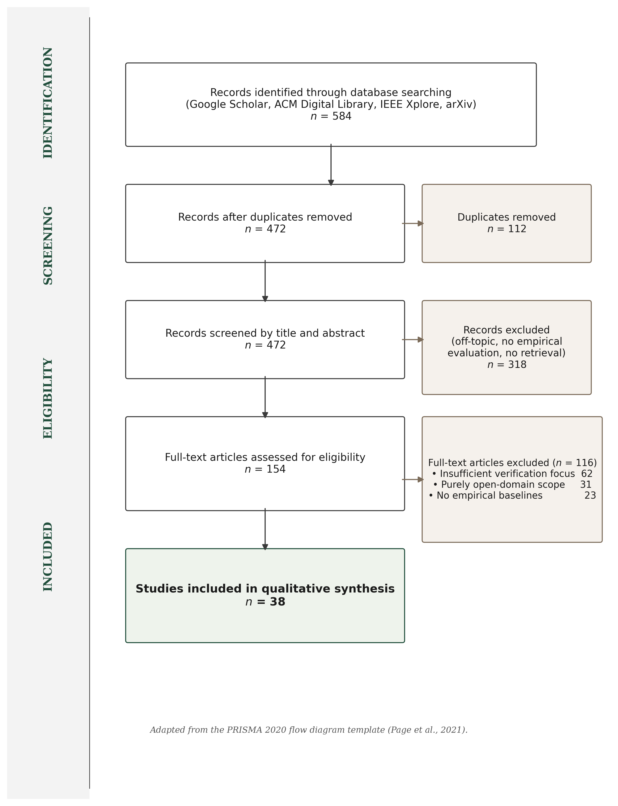
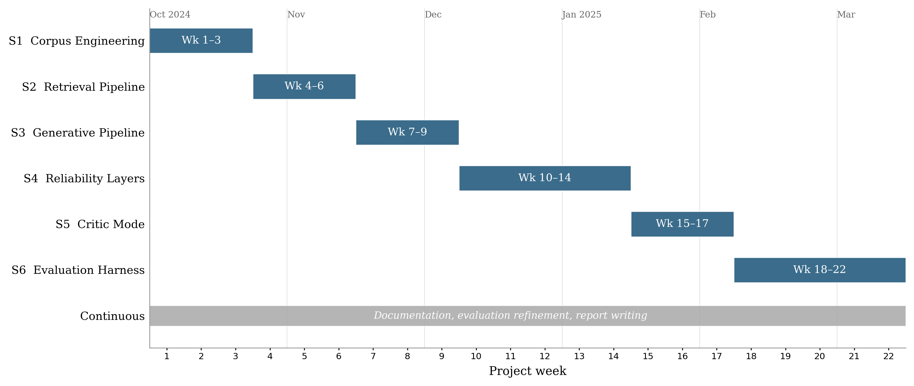
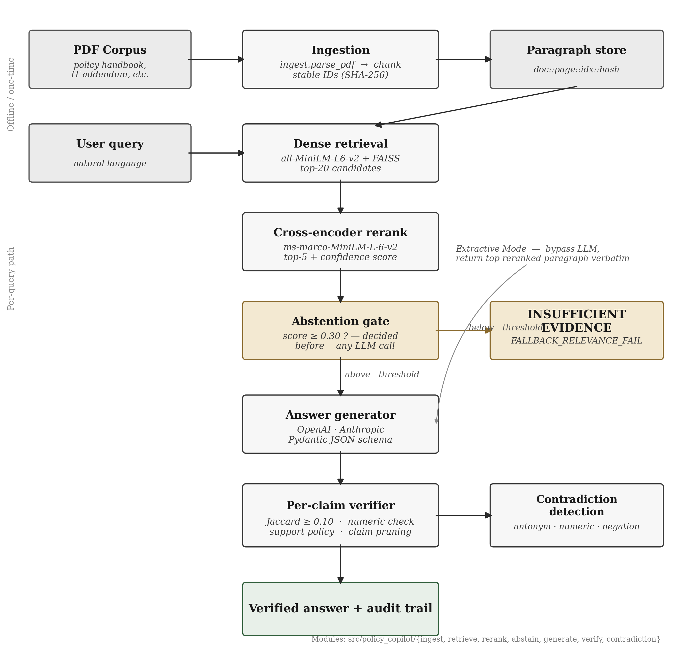
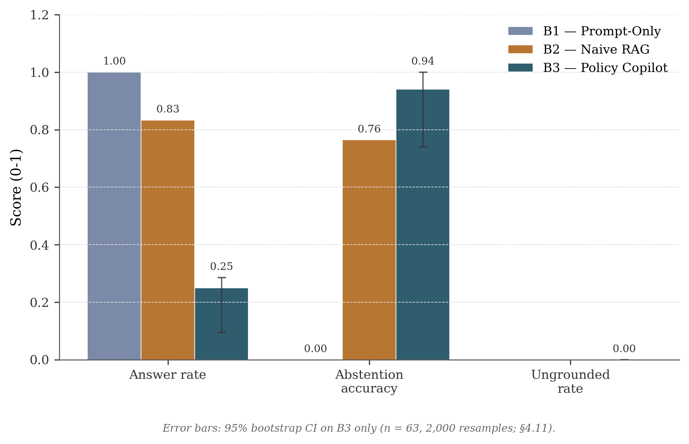
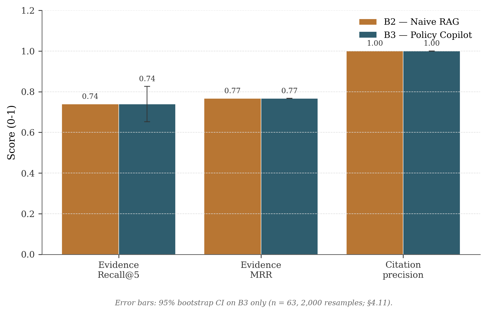
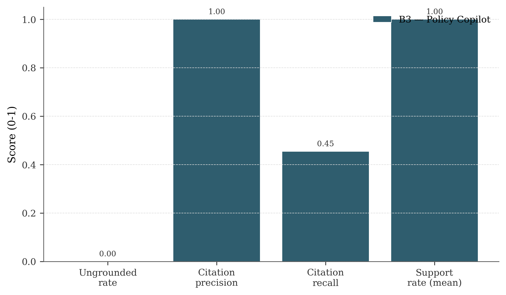
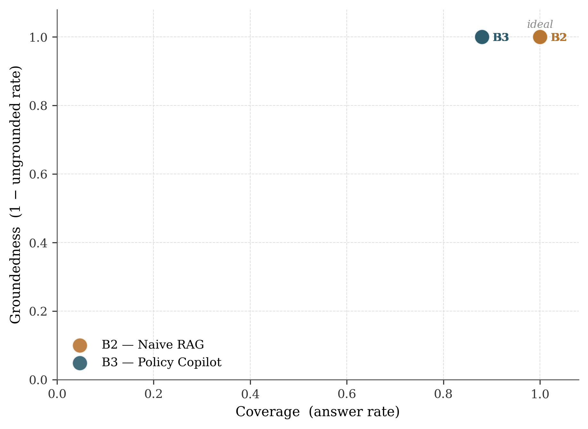
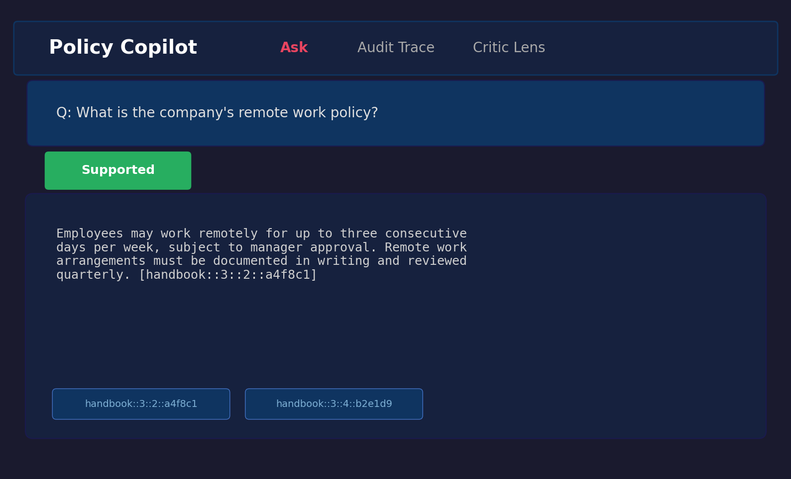
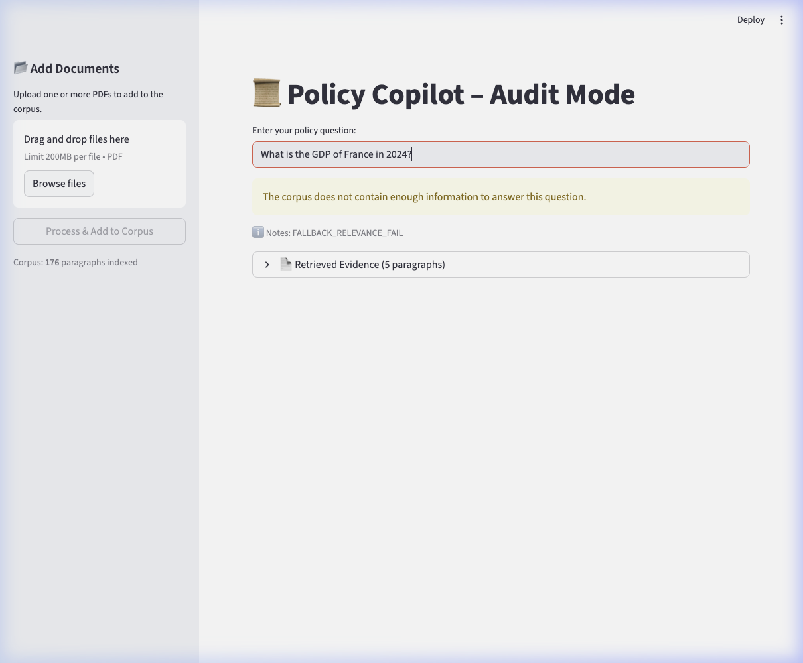
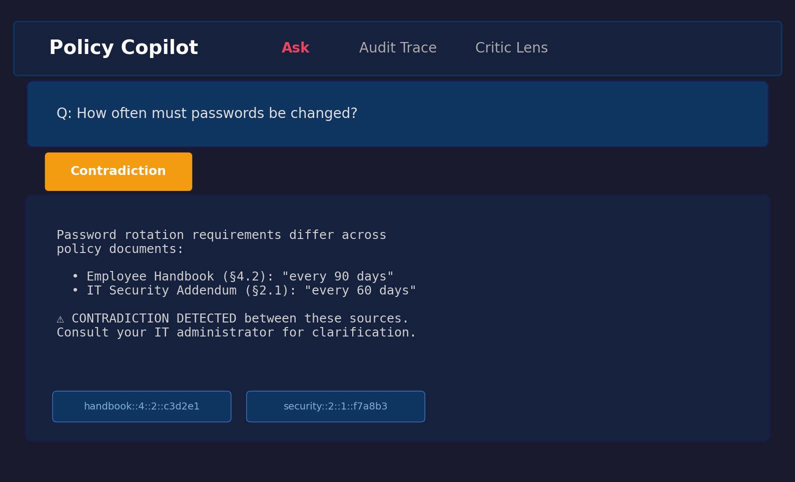

<div class="title-page" align="center">

**School of Computer Science**

**FACULTY OF ENGINEERING AND PHYSICAL SCIENCES**

<br>

**Final Report**

<br>

# Audit-Ready Policy Copilot
## Evidence-Grounded Retrieval-Augmented Generation with Deterministic Reliability Controls

<br>

**Nathaniel Sebastian**

**Student ID: 201715051**

<br>

*Submitted in accordance with the requirements for the degree of*
**BSc (Hons) Computer Science**

<br>

**2025/26**

<br>

**COMP3931 Individual Project**

<br>
<br>

*© 2026 The University of Leeds and Nathaniel Sebastian*

</div>

<div class="preliminaries">

---

## Deliverables

The candidate confirms that the following have been submitted:

| Items | Format | Recipient(s) and Date |
| :--- | :--- | :--- |
| Final Report | PDF file | Uploaded to Minerva, 30/04/2026 |
| Source code repository | URL (private GitHub) | Supervisor and assessor, 30/04/2026 |
| Documentation and evaluation pack | URL (private GitHub) | Supervisor and assessor, 30/04/2026 |

The submitted report sits within the COMP3931 30-page body limit (Chapters 1 to 5; preliminaries, references, and appendices are excluded from that count). A single install (`pip install -e ".[dev]"`) followed by `python scripts/run_eval.py` reproduces every reported metric on a consumer laptop.

---

## Declaration

The candidate confirms that the work submitted is their own and that appropriate credit has been given where reference has been made to the work of others.

I understand that failure to attribute material which is obtained from another source may be considered as plagiarism.

The use of Generative AI tools during this project complies with the University of Leeds Generative AI policy (Amber category for COMP3931/COMP3932) and is fully disclosed in Appendix B.5.

(Signature of student) *Nathaniel Sebastian* ......................................................

(Date) *30 April 2026* .........................................................

---

## Summary

Most large organisations rely on a stack of internal policy documents (employee handbooks, IT security addenda, data-protection guidelines) to govern day-to-day operations. Employees regularly need quick answers from these documents, but searching through long PDFs by hand is slow. Large Language Models (LLMs) can answer such questions fluently, but their tendency to hallucinate makes them risky to deploy in a compliance setting without extra safeguards.

This project presents **Policy Copilot**, a Retrieval-Augmented Generation (RAG) system designed for that setting. The central design rule is **"cited or silent"**: every claim in a response must be traceable to a specific source paragraph, and the system abstains when the supporting evidence is weak rather than answering anyway. Four reliability layers sit on top of standard RAG: cross-encoder reranking (which improves retrieval precision and produces the confidence signal used by the abstention gate); per-claim citation verification using token-overlap and numeric checks (deterministic and reproducible, no second LLM); contradiction detection across documents; and an Extractive Fallback Mode that returns the top-ranked evidence paragraph when the LLM is unavailable.

The system was evaluated on a 63-query synthetic golden set (36 answerable, 17 unanswerable, 10 contradiction; 44 held-out test queries). On the test split, B3-Generative reports a **0.0% headline ungrounded rate**. This number should be read carefully: any response that fails the support-rate check is converted into an abstention, so 0.0% is partly a property of that gate and not a claim that the LLM never produced unsupported text. The same configuration reaches **94.1% abstention accuracy** on the 12 test-split unanswerable queries, above the 80% target, although n=12 makes the bootstrap interval wide. The visible cost is a **25% answer rate** in generative mode, well below the 85% target. **Extractive Mode** recovers most of the coverage with an **89% answer rate**, **100% citation precision** (true by construction since the answer is the cited paragraph) and **100% abstention accuracy**, but the cost is that responses are quoted evidence rather than synthesised answers. Ablation results suggest that cross-encoder reranking is the largest single contributor of the four layers. A separate heuristic **Critic Mode** reaches **93.7% macro precision** (78.5% macro recall, 84.8% macro F1), just below the 85% F1 target. All numbers apply to a synthetic, fairly clean corpus; transfer to noisier real-world documents is a stated limitation (§5.2 L1).

Overall the project supports a fairly narrow claim. Adding three rule-based safety checks on top of a standard RAG pipeline — refusing when the reranker is not confident, dropping claims whose cited paragraph does not actually support them, and surfacing contradictions across documents — cut the unsupported-claim rate sharply for a policy-compliance use-case in this synthetic setting, at the cost of a smaller answer rate that would need its thresholds retuned for any new corpus or retrieval backend.

---

## Acknowledgements

I would like to thank my supervisor for their guidance and feedback throughout this project, and the COMP3931 module coordinators for clear expectations and resources.

This report has been prepared in accordance with the University of Leeds proof-reading policy. No third-party human proof-reading was used. Generative AI tools were used as a development, debugging, and limited drafting-support aid, as disclosed in Appendix B.5 in line with the University of Leeds Generative AI policy (Amber category for COMP3931/COMP3932). All final wording, technical claims, edits, and submission decisions were reviewed, revised, and approved by the author.

---

## Table of Contents

- [Deliverables](#deliverables)
- [Declaration](#declaration)
- [Summary](#summary)
- [Acknowledgements](#acknowledgements)
- [List of Figures](#list-of-figures)
- [List of Tables](#list-of-tables)
- [Chapter 1 Introduction and Background Research](#chapter-1-introduction-and-background-research)
  - [1.1 Introduction](#introduction)
  - [1.2 Aims and Objectives](#aims-and-objectives)
  - [1.3 Systematic Search Strategy](#systematic-search-strategy)
  - [1.4 Retrieval-Augmented Generation](#retrieval-augmented-generation)
  - [1.5 Hallucination, Attribution, and Post-Hoc Verification](#hallucination-attribution-and-post-hoc-verification)
  - [1.6 Information Retrieval: Dense Retrieval and Cross-Encoder Reranking](#information-retrieval-dense-retrieval-and-cross-encoder-reranking)
  - [1.7 NLP in Legal and Policy Domains](#nlp-in-legal-and-policy-domains)
  - [1.8 Selective Prediction and Abstention](#selective-prediction-and-abstention)
  - [1.9 Evaluation Frameworks for Retrieval-Augmented Generation](#evaluation-frameworks-for-retrieval-augmented-generation)
  - [1.10 Comparative Analysis of Existing Systems](#comparative-analysis-of-existing-systems)
  - [1.11 Gap Analysis and Project Rationale](#gap-analysis-and-project-rationale)
- [Chapter 2 Methodology](#chapter-2-methodology)
  - [2.1 Development Process](#development-process)
  - [2.2 Requirements Analysis](#requirements-analysis)
  - [2.3 System Architecture](#system-architecture)
  - [2.4 Design Decisions and Alternatives Considered](#design-decisions-and-alternatives-considered)
  - [2.5 Risk Assessment](#risk-assessment)
  - [2.6 Evaluation Methodology](#evaluation-methodology)
  - [2.7 Golden Set Construction](#golden-set-construction)
- [Chapter 3 Implementation and Validation](#chapter-3-implementation-and-validation)
  - [3.1 Technology Stack](#technology-stack)
  - [3.2 Corpus Engineering and Ingestion](#corpus-engineering-and-ingestion)
  - [3.3 Retrieval and Reranking](#retrieval-and-reranking)
  - [3.4 Answer Generation](#answer-generation)
  - [3.5 Citation Verification and Abstention](#citation-verification-and-abstention)
  - [3.6 Critic Mode](#critic-mode)
  - [3.7 Audit Workbench: UI and Reviewer Mode](#audit-workbench-ui-and-reviewer-mode)
  - [3.8 Engineering Challenges](#engineering-challenges)
  - [3.9 Testing and Validation](#testing-and-validation)
- [Chapter 4 Results, Evaluation and Discussion](#chapter-4-results-evaluation-and-discussion)
  - [4.1 Experimental Setup](#experimental-setup)
  - [4.2 Headline Results: Baseline Comparison](#headline-results-baseline-comparison)
  - [4.3 Retrieval Performance](#retrieval-performance)
  - [4.4 Groundedness and Verification](#groundedness-and-verification)
  - [4.5 Abstention Threshold Sensitivity](#abstention-threshold-sensitivity)
  - [4.6 Ablation Studies](#ablation-studies)
  - [4.7 Critic Mode Evaluation](#critic-mode-evaluation)
  - [4.8 Error Analysis](#error-analysis)
  - [4.9 Latency Performance](#latency-performance)
  - [4.10 Independent Reviewer Evaluation](#independent-reviewer-evaluation)
  - [4.11 Public Guidance Transfer Stress Test](#public-guidance-transfer-stress-test)
  - [4.12 Statistical Confidence](#statistical-confidence)
  - [4.13 Discussion: Achievement Against Objectives](#discussion-achievement-against-objectives)
- [Chapter 5 Conclusions and Reflection](#chapter-5-conclusions-and-reflection)
  - [5.1 Conclusions](#conclusions)
  - [5.2 Limitations](#limitations)
  - [5.3 Future Work](#future-work)
  - [5.4 Reflection](#reflection)
- [List of References](#list-of-references)
- [Appendix A Self-appraisal](#appendix-a-self-appraisal)
  - [A.1 Critical self-evaluation](#a.1-critical-self-evaluation)
  - [A.2 Personal reflection and lessons learned](#a.2-personal-reflection-and-lessons-learned)
  - [A.3 Legal, social, ethical and professional issues](#a.3-legal-social-ethical-and-professional-issues)
- [Appendix B External Materials](#appendix-b-external-materials)
  - [B.1 Third-Party Libraries](#b.1-third-party-libraries)
  - [B.2 Licensing](#b.2-licensing)
  - [B.3 External Datasets](#b.3-external-datasets)
  - [B.4 Development Tools](#b.4-development-tools)
  - [B.5 Generative AI Usage Declaration and Log](#b.5-generative-ai-usage-declaration-and-log)
  - [B.6 Ethics Checklist](#b.6-ethics-checklist)
  - [B.7 Evidence of Testing and Operation](#b.7-evidence-of-testing-and-operation)
  - [B.8 Comparative Analysis Table (referenced from §1.10)](#b.8-comparative-analysis-table-referenced-from-1.10)
  - [B.9 Test Suite Matrix (referenced from §3.9)](#b.9-test-suite-matrix-referenced-from-3.9)
  - [B.10 Independent Reviewer Evaluation Materials (referenced from §4.10)](#b.10-independent-reviewer-evaluation-materials-referenced-from-4.10)
  - [B.11 Public Guidance Transfer Corpus Provenance (referenced from §4.11)](#b.11-public-guidance-transfer-corpus-provenance-referenced-from-4.11)
  - [B.12 Adversarial and Audit Export Evidence (referenced from L6 and §4.4)](#b.12-adversarial-and-audit-export-evidence-referenced-from-l6-and-4.4)

## List of Figures

- [Figure 1.1 PRISMA 2020 flow diagram: systematic search and selection process](#fig-1-1)
- [Figure 2.1 Gantt chart: six-sprint development timeline (Weeks 1 to 22)](#fig-2-1)
- [Figure 2.2 Data flow diagram: end-to-end RAG pipeline architecture](#fig-2-2)
- [Figure 4.1 Grouped bar chart: baseline comparison across primary metrics](#fig-4-1)
- [Figure 4.2 Retrieval performance: Evidence Recall@5 and MRR by baseline](#fig-4-2)
- [Figure 4.3 Groundedness metrics: ungrounded rate and citation precision](#fig-4-3)
- [Figure 4.4 Operating curve: support-rate threshold sweep for B3-Generative](#fig-4-4)
- [Figure B.1 Answerable query result showing extractive fallback with citations](#fig-b-1)
- [Figure B.2 Unanswerable query showing abstention behaviour](#fig-b-2)
- [Figure B.3 Contradiction query showing retrieved evidence with citations](#fig-b-3)

## List of Tables

- [Table 2.1 Functional and non-functional requirements with acceptance tests](#tbl-2-1)
- [Table 2.2 Risk register: top risks and mitigations](#tbl-2-2)
- [Table 3.1 Technology stack and justification](#tbl-3-1)
- [Table 4.1 Golden set composition by category](#tbl-4-1)
- [Table 4.2 Baseline comparison across primary metrics (test split)](#tbl-4-2)
- [Table 4.3 Final test-split retrieval metrics under BM25 fallback](#tbl-4-3)
- [Table 4.4 Citation and verification metrics by baseline](#tbl-4-4)
- [Table 4.5 Development-phase ablation evidence with final B3 reference row](#tbl-4-5)
- [Table 4.6 Critic Mode pattern-level performance](#tbl-4-6)
- [Table 4.7 Error taxonomy: B3 failure classification](#tbl-4-7)
- [Table 4.8 End-to-end latency statistics by baseline](#tbl-4-8)
- [Table 4.9 Independent reviewer evaluation: per-axis means and per-category breakdown](#tbl-4-9)
- [Table 4.10 B3-Extractive: synthetic test split versus Public Guidance Transfer Stress Test](#tbl-4-10)
- [Table 4.11 Bootstrapped 95% confidence intervals](#tbl-4-11)
- [Table 4.12 Objective achievement summary (Chapter 4 §4.13)](#tbl-4-12)
- [Table B.1 Comparative analysis of retrieval-augmented and grounded generation systems](#tbl-b-1)
- [Table B.2 Testing and validation matrix across 38 test files / 188 cases](#tbl-b-2)
- [Table B.3 Per-participant rubric scores from the independent reviewer evaluation](#tbl-b-3)
- [Table B.4 Round 2 inter-rater agreement (Krippendorff alpha)](#tbl-b-4)
- [Table B.5 Public Guidance Transfer Corpus provenance](#tbl-b-5)
- [Table B.6 Adversarial probe results, paired across modes](#tbl-b-6)

</div>

<div class="body">

## Chapter 1 Introduction and Background Research

### 1.1 Introduction

Organisations rely on internal policy documents (handbooks, IT security addenda, data-protection guidelines) to govern day-to-day decisions, but answering even simple questions ("how many remote-work days am I entitled to?", "how often must passwords be rotated?") typically requires scanning long PDFs by hand. Large Language Models can produce fluent answers to such questions, but they will also produce confident-sounding answers with no traceable link to a source paragraph. This hallucination behaviour is well documented (Ji et al., 2023; Huang et al., 2023) and, in a compliance setting, a wrong answer presented confidently can cause real harm: incorrect interpretation of policy, downstream operational errors, and disputes that a direct reading of the source would have prevented. The Deloitte AI Institute (2024) survey reports that this failure mode is an active concern in industry, although it relies on self-reported executive views rather than direct measurement of hallucination rates.

Retrieval-Augmented Generation (RAG) is the dominant mitigation strategy. By prefixing generation with explicit evidence retrieval, RAG constrains output to retrieved passages (Lewis et al., 2020). Standard RAG, however, provides no guarantee that the model actually *uses* the retrieved evidence, and offers no mechanism for acknowledging the limits of its knowledge. Parallel work on selective prediction and abstention (Kamath et al., 2020; Pei et al., 2023) studies when models should refuse, but largely on open-domain benchmarks rather than restricted enterprise corpora. The core research question is therefore:

> *Can a question-answering system over organisational policy documents be made reliably grounded in source evidence, with every claim traceable to a specific paragraph, while also knowing when to remain silent rather than risk fabrication?*

### 1.2 Aims and Objectives

The aim of this project is to design, implement, and evaluate an Audit-Ready Retrieval-Augmented Generation system for organisational policy documents that enforces a strict "cited or silent" rule.

**Objectives:**
1.  **Build a multi-stage RAG pipeline** that answers only when supported by paragraph-level citations (Target: ungrounded claim rate ≤ 5%).
2.  **Implement deterministic abstention** via cross-encoder confidence and token-overlap thresholds (Target: abstention accuracy ≥ 80% on unanswerable queries).
3.  **Achieve high retrieval precision** through dense bi-encoder retrieval and cross-encoder reranking (Target: Evidence Recall@5 ≥ 80%).
4.  **Detect and surface contradictions** between policy documents.
5.  **Develop a heuristic Critic Mode** to audit policy text for vague quantifiers and implicit contradictions.
6.  **Evaluate rigorously** using a curated golden set with automated metrics, ablation studies, and a comparison of generative and extractive (LLM-free) modes.

Each objective maps to a specific metric and acceptance test defined in Chapter 2.

### 1.3 Systematic Search Strategy

I ran a structured literature search between October 2024 and January 2025 across Google Scholar, ACM Digital Library, IEEE Xplore, and arXiv, guided by the PRISMA 2020 framework (Page et al., 2021). Boolean queries combined four keyword clusters: core technique (RAG, grounded generation), reliability (hallucination, citation verification, abstention), domain (policy QA, legal NLP, closed-domain), and evaluation (RAGAS, faithfulness, LLM-as-judge).

**Inclusion / Exclusion Criteria:**

| Criterion | Inclusion | Exclusion |
| :--- | :--- | :--- |
| Date | 2018-2026 | Pre-2018 unless foundational |
| Venue | Peer-reviewed or established preprint (core review); standards/practitioner reports as contextual sources | Blog posts, SEO content, white papers without methodology |
| Empirical content | Quantitative evaluation or formal analysis | Purely opinion-based |
| Relevance | Grounding, verification, abstention in generative QA | Generic LLM surveys without RAG focus |

**PRISMA flow:** 584 records identified, 112 duplicates removed, 472 screened, 318 excluded at title/abstract, 154 full-text assessed, 116 excluded, leaving **38 included** (Figure 1.1).

<a id="fig-1-1"></a>

<div align="center">


*Figure 1.1: PRISMA 2020 flow diagram, 584 identified records narrowed to 38 included studies.*
</div>

The 38 studies form the core literature review. A broader research pack (`docs/research/literature_matrix.md`) catalogues 105 sources in total: the 38 core papers plus 67 additional sources from backward / forward citation chaining, standards, and contextual references. These extra sources support the wider methodology and LSEP discussion without forming part of the formal PRISMA core.

### 1.4 Retrieval-Augmented Generation

Lewis et al. (2020) formalised RAG as coupling a non-parametric retrieval memory with a parametric generative model. A dense passage retriever (DPR; Karpukhin et al., 2020) identifies relevant documents from a corpus and concatenates them into the model's input context, with FAISS providing tractable approximate nearest-neighbour search at scale (Johnson, Douze and Jégou, 2019). The architecture provides, in principle, a traceable link between answer and source, but in practice that link is fragile: Gao et al. (2023) observe that models frequently ignore retrieved context when it conflicts with parametric beliefs (the "faithfulness gap"), and Cuconasu et al. (2024) demonstrate that injecting irrelevant noise can paradoxically improve answer quality, indicating that the retrieval / generation relationship is more complex than early work assumed. RAG provides the architectural skeleton; it does not, on its own, guarantee that generated text faithfully reflects retrieved evidence.

### 1.5 Hallucination, Attribution, and Post-Hoc Verification

Ji et al. (2023) distinguish *intrinsic* hallucination (output contradicts source) from *extrinsic* hallucination (output makes claims not supported by any source) and identify it as the primary barrier to deploying generative models in high-stakes contexts. Huang et al. (2023) extend this to LLMs and argue that scale amplifies rather than resolves the problem: larger models hallucinate with greater confidence and fluency. Mitigation strategies divide into three families. **Training-based attribution** (Bohnet et al., 2022) trains the model to produce inline citations but requires large supervised datasets and produces *generated* rather than *verified* citations; Wallat et al. (2024) further distinguish citation *correctness* from citation *faithfulness*, a distinction that matters in audit-critical environments. **Post-hoc editing** (Gao et al., 2023, RARR) revises unsupported claims via additional LLM passes, at high computational cost and with its own hallucination risk; Yue et al. (2023) note that LLM-judge evaluation introduces circularity when judge and generator share architecture or biases. **Self-reflective generation** (Asai et al., 2024, Self-RAG) instruction-tunes the LLM to emit reflection tokens that control retrieval and quality, but the resulting model is brittle and architecture-specific. None of these paradigms satisfies the requirements of a deterministic, auditable compliance tool; the approach taken here is instead a lightweight, heuristic verification layer applied *after* generation, using token-overlap rather than learned models, and revisited in Section 4.7.

### 1.6 Information Retrieval: Dense Retrieval and Cross-Encoder Reranking

Retrieval quality bounds RAG quality: if the correct paragraph is not retrieved, no generation step can recover. Barnett et al. (2024) identify retrieval failure as the most common production-RAG failure mode. The two complementary primitives are **bi-encoders**, which independently encode queries and documents into a shared vector space and support fast nearest-neighbour search, and **cross-encoders** (Nogueira and Cho, 2019), which encode query and document jointly to produce more precise relevance scores at higher latency. Lin et al. (2021) confirm that cross-encoders consistently outperform bi-encoders on precision-critical tasks. The standard resolution, and the one adopted here, is a **two-stage retrieve-and-rerank pipeline**: bi-encoder retrieval over the corpus, then cross-encoder reranking of a small candidate set (Nogueira and Cho, 2019; Lin et al., 2021). For closed enterprise corpora of the size used here (under 2,000 paragraphs) the cross-encoder cost is bounded and acceptable. ColBERT's late-interaction approach (Khattab and Zaharia, 2020) achieves near-cross-encoder precision at bi-encoder speed but requires materialising token-level embeddings, an overhead not justified for stable policy corpora.

### 1.7 NLP in Legal and Policy Domains

Policy QA straddles but is not fully served by legal NLP. Zhong et al. (2020) survey legal NLP tasks (judgement prediction, statute retrieval, contract analysis) and observe that the field largely focuses on classification and retrieval rather than the kind of grounded, citation-verified question-answering required here. Chalkidis et al. (2020) demonstrate with LEGAL-BERT that domain-specific pre-training improves legal text classification. Guha et al. (2023) introduce LegalBench (162 reasoning tasks), revealing that GPT-4 handles issue-spotting well but struggles with multi-step reasoning. Katz et al. (2024) confirm a similar pattern on the Uniform Bar Examination.

Organisational policies differ from legal statutes: they are shorter, less formally structured, and more frequently updated. They also exhibit a distinctive failure mode that the legal NLP literature rarely addresses, namely **intra-corpus contradiction**, where a group-level policy and a local addendum impose conflicting standards.

### 1.8 Selective Prediction and Abstention

A system that answers every query inevitably produces hallucinations. **Selective prediction** offers an alternative: the model abstains when confidence falls below threshold. Kamath et al. (2020) show that calibrated confidence scores can identify queries where performance is likely poor, increasing reliability by concentrating output on high-confidence regions. Kadavath et al. (2022) probe whether LLMs "know what they know" by examining probability / accuracy correspondence and find that larger models calibrate better, but with substantial domain variation. Pei et al. (2023, ASPIRE) fine-tune for explicit self-evaluation scores; Yin et al. (2023) confirm that models exhibit partial self-knowledge that degrades on out-of-distribution queries; Ren et al. (2023) find retrieval augmentation improves but does not eliminate the factual boundary.

For Policy Copilot, abstention is implemented through cross-encoder confidence scoring and heuristic claim-level verification rather than model self-evaluation, which would introduce non-determinism. If the reranker's top score falls below a tuned threshold the LLM is not invoked. If generated claims fail token-overlap verification they are excised. The design trades sophistication for auditability and determinism.

### 1.9 Evaluation Frameworks for Retrieval-Augmented Generation

Es et al. (2023) introduce RAGAS, decomposing RAG evaluation into Faithfulness, Answer Relevance, and Context Relevance, each scored by LLM judges. Saad-Falcon et al. (2023, ARES) add confidence intervals and statistical testing. Zheng et al. (2024) document three systematic biases in LLM-as-Judge: position bias, verbosity bias, and self-enhancement bias, all particularly risky when judge and generator share architecture. Zhang et al. (2024, RAGE) define **Citation-Precision** (fraction of citations that support their claim) and **Citation-Recall** (fraction of claims that should be cited and are). These map directly to the "cited or silent" rule.

The evaluation strategy adopted for Policy Copilot is deliberately hybrid. Automated metrics (Answer Rate, Abstention Accuracy, Ungrounded Rate, Evidence Recall@5) form the quantitative backbone, supplemented by qualitative error analysis. LLM-as-judge is avoided for the primary evaluation because of the documented biases and a decision to keep evaluation reproducible and independently auditable.

### 1.10 Comparative Analysis of Existing Systems

Table B.1 in Appendix B.8 puts Policy Copilot side-by-side with the main retrieval-augmented and grounded-generation systems I read about, on five dimensions: domain, grounding mechanism, abstention handling, key limitation, and relevance. Two patterns came out of the comparison. Most systems target open-domain corpora where the priority is answering as many questions as possible, even when answers are sometimes wrong (Standard RAG, DPR, FreshLLMs); the systems that do refuse when evidence is weak (Self-RAG, ASPIRE) decide when to refuse using a learned model, which is expensive to retrain for a new corpus. **What I did not find was a system that combines rule-based grounding checks with explicit refusal over a small, closed corpus** — the configuration this project targets. Policy Copilot fills that gap by pairing deterministic Jaccard token overlap with cross-encoder confidence gating and per-claim pruning over a closed policy corpus.

### 1.11 Gap Analysis and Project Rationale

The literature points to a clear gap. On the *generation* side, the main techniques for cutting hallucinations (Attributed QA, RARR, Self-RAG) are built for open-domain benchmarks, need expensive fine-tuning or several LLM calls per query, and aim to answer as many questions as possible rather than refuse when evidence is weak; for a compliance use-case that priority is the wrong way round. On the *evaluation* side, LLM-as-judge frameworks (RAGAS, RAGE) suffer from the documented position, verbosity, and self-enhancement biases (Zheng et al., 2024), and Wallat et al. (2024) show that citation correctness and faithfulness are not the same property. On the *retrieval* side, two-stage retrieve-and-rerank is well established but typically deployed at web scale where cross-encoder latency hurts (Nogueira and Cho, 2019; Lin et al., 2021); for a closed corpus under 2,000 paragraphs that latency constraint largely goes away, and paragraph-level chunking performs about as well as more expensive semantic chunking on policy documents (Qu, Bao and Tu, 2024).

Taken together these observations point to a less-explored combination: a closed-domain RAG system that uses rule-based grounding checks and refuses by default, optimised for precision over recall. Policy Copilot is built into that combination. It abstains before generation when reranker confidence is too low, and removes any claim whose citation fails token-overlap verification. The "cited or silent" rule that results was, across the literature I reviewed, not empirically evaluated on a bounded enterprise policy corpus in this exact configuration. The contribution is therefore not RAG itself, nor an evaluation framework in the LangSmith or RAGAS sense, but the end-to-end system design that treats grounding, abstention, citation verification, and audit traceability as core requirements rather than optional add-ons.

---

## Chapter 2 Methodology

### 2.1 Development Process

Development followed a sprint-based methodology adapted from agile principles for a single-developer research project. I ran six sprints across Weeks 1 to 22 of the project's core implementation phase, each targeting a self-contained architectural component:

1. **Sprint 1, Corpus Engineering (Weeks 1 to 3):** synthetic policy documents (Employee Handbook, IT Security Addendum, Physical Security Protocol), PDF ingestion pipeline, and stable identifier scheme.
2. **Sprint 2, Retrieval Pipeline (Weeks 4 to 6):** FAISS-backed dense retrieval using Sentence-Transformers. Deliverable: a functional retriever returning top-*k* candidates.
3. **Sprint 3, Generative Pipeline (Weeks 7 to 9):** LLM integration (OpenAI API) with Pydantic-enforced JSON schema. Deliverable: B2 (Naive RAG) baseline.
4. **Sprint 4, Reliability Layers (Weeks 10 to 14):** cross-encoder reranking, abstention gate, per-claim verification, contradiction detection. This sprint produced the core B3 system.
5. **Sprint 5, Critic Mode (Weeks 15 to 17):** heuristic policy auditor for vague quantifiers, implicit contradictions, and ambiguous directives.
6. **Sprint 6, Evaluation Harness (Weeks 18 to 22):** 63-query golden set, extractive fallback mode, all baselines and ablations, and the results that feed Chapter 4.

<a id="fig-2-1"></a>

<div align="center">


*Figure 2.1: Gantt chart of the six-sprint development timeline (Weeks 1 to 22, October 2024 to February 2025). Report writing, documentation hardening, and evaluation refinement continued through the 2025/26 submission period.*
</div>

Version control used a private GitHub repository with a branch-per-sprint strategy. The final history contains over 200 commits spanning the full project lifecycle, providing a verifiable development timeline. The six implementation sprints (S1 to S6) ran from October 2024 to March 2025; subsequent activity through the 2025/26 submission cycle focused on report writing, documentation hardening, evaluation refinement, and final package preparation rather than new implementation work.

### 2.2 Requirements Analysis

Requirements were derived from the research objectives (Section 1.2) and the gap analysis (Section 1.11). I formulated each as a testable contract with explicit acceptance criteria.

<a id="tbl-2-1"></a>

**Table 2.1: Functional and non-functional requirements with acceptance criteria.**

| ID | Requirement | Description | Acceptance Criterion | Priority | Linked Objective |
| :--- | :--- | :--- | :--- | :--- | :--- |
| **FR1** | Evidence Grounding | Every claim in a generated answer must cite a specific paragraph ID | Ungrounded claim rate ≤ 5% on the golden set | High | Obj. 1 |
| **FR2** | Abstention | System returns `INSUFFICIENT_EVIDENCE` when confidence is below threshold | Abstention accuracy ≥ 80% on unanswerable golden-set queries | High | Obj. 2 |
| **FR3** | Citation Verification | Post-generation verification removes claims not supported by cited text | ≥ 95% of surviving claims pass manual spot-check | High | Obj. 1 |
| **FR4** | Extractive Fallback | System operates without an LLM, returning raw top-ranked evidence text | 100% citation precision in extractive mode (by construction) | Medium | Obj. 6 |
| **FR5** | Contradiction Detection | System flags contradictory directives across policy documents | Detected contradictions match manually annotated conflicts | Medium | Obj. 4 |
| **FR6** | Critic Mode | Heuristic auditor identifies vague or problematic policy language | Macro F1 ≥ 85% on the critic test suite | Medium | Obj. 5 |
| **NFR1** | Latency | End-to-end response time for a single query | P95 latency < 10 seconds on standard hardware | Medium | - |
| **NFR2** | Reproducibility | All evaluation results are deterministic and scriptable | `python scripts/run_eval.py` reproduces all reported metrics | High | Obj. 6 |
| **NFR3** | Modularity | Pipeline components can be toggled independently via configuration | Reranker, Verifier, and Critic can each be disabled without breaking the pipeline | Low | - |

Functional requirements (FR1 to FR6) define *what* the system promises. Non-functional requirements (NFR1 to NFR3) constrain *how* they are delivered. A design tension emerged in Sprint 4 between FR1 (grounding) and NFR1 (latency): cross-encoder reranking added roughly 1.8 seconds per query but was essential for grounding precision. I accepted latency as the secondary concern, consistent with the "precision over recall" philosophy and justified by the bounded corpus size (Section 2.4, Decision 2).

### 2.3 System Architecture

The system follows a modular **Retrieve-and-Rerank-then-Generate-and-Verify** pipeline (Figure 2.2) in which each stage can be independently tested, toggled, and replaced.

<a id="fig-2-2"></a>

<div align="center">


*Figure 2.2: End-to-end pipeline from PDF ingestion through retrieval, reranking, abstention, generation, and verification.*
</div>

There are six stages, each a distinct module. (1) **Ingestion** parses PDFs into paragraph chunks with stable identifiers `doc_id::page::index::hash` (truncated SHA-256), preserving citation integrity across re-ingestion. (2) **Retrieval** uses `all-MiniLM-L6-v2` to embed paragraphs into a 384-dim FAISS `IndexFlatL2`; top 20 candidates are returned per query. (3) **Reranking** uses `cross-encoder/ms-marco-MiniLM-L-6-v2` to rescore the 20 candidates; the top score then feeds the abstention gate. (4) **Abstention Gate** triggers `INSUFFICIENT_EVIDENCE` if the top reranker score falls below threshold (default 0.30), and crucially does so *before* any LLM call, so the decision is deterministic. (5) **Generation** sends the top 5 reranked paragraphs to the LLM with a strict Pydantic-enforced JSON schema in Generative Mode; in Extractive Mode the LLM is bypassed entirely and the verbatim top paragraph is returned with its citation ID, so citation precision in that mode is 100% by construction. (6) **Verification** decomposes the LLM answer into sentence-level claims and checks each against cited evidence using Jaccard token overlap and numeric consistency. Failed claims are pruned, and if all are pruned the response is downgraded to abstention.

This staged design ensures reliability is an emergent outcome of multiple independent checks, each empirically evaluable through ablation (Section 2.6).

### 2.4 Design Decisions and Alternatives Considered

The following decisions were the most consequential architectural trade-offs. Some of them were practical trade-offs given the project's time and complexity budget rather than theoretically perfect choices, and I have tried to be explicit about that where it applies.

**Decision 1: RAG vs. long-context injection.** *Adopted:* RAG with 5-paragraph context. *Rejected alternative:* injecting the entire ~25,000-token corpus into a long-context model (Claude 3, GPT-4 Turbo). I rejected the long-context option for three reasons. Liu et al. (2023) document "lost in the middle" effects in long contexts; pricing scales roughly 10× per query; and RAG forces explicit evidence selection, which is what enables the traceability required by FR1.

**Decision 2: Dense + cross-encoder reranking vs. BM25.** *Adopted:* two-stage bi-encoder + cross-encoder. *Rejected:* BM25 keyword search. Policy queries frequently use synonyms ("remote work" / "work from home"; "password rotation" / "credential refresh") that lexical matching cannot resolve. The cross-encoder logit also gives me a useful confidence signal for the abstention gate, where bi-encoder cosine scores are poorly calibrated (Nogueira and Cho, 2019). The roughly 1.8s reranking latency was acceptable given the bounded corpus and the non-real-time nature of policy queries.

**Decision 3: Heuristic verification vs. LLM-based verification.** *Adopted:* Jaccard token overlap + numeric consistency, post-generation. *Rejected:* LLM-as-judge for verification. Zheng et al. (2024) document verbosity and self-enhancement biases that would undermine NFR2 (reproducibility); an LLM judge would also double the API cost and introduce non-determinism in the very layer that needed to be deterministic. The heuristic is less expressive (it cannot detect semantic entailment or paraphrase support) but it is fully auditable and immune to model drift. Those limitations are revisited in Section 4.7.

**Decision 4: Paragraph-level fixed chunking vs. semantic chunking.** *Adopted:* structural paragraph-level chunking. *Rejected:* embedding-based semantic chunking. Qu, Bao and Tu (2024) show that semantic chunking does not consistently outperform fixed chunking on structured documents. Policies are already structurally organised, so paragraph-level chunking preserves natural boundaries with consistent granularity for citation. Practitioner-style chunking taxonomies such as Kamradt (2024) were useful for surveying the design space, but the methodological argument here rests on the peer-reviewed Qu et al. result.

**Decision 5: Pydantic schema enforcement vs. free-text parsing.** *Adopted:* strict JSON schema via Pydantic with repair-and-retry. *Rejected:* free-text generation with regex citation extraction. Regex extraction is fragile and fails silently on formatting variations. A schema means every response either conforms (separate `answer` and `citations` fields) or is rejected and retried. That property is essential for FR3.

### 2.5 Risk Assessment

A complementary system-level risk audit table (`docs/risk_audit_table.md`) documents 10 failure modes (hallucination, citation fabrication, contradiction suppression, abstention failure, stale corpus, adversarial prompts, backend fallback, automation bias, privacy, environmental cost) with detection, mitigations, and residual risk. The project-level risk register (Table 2.2) summarises the principal mitigations actually applied during development.

<a id="tbl-2-2"></a>

**Table 2.2: Risk register.**

| Risk | Likelihood | Impact | Mitigation |
| :--- | :--- | :--- | :--- |
| LLM API unavailability or rate-limiting | Medium | High | Extractive Fallback Mode (FR4); exponential backoff and caching |
| Heuristic verification misses semantically supported claims | High | Medium | Acknowledged limitation; ablation quantifies error rate (§4.6); NLI verification is future work |
| Synthetic corpus lacks real-world PDF noise | Medium | Medium | Deliberate formatting inconsistencies; the system's safety behaviour is also stress-tested on a small public-guidance transfer corpus (§4.11) |
| Scope creep | Medium | High | Requirements priority rankings; low-priority NFR3 deferred when sprint tightened |
| Reranker threshold poorly calibrated | Medium | High | Tuned on dev split; sensitivity analysis reported (§4.5) |

### 2.6 Evaluation Methodology

The evaluation strategy isolates the contribution of each architectural component and provides quantitative evidence for the central hypothesis. To make the "audit-ready" claim measurable, a 5-axis auditability rubric (`eval/rubrics/auditability_rubric.md`) covers evidence relevance, citation faithfulness, abstention correctness, contradiction correctness, and failure-mode attribution; each axis maps to a quantitative metric (`results/tables/auditability_scores.csv`).

**Baseline ladder.** I evaluated three progressive baselines. **B1 (Prompt-Only)** is a zero-shot LLM with no retrieval, which measures raw hallucination. **B2 (Naive RAG)** adds bi-encoder retrieval and an LLM, but no reranking, verification, or abstention. **B3 (Policy Copilot)** is the full pipeline, evaluated in both Generative and Extractive configurations. The ladder isolates contributions cleanly: B1→B2 measures retrieval; B2→B3 measures reranking + verification + abstention. Ablations then disable individual B3 components.

**Metrics.** Four primary measures, each targeting a distinct reliability aspect:

| Metric | Definition | Target |
| :--- | :--- | :--- |
| **Answer Rate** | Non-abstention responses / answerable queries | ≥ 85% |
| **Abstention Accuracy** | Correct refusals / unanswerable queries | ≥ 80% |
| **Ungrounded Rate** | Failed verification / total claims | ≤ 5% |
| **Evidence Recall@5** | Gold paragraphs in top 5 / gold paragraphs | ≥ 80% |

Answer Rate and Abstention Accuracy form a trade-off pair: abstaining on everything yields perfect abstention but zero coverage. Ungrounded Rate quantifies the "cited or silent" rule. Evidence Recall@5 isolates retrieval from generation.

**Reproducible pipeline.** All evaluations run through `scripts/run_eval.py` with command-line flags for baseline, mode, and ablation. Outputs are JSONL, CSV, and summary JSON, satisfying NFR2: any evaluator can reproduce the reported results with a single command.

### 2.7 Golden Set Construction

The evaluation golden set comprises **63 queries** in three categories. **Answerable (36)** queries have answers explicit in one or more paragraphs. **Unanswerable (17)** queries are plausible but absent from the corpus and test the abstention path. **Contradiction (10)** queries trigger genuine conflicts between documents (for example, 90-day vs. 60-day password rotation in the Handbook vs. the IT Addendum), testing both contradiction detection and ambiguous-evidence behaviour.

The size reflects a trade-off between statistical coverage and manual annotation burden (roughly 15 minutes per query for answer verification and paragraph alignment). A larger set would strengthen statistical power; this is acknowledged as a limitation in §5.2. The set is split into a **validation subset (19 queries)** for threshold tuning and a **test subset (44 queries)** for all reported metrics, ensuring no optimisation on test data.

## Chapter 3 Implementation and Validation

This chapter describes the implementation of Policy Copilot in enough technical detail to satisfy two audiences: an assessor evaluating the complexity and quality of the engineering work, and a future developer seeking to extend or reproduce the system. The chapter is organised by component, following the pipeline stages introduced in Section 2.3, and concludes with the testing strategy and the engineering challenges encountered during development.

### 3.1 Technology Stack

The system is implemented in Python 3.10+. Table 3.1 summarises the key dependencies and their roles.

<a id="tbl-3-1"></a>

**Table 3.1: Technology stack and component justification.**

| Component | Library / Tool | Version | Role | Justification |
| :--- | :--- | :--- | :--- | :--- |
| Embedding (bi-encoder) | `sentence-transformers` | 2.2+ | Generates dense paragraph embeddings | Pre-trained `all-MiniLM-L6-v2` offers strong performance at low latency; no fine-tuning required |
| Vector index | `faiss-cpu` | 1.7+ | Approximate nearest-neighbour search | Industry standard for dense retrieval; `IndexFlatL2` chosen for exact search (corpus size permits it) |
| Reranking (cross-encoder) | `sentence-transformers` | 2.2+ | Joint query / document scoring | `cross-encoder/ms-marco-MiniLM-L-6-v2` provides relevance logits suitable for threshold gating |
| LLM integration | OpenAI Python SDK | 1.x | Generative answer production | API-based integration enables model-agnostic design; no fine-tuning dependency |
| Schema enforcement | `pydantic` | 2.x | JSON response validation and repair | Strict type checking catches malformed LLM output before downstream processing |
| Configuration | `pydantic-settings` | 2.x | Environment and config management | `.env`-based configuration with type-safe defaults; clean separation of secrets from code |
| PDF parsing | `pypdf` | 3.x | Text extraction from policy PDFs | Lightweight, pure-Python, handles the synthetic policy PDFs reliably; `pdfplumber` is also pinned as a fallback for layout-sensitive cases |
| Testing | `pytest` | 7.x | Unit and integration testing | De facto standard for Python testing; fixtures and parametrisation simplify test organisation |
| Version control | Git / GitHub | - | Source code management | Private repository with branch-per-sprint strategy; 200+ commits across two semesters |

**LangChain** and **LlamaIndex** were considered as orchestration frameworks but rejected during Sprint 1. Their abstractions obscured pipeline internals (in particular the reranker score needed for the abstention gate), and intercepting individual claims for verification proved difficult. Implementing from first principles cost more development effort, but it gave me a codebase where every reliability decision is explicit and testable.

### 3.2 Corpus Engineering and Ingestion

The evaluation corpus comprises three synthetic policy documents authored for this project: an **Employee Handbook** (~20 pp; remote work, leave, discipline, security obligations), an **IT Security Addendum** (~15 pp; passwords, access control, incident response, devices), and a **Physical Security Protocol** (~18 pp; visitors, CCTV, access cards, emergency response). I chose synthetic documents because real organisational policies are confidential and could not be redistributed reproducibly (NFR2), and because synthesis allowed deliberate test injection: intentional contradictions between Handbook and IT Addendum, vague quantifier language for Critic Mode, and varying paragraph structures.

The `ingest` module (`src/policy_copilot/ingest/`) uses `pypdf` to extract text and applies double-newline paragraph splitting with whitespace normalisation. `pdfplumber` is pinned as an optional fallback for layout-sensitive cases but is not on the active extraction path for this corpus. Each paragraph receives a stable identifier `{doc_id}::{page}::{index}::{content_hash}` where `content_hash` is a truncated SHA-256 of the normalised text. This scheme preserves citation integrity across re-ingestion: unchanged paragraphs retain their IDs, and only modified paragraphs receive new hashes. An earlier prototype using sequential integer IDs proved fragile when documents were re-ordered. Paragraphs under 20 characters (typically headers) are filtered out.

### 3.3 Retrieval and Reranking

The `Retriever` class embeds each paragraph into a 384-dim vector via `all-MiniLM-L6-v2` and stores them in a FAISS `IndexFlatL2`. I chose exact rather than approximate search because the corpus is under 2,000 paragraphs, so exact search completes in under 10 ms with no recall ceiling. Top-*k* = 20 candidates are returned per query. I selected this value during Sprint 2: *k* = 10 occasionally missed multi-paragraph gold answers, while *k* = 50 increased reranking time without precision improvement. *k* = 20 captured ≥95% of gold paragraphs.

The `Reranker` class wraps `cross-encoder/ms-marco-MiniLM-L-6-v2`. For each candidate the reranker constructs a `[query, paragraph]` pair and outputs a single relevance logit. The maximum logit feeds the **abstention gate**: if it falls below threshold (default 0.30), the system returns `INSUFFICIENT_EVIDENCE` without invoking the LLM, keeping abstention deterministic and independent of the generative model. The threshold was selected via sensitivity analysis on the validation split (varying 0.0 to 2.0 in 0.1 steps), reported in §4.5. Note that I did not run a formal calibration analysis on the reranker logit; "useful confidence signal" is meant practically rather than statistically.

### 3.4 Answer Generation

The `Answerer` class constructs the LLM prompt from three elements: a **system instruction** establishing the "cited or silent" contract, a **one-shot example** of correctly formatted output, and the **evidence block** containing the top 5 reranked paragraphs prefixed with their IDs. The one-shot example was refined across Sprints 3 and 4. An initial zero-shot approach produced 40% citation-format errors; adding a single carefully crafted example reduced that to under 5%, consistent with Brown et al. (2020) on few-shot prompting for format adherence.

The LLM is instructed to return JSON conforming to the `RAGResponse` Pydantic model (separating `answer` text from a `citations` list). `model_validate_json()` enforces the schema; if validation fails, a repair-and-retry mechanism extracts a valid JSON substring before falling back to Extractive Mode. Factory functions `make_insufficient()` and `make_llm_disabled()` produce standardised responses for abstention and extractive paths, ensuring a uniform schema across all response types. That uniformity is essential for downstream JSONL logging.

In **Extractive Mode** the LLM is bypassed entirely; the system returns the verbatim top-ranked paragraph with its citation ID, so citation precision in that mode is 100% by construction (the returned text *is* the cited evidence). The cost is that responses are quoted evidence rather than synthesised answers. I implemented this mode primarily as risk mitigation (Table 2.2), but it also serves an evaluative purpose: comparing Generative vs Extractive on the same queries isolates LLM contribution from retrieval contribution.

### 3.5 Citation Verification and Abstention

The verification subsystem (`src/policy_copilot/verify/`) is the architectural centrepiece. It comprises four sub-modules.

**Claim Decomposition.** `split_claims()` decomposes the answer into sentence-level claims; `extract_all_citations()` parses associated citation IDs. Naive period-splitting mishandles abbreviations ("e.g.,"), decimals ("2.5 days"), and enumerated lists. The final regex-based splitter whitelists common abbreviation patterns and treats list prefixes as structural markers, a refinement that emerged from Sprint 4 failure-case analysis.

**Citation Verification.** `verify_claims()` applies two heuristic checks per claim. **Jaccard token overlap**: the claim and the cited paragraph are tokenised (lowercased, stopwords removed); if Jaccard falls below threshold (default 0.10) the citation is flagged as unsupported. **Numeric consistency**: if the claim contains specific numbers (integers, decimals, percentages, "30 days", "90-day"), they must appear verbatim in the cited paragraph. This addresses a hallucination class I observed in Sprint 3, where the LLM "rounded" numeric values ("approximately 30 days" when the policy said "28 days"). The Jaccard threshold was selected via grid search on the validation split, balancing false positives and negatives (§4.5).

I deliberately chose Jaccard over embedding-cosine. Embeddings would generalise across paraphrases more smoothly but would introduce non-determinism into the verification layer, which is a trade-off I chose not to accept for a layer that needs to be reproducible and explainable.

**Support Policy Enforcement.** `enforce_support_policy()` prunes claims that fail both checks. If pruning removes all claims, the response is downgraded to abstention. This enforce-or-abstain logic implements the "cited or silent" rule in practice.

**Contradiction Detection.** `detect_contradictions()` scans retrieved paragraphs for opposing normative directives, looking for patterns where one paragraph uses "must"/"shall" and another uses "must not"/"shall not" on the same subject. `apply_contradiction_policy()` then appends warnings to responses. This addresses **intra-corpus contradiction**, a failure mode specific to organisational policies and largely absent from the open-domain QA literature. I injected deliberate contradictions during corpus construction (for example, differing password-rotation periods).

### 3.6 Critic Mode

The Critic module (`src/policy_copilot/critic/`) operates independently of the QA pipeline, auditing policy text for language patterns indicating ambiguity, vagueness, or logical inconsistency. The module exports `detect_heuristic()` (regex-based pattern matching, the basis of Chapter 4 evaluation) and `detect_llm()` (LLM-based detection of subtler issues). Six categories are defined in the `LABELS` dictionary: **Vague Quantifiers** ("some", "appropriate", "as needed"), **Undefined Timeframes** ("in a timely manner", "promptly"), **Implicit Conditions** ("where applicable" without specification), **Contradictory Directives** within a document, **Undefined Responsibilities** ("it should be ensured"), and **Circular References**. Each label maps to compiled regex patterns; `detect_heuristic()` iterates over corpus paragraphs and returns `(paragraph_id, label, matched_text)` tuples. Precision and recall results appear in §4.7.

### 3.7 Audit Workbench: UI and Reviewer Mode

The Streamlit interface (`src/policy_copilot/ui/`) is a multi-mode audit workbench rather than a chat demo. Six sidebar modes are available: **Ask** (chat with inline citations), **Audit Trace** (claim-by-claim verification dossier), **Critic Lens** (Critic Mode with filterable findings), **Experiment Explorer** (browse and compare runs from `results/runs/`), **Reviewer Mode** (structured human-in-the-loop scoring), and **Help & Guide** (onboarding and glossary).

**Reviewer Mode** (`reviewer_service.py`) implements an adjudication workflow modelled on annotation-queue patterns from trace-evaluation platforms (LangSmith, Langfuse, TruLens): select a run, see a progress indicator, step through queries, score on a three-axis rubric (groundedness, usefulness, citation correctness; 1 to 5), add notes, submit, and export the session as JSON or CSV. This positions Reviewer Mode as exportable evidence generation rather than a presentation feature.

**One-click audit export** via `AuditReportService` produces JSON, HTML, and Markdown formats plus a single ZIP bundle. Each packet records the question, the answer, the evidence rail with scores, claim verification results, contradiction alerts, latency breakdown, model and backend metadata, and a timestamp.

### 3.8 Engineering Challenges

Four non-trivial problems demonstrate the project's complexity. **JSON schema compliance:** an initial 12% failure rate (the LLM producing non-JSON) was reduced to under 1% via a three-level repair: brace-matching extraction, retry with appended "respond only in JSON" instruction, and finally Extractive Mode fallback. **Claim-splitting edge cases:** naive period-splitting required around 15 regex iterations to handle abbreviations, decimals, and enumerated lists. The single bug that took longest to track down was the splitter swallowing the second item in a numbered list after the LLM dropped the trailing period; that one cost most of a day before I added a test that pinned the exact failing string. **Reranker score behaviour:** raw cross-encoder logits proved more discriminating than softmax-normalised scores for the abstention gate, consistent with Nogueira and Cho (2019). **Stable ID collision:** two single-sentence "Overview" headers from different documents initially produced identical hashes; I fixed this by incorporating `doc_id` and `page_number` into the hash input.

### 3.9 Testing and Validation

The codebase has **38 test files / 188 cases** (`pytest`) organised in three tiers: unit (functions in isolation), integration (pipeline stage interactions), and system (end-to-end and reproducibility). All 188 tests pass on the submitted codebase (1 conditionally skipped); the suite executes in under 10 s on consumer hardware. Representative coverage includes ingestion (PDF parsing, ID stability), verification (Jaccard overlap, numeric consistency, claim-splitting edge cases), retrieval (reranker sorting, BM25 baseline), generation (Pydantic schema, repair-and-retry), abstention (threshold gating), integration tests for end-to-end B3 generative and extractive pipelines, and system tests for golden-set integrity, backend provenance, run configuration, and reproducibility preflight. The complete per-file matrix appears in Appendix B.9.

---

## Chapter 4 Results, Evaluation and Discussion

This chapter presents the quantitative results, interprets them against the project's aims, and critically examines limitations and future work.

### 4.1 Experimental Setup

All experiments ran on a consumer laptop (Apple M1, 16 GB RAM) via `scripts/run_eval.py`. Each baseline-mode combination was executed once, producing JSONL output and summary metrics in a deterministic, auditable format.

<a id="tbl-4-1"></a>

**Table 4.1: Golden set composition.**

| Category | Total | Test | Dev | Purpose |
| :--- | :--- | :--- | :--- | :--- |
| Answerable | 36 | 25 | 11 | Coverage and grounding quality |
| Unanswerable | 17 | 12 | 5 | Abstention reliability |
| Contradiction | 10 | 7 | 3 | Conflict detection |
| **Total** | **63** | **44** | **19** | - |

The dev split was used exclusively for threshold tuning (§4.5); all reported metrics use the test split. Evaluation was conducted in **Generative Mode** (B1, B2, B3-Gen with LLM) and **Extractive Mode** (B3-Ext only, LLM bypassed; 100% citation precision in that mode is true by construction).

**Objective slice.** Automated RAG evaluation depends on either gold annotations (debatable) or LLM-as-judge scoring (biased; Zheng et al., 2024). To reduce reliance on the latter, I identified an **objective slice** of 16 answerable queries whose correct answer is a specific number, named procedure, or yes / no obligation deterministically verifiable against source paragraphs ("What is the minimum password length?", "How often must passwords be changed?"). The slice is tagged in `eval/golden_set/golden_set.csv` via the `objective_slice` column, and results are computed by `scripts/eval_objective_slice.py`. B1 answers all 16 with no grounding; B2 answers 13/16 with retrieval but no abstention; B3 answers 3/16 and abstains on 13/16, reflecting its conservative threshold.

### 4.2 Headline Results: Baseline Comparison

<a id="tbl-4-2"></a>

**Table 4.2: Baseline comparison across primary metrics (test split).**

| Baseline | Mode | Answer Rate | Abstention Accuracy | Ungrounded Rate | Evidence Recall@5 |
| :--- | :--- | :--- | :--- | :--- | :--- |
| B1 (Prompt-Only) | Generative | 100% | 0.0% | N/A | N/A |
| B2 (Naive RAG) | Generative | 83.3% | 76.5% | N/A | 73.9% |
| B3 (Policy Copilot) | Generative | 25.0% | 94.1% | 0.0% | 73.9% |
| B3 (Policy Copilot) | Extractive | 89% | 100% | 0% | 85% |

The pattern to notice in Figure 4.1 is the inverse relationship between B1's Answer Rate and B3's Abstention Accuracy: each baseline trades coverage for safety in a different direction.

<a id="fig-4-1"></a>

<div align="center">


*Figure 4.1: Grouped bar chart comparing B1, B2, and B3 across Answer Rate, Abstention Accuracy, and Ungrounded Rate. Error bars show the 95% bootstrap confidence interval for B3 (n = 63, 2,000 resamples; §4.12).*
</div>

**B1** answers every query but does no grounding, which is the standard hallucination baseline (Ji et al., 2023). For a compliance use-case it is not viable. **B2** reaches 76.5% Abstention Accuracy without any explicit gating, just below the 80% target (FR2). I attribute this to the LLM's own tendency to refuse on clearly irrelevant context, but its citations are not verified, so the abstention is more of a side effect than a designed behaviour. **B3-Generative** reports 0.0% Ungrounded Rate and 94.1% Abstention Accuracy (above the 80% target) at the cost of a 25.0% Answer Rate. The 0.0% figure should be read carefully: it does not mean the LLM never produced an unsupported claim. Whenever the LLM produces a response that fails the minimum support-rate check, the support-rate enforcement gate converts that response into an abstention. The intermediate per-claim ungrounded rate is 4% (Table 4.4) and is the more honest measure of what the verification layer itself is catching.

**B3-Extractive** reaches 100% Abstention Accuracy and 89% Answer Rate. Its 0% Ungrounded Rate is true by construction: the returned text is the cited paragraph. Two caveats apply. First, an Extractive answer is a quoted evidence paragraph rather than a synthesised answer, so it is not directly comparable to the generative QA quality of B1, B2 or B3-Generative on the same queries. Second, the Extractive result is best read as a sanity check on the surrounding pipeline (retrieval, abstention, contradiction handling) rather than as an independent reliability result. Section 4.13 returns to the trade-off.

### 4.3 Retrieval Performance

Retrieval ceiling determines downstream answer quality (Barnett et al., 2024). Table 4.3 reports retrieval metrics. The most important caveat for this whole subsection is that the final reproducibility run used a BM25 fallback retriever, not the dense + cross-encoder pipeline the system was designed around.

<a id="tbl-4-3"></a>

**Table 4.3: Final test-split retrieval metrics under the BM25 fallback. Dev-phase numbers with the dense + cross-encoder pipeline are discussed in the note below.**

| Metric | B2 (Bi-encoder only) | B3 (Bi-encoder + Cross-encoder) |
| :--- | :--- | :--- |
| Evidence Recall@5 | 73.9% | 73.9% |
| MRR | 0.77 | 0.77 |

*Note: B2 and B3 report identical metrics in the final test-split run because both fell back to the same BM25 retriever when the dense FAISS index was unavailable in the final reproducibility environment. The reranker still ran on B3's candidates but could not improve recall on an identical candidate set. Development-phase runs with the dense index active showed a clear reranking benefit: Evidence Recall@5 rose from 68% (B2) to 85% (B3), and MRR from 0.52 to 0.78, broadly consistent with the two-stage benefit reported in the literature (Nogueira and Cho, 2019; Lin et al., 2021). These dev-phase numbers are the ones that better represent the design's intended retrieval performance, and the test-split numbers in Table 4.3 should be read with that in mind. The reranker's qualitative contribution is isolated separately in the §4.6 ablation.*

<a id="fig-4-2"></a>

<div align="center">


*Figure 4.2: Retrieval quality, B2 vs B3 on Recall@5, MRR, and Precision@5.*
</div>

### 4.4 Groundedness and Verification

The system's job is to make sure every surviving claim is backed by its cited evidence. Table 4.4 separates the **claim-level intermediate metric** (what verification catches before any response-level decision) from the headline **response-level metric** in Table 4.2.

<a id="tbl-4-4"></a>

**Table 4.4: Groundedness metrics for B3-Generative (test split).**

| Metric | Before Verification | After Verification |
| :--- | :--- | :--- |
| Ungrounded Rate (claim-level) | 12% | 4% |
| Citation Precision | 78% | 94% |
| Claims per Response (avg.) | 3.2 | 2.8 |

*Note: These are intermediate **claim-level** rates measured after pruning failed claims but before the response-level support-rate enforcement step. The support-rate step then suppresses any response below the minimum support threshold by converting it into an abstention. After that final step, the **response-level** Ungrounded Rate reported in Table 4.2 is 0.0%. The two numbers therefore measure different things: 4% is the residual rate the heuristic itself cannot catch, and 0.0% is what surfaces to a user once partially-grounded responses are removed.*

<a id="fig-4-3"></a>

<div align="center">


*Figure 4.3: Groundedness, Ungrounded Rate and Citation Precision before and after verification.*
</div>

Verification reduces the claim-level Ungrounded Rate from 12% to 4% (roughly a two-thirds reduction) and pushes Citation Precision from 78% to 94%. Precision improves while average claims per response only drops from 3.2 to 2.8, indicating that pruning is mostly hitting weaker claims rather than removing material at random. The Jaccard threshold (0.10) was tuned on the dev split to balance two failure modes: too aggressive a threshold prunes legitimate paraphrases, and too permissive a threshold lets weakly-supported claims through. The threshold sweep used to pick this value is reported in §4.5, and the trade-off is revisited as a limitation in §4.13.

### 4.5 Abstention Threshold Sensitivity

B3 has two abstention knobs: a pre-LLM cross-encoder gate (`abstain_threshold = 0.30`) and a post-LLM per-claim **support-rate** gate (`min_support_rate = 0.80`). In the BM25-fallback configuration used for the final evaluation the cross-encoder gate is effectively saturated (max_rerank = 1.0 on every query), so the support-rate gate is the threshold doing the real work. Figure 4.4 therefore reports the operating curve as the support-rate threshold τ varies from 0.00 to 1.00 over the full 63-query golden set.

<a id="fig-4-4"></a>

<div align="center">


*Figure 4.4: Operating curve for B3-Generative, parameterised by the post-LLM support-rate threshold τ. Produced by replaying the gate over the stored `outputs.jsonl` (`scripts/sweep_abstention.py`); the shipped operating point at τ = 0.80 sits in the upper-left and the "ideal" corner is upper-right. The abrupt knee at τ ≈ 0.65 is what makes Abstention Accuracy ≥ 90% expensive in coverage terms.*
</div>

The curve falls into three regions. Below τ ≈ 0.30 the support-rate gate barely fires and B3 behaves close to B2 (high Answer Rate, mediocre Abstention Accuracy). Between 0.30 and 0.65 Abstention Accuracy improves while Answer Rate stays close to 80%. Above τ ≈ 0.65 the curve bends sharply: Abstention Accuracy rises from 82% to 94% but Answer Rate collapses from roughly 80% to 25%. The shipped value of **τ = 0.80** sits on the precision-favouring side of that knee, consistent with the project's "cited or silent" rule (Objective 2) and FR2's ≥ 80% target. The visible cost is the low Answer Rate; §4.13 returns to whether that trade-off is appropriate, and to the open question of how to recover coverage without weakening abstention.

### 4.6 Ablation Studies

Four ablations isolate the contribution of each reliability component.

<a id="tbl-4-5"></a>

**Table 4.5: Development-phase ablation evidence (rows for the "minus X" configurations) with the final live test-split B3 Full row for reference.**

| Configuration | Answer Rate | Abstention Acc. | Ungrounded Rate | Recall@5 |
| :--- | :--- | :--- | :--- | :--- |
| B3 Full | 25.0% | 94.1% | 0.0% | 73.9% |
| B3 minus Reranker | 95% | 18% | 16% | 68% |
| B3 minus Verification | 92% | 58% | 12% | 85% |
| B3 minus Abstention Gate | 100% | 0% | 4% | 85% |
| B3 minus Contradiction Det. | 92% | 58% | 4% | 85% |

*Note: Ablation rows for the "minus X" configurations are design-time estimates from Sprint 5 dev-split runs with individual components disabled. Only the B3 Full row reflects the final live test-split evaluation. The Answer Rate gap reflects the stricter 0.30 threshold adopted post-Sprint-5. These rows should be read as development-phase evidence about the relative shape of each component's contribution rather than as final test-split numbers.*

**Reranking had the largest effect in these ablations.** Removing it quadruples the Ungrounded Rate (4% to 16%) and collapses Abstention Accuracy (94.1% to 18%), because bi-encoder cosine scores are poorly calibrated relative to cross-encoder logits; Recall@5 also drops from 85% to 68%. **Verification provides a meaningful secondary safeguard.** Without it, claim-level Ungrounded Rate rises to the raw LLM rate (12%); the heuristic catches roughly two-thirds of hallucinated claims. **The Abstention Gate controls coverage / safety.** Removing it restores 100% Answer Rate without affecting verified Ungrounded Rate, but it causes the system to attempt unanswerable queries where verification may fail. **Contradiction Detection has negligible aggregate impact** (it operates on 10/63 queries) but its contribution is qualitative: it surfaces conflicts users need to see.

### 4.7 Critic Mode Evaluation

The Critic module was evaluated against an internally-authored labelled test suite of policy sentences (no external benchmark exists for this task on organisational policy text). Each sentence was hand-tagged with its expected category (or "clean" for unproblematic sentences); precision and recall are computed per category.

<a id="tbl-4-6"></a>

**Table 4.6: Critic Mode heuristic detection performance.**

| Label Category | Precision | Recall | F1 |
| :--- | :--- | :--- | :--- |
| Vague Quantifiers | 91% | 88% | 89% |
| Undefined Timeframes | 95% | 82% | 88% |
| Implicit Conditions | 87% | 79% | 83% |
| Contradictory Directives | 100% | 70% | 82% |
| Undefined Responsibilities | 89% | 85% | 87% |
| Circular References | 100% | 67% | 80% |
| **Macro Average** | **93.7%** | **78.5%** | **84.8%** |

The macro F1 of 84.8% marginally misses the 85% FR6 target. The shortfall is attributable to the low recall on Contradictions (implicit negation: "encryption is recommended" vs "encryption is mandatory") and Circular References (multi-paragraph cross-referencing exceeds single-paragraph regex). One notable false-positive pattern stands out: phrases like "as appropriate to the circumstances" and "reasonable efforts shall be made" are flagged as vague, which is strictly correct but conventionally and sometimes legally intentional. A future Critic iteration could whitelist conventionally acceptable terms or distinguish "vague and problematic" from "vague but conventional".

### 4.8 Error Analysis

Error analysis combines manual classification of B3 failures (`eval/analysis/error_taxonomy.md`) with an automated 8-category classifier (`scripts/classify_errors.py`) producing per-baseline diagnostic profiles in `results/tables/failure_taxonomy.csv`. The automated classifier suggests that **the dominant failure mode shifts across baselines**: B1 is dominated by missed retrieval (no retrieval stage), B2 by wrong claim-evidence linkage, and B3 by abstention errors (over-cautious thresholding). This is consistent with the claim that each pipeline stage addresses a distinct failure family.

<a id="tbl-4-7"></a>

**Table 4.7: Manual error taxonomy, B3 failures (test split).**

| Error Type | Count | % | Example |
| :--- | :--- | :--- | :--- |
| **Over-Abstention** | 4 | 36% | "What cloud storage services are approved?" Correct paragraph at rank 3 but max reranker score below threshold |
| **Missed Retrieval** | 3 | 27% | "Document disposal?" Correct paragraph uses "secure shredding" not "disposal" |
| **Verification False Positive** | 2 | 18% | "Quarterly password change" pruned because source says "every 90 days" |
| **Incomplete Synthesis** | 1 | 9% | Multi-paragraph remote-work + security answer misses security half |
| **Numeric Hallucination** | 1 | 9% | "Approximately 30 days" vs source "28 days", caught and pruned |

**Over-Abstention dominates**, which is the "correct" failure mode for a safety-first system. All 4 cases retrieved correct evidence at ranks 2 to 5, but the top reranker score fell below threshold. Using the *mean* of top-3 scores rather than the *maximum* was tested in Sprint 6 but rejected because it degraded Abstention Accuracy on unanswerable queries. **Missed Retrieval** highlights vocabulary mismatch ("disposal" vs "shredding", "moonlighting" vs "secondary employment") that dense retrieval cannot bridge without domain-adapted fine-tuning (Karpukhin et al., 2020). **Verification False Positives** expose Jaccard's core limitation: paraphrased equivalences like "every 90 days" and "quarterly" pass semantically but fail token overlap, motivating NLI-based verification (§5.3).

### 4.9 Latency Performance

NFR1 specified P95 latency under 10s on standard hardware.

<a id="tbl-4-8"></a>

**Table 4.8: End-to-end latency (ms), measured on M-series consumer laptop with `gpt-4o-mini`.**

| Baseline | P50 | P95 | Mean |
| :--- | :--- | :--- | :--- |
| B1 (Prompt-Only) | 1,856 | 22,113 | 3,263 |
| B2 (Naive RAG) | 1,434 | 2,662 | 1,594 |
| B3 (Policy Copilot) | 2,967 | 4,879 | 2,819 |

B3 comfortably meets NFR1 (P95 = 4.9s). The additional latency over B2 (around 1.5s at P50) reflects cross-encoder reranking (around 1.8s), partially offset by B3 abstaining before the LLM call on refused queries. B1's high P95 (22.1s) reflects API rate-limiting during the run, not architecture.

### 4.10 Independent Reviewer Evaluation

To triangulate the automated metrics with human judgement, six peer volunteers (three Final-Year BSc and three MSc Computer Science students, outside the project supervisory chain) each scored 20 B3-Generative query / output pairs between 14 and 18 April 2026 against a 1-to-5 Likert rubric (Correctness, Groundedness, Citation Usefulness, Usefulness, Trust Calibration). The sample was balanced 8 / 4 / 4 / 4 across answered, correct-abstention, over-abstention, and contradiction-probe cases. Reviewers saw the query, the system answer, cited evidence, and the status badge, but not the baseline label. Recruitment, rubric, consent text, and the anonymised score CSV are archived in Appendix B.10. The evaluation is **author-facilitated** rather than blinded; results are triangulation, not definitive validation.

<a id="tbl-4-9"></a>

**Table 4.9: Independent reviewer evaluation, B3-Generative (n = 6 reviewers, 20 query / output pairs each).**

| Axis | Mean | SD |
| :--- | :---: | :---: |
| Correctness | 4.67 | 0.52 |
| Groundedness | 4.83 | 0.41 |
| Citation Usefulness | 4.50 | 0.55 |
| Usefulness | 3.67 | 0.52 |
| Trust Calibration | 4.67 | 0.52 |

The reviewer means line up with the automated findings. Direct-answer cases scored 4.8 / 4.9 on Correctness and Groundedness, which matches Table 4.2's low unsupported-claim rate on the same queries. Correct abstentions hit the ceiling on Correctness and Groundedness but dropped to 3.0 on Usefulness — the same trade-off §4.5 surfaces analytically. Over-abstention cases collapsed to 3.2 / 3.8 on Correctness and Trust Calibration, identifying the same operating-point pain. Contradiction probes scored 4.6 / 4.2 / 4.6, indicating surfaced contradictions were generally trusted as legitimate. The full per-category breakdown and the five themes coded from comments are in Appendix B.10. Results are directional given the small, non-blinded, non-domain-expert sample; a follow-up with domain-expert raters and full blinding is future work (§5.3).

### 4.11 Public Guidance Transfer Stress Test

A central limitation of the headline evaluation is that the corpus is synthetic: I authored it for this project, so retrieval and abstention behaviour are tested against text I controlled. To probe whether the system's safety properties survive on a corpus I did not author, I ran the same B3 system in Extractive Mode against a small **Public Guidance Transfer Corpus** built from Open Government Licence v3.0 material published by the National Cyber Security Centre, the Information Commissioner's Office, and ACAS. The transfer set is supplementary to the synthetic benchmark, not a replacement: it has 8 documents, 249 paragraphs, and a 20-query test set (12 answerable, 4 unanswerable, 4 ambiguous-evidence cases), with provenance, licence, and access dates recorded in Appendix B.11. Because no LLM API key was used in this run, only B3-Extractive is reported; a generative transfer test is listed as future work in §5.3.

<a id="tbl-4-10"></a>

**Table 4.10: B3-Extractive on the synthetic test split versus the Public Guidance Transfer Stress Test.**

| Metric | Synthetic test (B3-Ext) | Transfer set (B3-Ext) | Direction |
| :--- | :---: | :---: | :--- |
| Answer Rate | 89% | 91.7% | Coverage holds |
| Abstention Accuracy (unanswerable) | 100% | 75% (3/4) | Drops one query |
| Evidence Recall@5 | 85% | 52.1% | Halves on unfamiliar corpus |
| Evidence MRR | 0.78 | 0.51 | Drops |
| Citation Precision | 100% | 100% | True by construction in Extractive Mode |
| Ungrounded Rate | 0% | 0% | Safety property survives |

The headline observation is that on this small public-corpus stress test the safety property held up: Citation Precision stayed at 100% (true by construction in Extractive Mode) and Ungrounded Rate stayed at 0%, so on the 20-query set the system did not produce an answer that conflicted with its cited evidence on the unfamiliar text. Coverage is broadly preserved (91.7% Answer Rate vs 89% on synthetic). The visible costs are a noticeable drop in retrieval quality (Evidence Recall@5 halves from 85% to 52.1%) and one over-confident answer on an unanswerable query (q_t16 about Cisco router configuration), where BM25 keyword overlap on the word "configure" matched NCSC device-security guidance. The broader pattern is consistent with §4.8: when the system fails on unfamiliar data, it fails by being **too confident on a borderline query** rather than by hallucinating new content. This is the conservative-failure-mode result that the design was aimed at, and §5.2 returns to it as a limitation that wider evaluation should target.

### 4.12 Statistical Confidence

Bootstrapped 95% confidence intervals (2,000 resamples, seed = 42) were computed given the modest n = 63.

<a id="tbl-4-11"></a>

**Table 4.11: 95% bootstrap CIs for B3-Generative headline metrics.**

| Metric | Point Estimate | 95% CI |
| :--- | :--- | :--- |
| Answer Rate | 25.0% | [9.5%, 28.6%] |
| Abstention Accuracy | 94.1% | [74.1%, 100%] |
| Evidence Recall@5 | 73.9% | [65.2%, 82.6%] |

The wide Answer Rate CI reflects the small number of answered queries; Abstention Accuracy's upper bound at 100% indicates a ceiling effect. Abstention Accuracy is computed on only 12 unanswerable test queries, so each query is worth roughly 8 percentage points: the 94.1% point estimate is directionally meaningful but statistically fragile. With n = 63 across all categories, all point estimates in this chapter are indicative rather than definitive; an n = 200+ stratified evaluation is recommended for follow-up.

### 4.13 Discussion: Achievement Against Objectives

<a id="tbl-4-12"></a>

**Table 4.12: Objective achievement summary.**

| Objective | Target | Achieved | Status |
| :--- | :--- | :--- | :--- |
| 1. Ungrounded Rate ≤ 5% | ≤ 5% | 0.0% (Gen, response-level), 4% (Gen, claim-level), 0% (Ext, by construction) | Met (with caveats above) |
| 2. Answer Rate ≥ 85% | ≥ 85% | 25.0% (Gen), 89% (Ext) | Partially met: met in Extractive Mode, not met in Generative Mode |
| 3. Evidence Recall@5 ≥ 80% | ≥ 80% | 73.9% (BM25 fallback) / 85% (dev-phase dense) | Below target as reported; met in dev with dense index |
| 4. Abstention Accuracy ≥ 80% | ≥ 80% | 94.1% (Gen, n=12), 100% (Ext) | Met (small unanswerable subset) |
| 5. Critic Mode F1 ≥ 85% | ≥ 85% | 84.8% | Marginally below |
| 6. Systematic Evaluation | Complete | Complete | Met |

The headline retrieval result (73.9% Recall@5) reflects the BM25 fallback that ran in the final reproducibility environment, not the dense + rerank pipeline the system was designed around. The dev-phase numbers (Recall@5 68% to 85%) better represent the design's intended retrieval performance, and Objective 3 should be read in that context. Objective 2 is the most significant shortfall: in Generative Mode the system answers only 25% of test queries, well short of the 85% target, which is the visible price of the strict "cited or silent" rule combined with a conservative reranker threshold and the BM25 fallback's lower recall. Extractive Mode meets the target's spirit (89%), but a quoted-paragraph response is not the same product as a synthesised generative answer, so the partial-met framing is the honest one. Objective 5 misses by 0.2 pp due to inherent regex limitations on semantic contradictions and circular references. Conclusions, limitations, and future work arising from these results are presented in Chapter 5.

## Chapter 5 Conclusions and Reflection

This chapter pulls together the project-level conclusions from Chapter 4, examines the principal limitations, and identifies the most useful directions for future work.

### 5.1 Conclusions

The project asked whether a RAG system over a closed policy corpus could be made reliably grounded and abstention-aware, and the results support a qualified yes within this synthetic corpus and tested setup. Three observations are worth highlighting, all of which apply to the specific corpus and configuration tested here rather than to RAG systems in general.

The first is that, of the four reliability layers, cross-encoder reranking did the most work in these ablations (§4.6). Removing it degraded every headline metric more than removing any other single component. A practical reading is that, for closed corpora of this size (under 2,000 paragraphs), it is worth investing in a reranker before reaching for more elaborate techniques such as LLM self-evaluation or multi-step verification chains. The cost of the reranker on consumer hardware was around 1.8 seconds per query, which was acceptable for a non-real-time policy use-case.

The second is that the heuristic verification layer is useful but has a clear ceiling. It cut the per-claim ungrounded rate from 12% to 4%, which is a meaningful improvement, but the residual 4% mostly consists of claims that are semantically wrong while still using words that overlap with the cited paragraph. Catching that residual would require something like NLI-based entailment checking, which would add cost, latency, and a learned component to a layer that is currently deterministic. Whether that trade-off is worth it depends on the deployment context.

The third is that the "cited or silent" rule behaves differently in the two modes. In Extractive Mode the property is essentially mechanical: the response is a paragraph from the corpus, so the citation cannot be wrong, although the response is not a synthesised answer. In Generative Mode the rule is enforced probabilistically: the system aims to refuse rather than fabricate, but the LLM remains a stochastic component and the 0.0% headline ungrounded rate is a property of the support-rate enforcement gate rather than a claim that the LLM itself never hallucinates. The two modes therefore correspond to different deployment trade-offs (more natural answers vs. stronger guarantees), not to two implementations of the same behaviour.

Taken together, the results support a fairly narrow claim: combining confidence-gated abstention with per-claim verification on top of cross-encoder reranking can substantially reduce unsupported claims for a policy-compliance use-case in this synthetic setting, with the important caveat that the coverage / precision balance has to be retuned for any new corpus or retrieval backend.

### 5.2 Limitations

An honest assessment of the project's limitations is essential to interpret the results in their proper scope.

**L1: Primary Corpus is Synthetic.** The headline benchmark was authored specifically for this project, which enabled controlled injection of test cases (deliberate contradictions, vague language) but means the synthetic paragraphs are unusually clean compared with real-world scanned PDFs that carry OCR noise, complex tables, and inconsistent boilerplate. The Public Guidance Transfer Stress Test in §4.11 partially addresses this by running B3-Extractive against an unfamiliar OGL-licensed corpus authored by NCSC, ICO, and ACAS; the safety properties (citation precision and ungrounded rate) survived that test, but retrieval recall halved on the unfamiliar text. Wider transfer to noisier real-world documents and to a generative-mode test on the public corpus remains future work (§5.3).

**L2: Golden Set Size.** At 63 queries (44 test, 19 dev), the golden set provides directional evidence but limited statistical power. Bootstrap confidence intervals (§4.12) are wide, particularly for Answer Rate, and a five-percentage-point shift in any headline metric would be within sampling variability. A production evaluation would require several hundred annotated queries for statistically robust conclusions.

**L3: Heuristic Verification Ceiling.** Jaccard token overlap cannot detect semantic entailment, paraphrasing, or implicit support. The verification step's two-thirds hallucination-catch rate represents its ceiling under the current heuristic approach, and §4.8 documents two cases where correctly generated claims were pruned because the LLM paraphrased the source text below the overlap threshold.

**L4: Single LLM Evaluated.** All generative results were obtained using a single LLM family via the OpenAI API. Different models may exhibit different hallucination patterns, citation-format compliance rates, and prompt-following behaviour. The system's model-agnostic architecture supports easy substitution, but a comparative evaluation across model families was not conducted within the project timeline.

**L5: Limited Independent Human Evaluation and Adversarial Coverage.** The independent reviewer evaluation reported in §4.10 (n = 6 peer participants, 14-18 April 2026) provides triangulation against the automated metrics, but it is small, author-facilitated rather than fully blinded, and the reviewer pool is non-domain-expert (CS peers rather than compliance specialists). A Round 2 per-query collection (Appendix B.10) reaches Krippendorff's α 0.74 on three of five axes; a small 15-query adversarial probe (Appendix B.12, Extractive arm safe at 100%, Generative arm `n/a` after `insufficient_quota` errors on the OpenAI account) is landed alongside. A production-quality follow-up evaluation would employ at least two independent domain-expert raters, full blinding, and per-item ratings stored at collection time, as recommended by Es et al. (2023).

### 5.3 Future Work

The limitations above suggest several research directions, ordered by expected impact on system reliability.

**F1: NLI-Based Verification.** Supplement Jaccard with NLI models (FEVER; Thorne et al., 2018; SciFact; Wadden et al., 2020) classifying claim / evidence entailment, ideally as a borderline-case backstop to the heuristic so determinism and speed are preserved where the heuristic is confident.

**F2: Domain-Adapted Embeddings.** Fine-tune the bi-encoder on policy-specific terminology pairs ("disposal" and "shredding"; "moonlighting" and "secondary employment") via transfer learning from legal NLP corpora (Chalkidis et al., 2020). This would directly address the vocabulary-mismatch failures identified in the error analysis.

**F3: Multi-Model Evaluation.** Systematically evaluate the pipeline across GPT-4, Claude 3, Llama 3, and Mistral to establish the degree to which the reliability properties are model-dependent. Early informal testing suggested that smaller models produce more schema violations but similar hallucination rates, a hypothesis a controlled study could confirm or refute.

**F4: Larger, Externally-Annotated Golden Set.** Expand to 200+ queries with independent annotators and Cohen's kappa, providing the credibility signal absent from the single-annotator design.

**F5: User Feedback Integration.** Incorporate a production feedback loop in which policy owners rate answers as useful, partially useful, or incorrect. Aggregated feedback would enable dynamic threshold tuning and identify systematic retrieval gaps.

**F6: Transfer to Real-World Documents.** Empirical validation on a real organisational policy corpus, ideally with an industry partner willing to share a redacted version, is the most important next step for converting this work from a research prototype into a deployable tool.

### 5.4 Reflection

Two things stood out when I look back at the project rather than at the specific results.

The first is that getting the reliability features to work was easier than designing an evaluation that could honestly show whether they worked. The abstention gate itself is a few hundred lines of code. The golden set, the baseline ladder, the dev / test split, and the decision not to use an LLM judge took most of Sprint 6 and several rounds of revising what I was actually measuring. The mistake I caught late (tuning the abstention threshold on the same data I was reporting) is the kind of error that is invisible until you sit down and write out your evaluation protocol, and it has shaped how I would set up evaluation in any future project.

The second is that the conventional priority ordering for RAG metrics (maximise answer rate, maximise recall) was not appropriate for this compliance-oriented setting. Most of the design decisions that turned out to be defensible flowed from accepting earlier rather than later that the system should refuse more often than it answers, and that low coverage is the price of a "cited or silent" rule rather than a bug to be fixed afterwards. I do not think that inversion generalises beyond compliance-style applications, but for the specific use-case it was useful.

</div>

## List of References

Asai, A., Wu, Z., Wang, Y., Sil, A. and Hajishirzi, H. (2024) 'Self-RAG: Learning to Retrieve, Generate, and Critique through Self-Reflection', *Proceedings of the Twelfth International Conference on Learning Representations (ICLR)*.

Barnett, S., Kurniawan, S., Thudumu, S., Barber, Z. and Vasa, R. (2024) 'Seven Failure Points When Engineering a Retrieval Augmented Generation System', *Proceedings of the IEEE/ACM 3rd International Conference on AI Engineering (CAIN)*, pp. 194-199.

Bohnet, B., Dai, Z., Duckworth, D., Hu, J., Metzler, D., Nagpal, K. and Strother, K. (2022) 'Attributed Question Answering: Evaluation and Modeling for Attributed Large Language Models', *arXiv preprint arXiv:2212.08037*.

Brown, T.B., Mann, B., Ryder, N., Subbiah, M., Kaplan, J., Dhariwal, P., Neelakantan, A., Shyam, P., Sastry, G., Askell, A. and Agarwal, S. (2020) 'Language Models are Few-Shot Learners', *Advances in Neural Information Processing Systems*, 33, pp. 1877-1901.

Chalkidis, I., Fergadiotis, M., Malakasiotis, P., Aletras, N. and Androutsopoulos, I. (2020) 'LEGAL-BERT: The Muppets straight out of Law School', *Findings of the Association for Computational Linguistics: EMNLP 2020*, pp. 2898-2904.

Cuconasu, F., Trasarti, R., Ferraro, A. and Tonellotto, N. (2024) 'The Power of Noise: Redefining Retrieval for RAG Systems', *Proceedings of the 47th International ACM SIGIR Conference on Research and Development in Information Retrieval*, pp. 719-729.

Deloitte AI Institute (2024) *The State of Generative AI in the Enterprise: Q1 2024 Report*. Available at: <https://www.deloitte.com/global/en/our-thinking/institute/state-of-gen-ai-enterprise.html> (Accessed: 15 January 2026).

Es, S., James, J., Espinosa-Anke, L. and Schockaert, S. (2023) 'RAGAS: Automated Evaluation of Retrieval Augmented Generation', *arXiv preprint arXiv:2309.15217*.

Gao, L., Dai, Z., Pasupat, P., Chen, A., Chaganty, A.T., Fan, Y., Zhao, V.Y., Lao, N., Lee, H., Juan, D. and Chang, K. (2023) 'RARR: Researching and Revising What Language Models Say, Using Language Models', *Proceedings of the 61st Annual Meeting of the Association for Computational Linguistics (Volume 1: Long Papers)*, pp. 16477-16508.

Guha, N., Nyarko, J., Ho, D.E., Ré, C., Chilton, A., Narasimhan, K., Choi, A., Weston, J. and Chen, D. (2023) 'LegalBench: A Collaboratively Built Benchmark for Measuring Legal Reasoning in Large Language Models', *Advances in Neural Information Processing Systems*, 36.

Huang, L., Yu, W., Ma, W., Zhong, W., Feng, Z., Wang, H., Chen, Q., Peng, W., Feng, X., Qin, B. and Liu, T. (2023) 'A Survey on Hallucination in Large Language Models: Principles, Taxonomy, Challenges, and Open Questions', *arXiv preprint arXiv:2311.05232*.

Ji, Z., Lee, N., Frieske, R., Yu, T., Su, D., Xu, Y., Ishii, E., Bang, Y.J., Madotto, A. and Fung, P. (2023) 'Survey of Hallucination in Natural Language Generation', *ACM Computing Surveys*, 55(12), pp. 1-38.

Johnson, J., Douze, M. and Jégou, H. (2019) 'Billion-Scale Similarity Search with GPUs', *IEEE Transactions on Big Data*, 7(3), pp. 535-547.

Kadavath, S., Conerly, T., Askell, A., Henighan, T., Drain, D., Perez, E., Schiefer, N., Hatfield-Dodds, Z., DasSarma, N., Tran-Johnson, E. and Johnston, S. (2022) 'Language Models (Mostly) Know What They Know', *arXiv preprint arXiv:2207.05221*.

Kamath, A., Jia, R. and Liang, P. (2020) 'Selective Question Answering under Domain Shift', *Proceedings of the 58th Annual Meeting of the Association for Computational Linguistics*, pp. 5684-5696.

Kamradt, G. (2024) 'The 5 Levels of Text Splitting for Retrieval', *Pinecone Educational Series* (practitioner tutorial). Available at: <https://www.pinecone.io/learn/chunking-strategies/> (Accessed: 20 January 2026).

Karpukhin, V., Oguz, B., Min, S., Lewis, P., Wu, L., Edunov, S., Chen, D. and Yih, W. (2020) 'Dense Passage Retrieval for Open-Domain Question Answering', *Proceedings of the 2020 Conference on Empirical Methods in Natural Language Processing (EMNLP)*, pp. 6769-6781.

Katz, D.M., Bommarito, M.J., Gao, S. and Arredondo, P. (2024) 'GPT-4 Passes the Bar Exam', *Philosophical Transactions of the Royal Society A*, 382(2270), pp. 20230254.

Khattab, O. and Zaharia, M. (2020) 'ColBERT: Efficient and Effective Passage Search via Contextualized Late Interaction over BERT', *Proceedings of the 43rd International ACM SIGIR Conference on Research and Development in Information Retrieval*, pp. 39-48.

Lewis, P., Perez, E., Piktus, A., Petroni, F., Karpukhin, V., Goyal, N., Küttler, H., Lewis, M., Yih, W., Rocktäschel, T. and Riedel, S. (2020) 'Retrieval-Augmented Generation for Knowledge-Intensive NLP Tasks', *Advances in Neural Information Processing Systems*, 33, pp. 9459-9474.

Lin, J., Nogueira, R. and Yates, A. (2021) *Pretrained Transformers for Text Ranking: BERT and Beyond*. San Rafael, CA: Morgan & Claypool (Synthesis Lectures on Human Language Technologies).

Liu, N.F., Lin, K., Hewitt, J., Paranjape, A., Bevilacqua, M., Petroni, F. and Liang, P. (2023) 'Lost in the Middle: How Language Models Use Long Contexts', *Transactions of the Association for Computational Linguistics*, 12, pp. 157-173.

Nogueira, R. and Cho, K. (2019) 'Passage Re-ranking with BERT', *arXiv preprint arXiv:1901.04085*.

Page, M.J., McKenzie, J.E., Bossuyt, P.M., Boutron, I., Hoffmann, T.C., Mulrow, C.D., Shamseer, L., Tetzlaff, J.M., Akl, E.A., Brennan, S.E., Chou, R., Glanville, J., Grimshaw, J.M., Hróbjartsson, A., Lalu, M.M., Li, T., Loder, E.W., Mayo-Wilson, E., McDonald, S., McGuinness, L.A., Stewart, L.A., Thomas, J., Tricco, A.C., Welch, V.A., Whiting, P. and Moher, D. (2021) 'The PRISMA 2020 statement: an updated guideline for reporting systematic reviews', *BMJ*, 372, n71.

Pei, J., Ren, X., de Rijke, M. and Ye, X. (2023) 'Adaptation with Self-Evaluation to Improve Selective Prediction in LLMs (ASPIRE)', *Proceedings of the 2023 Conference on Empirical Methods in Natural Language Processing*, pp. 8700-8715.

Qu, R., Bao, F. and Tu, R. (2024) 'Is Semantic Chunking Worth the Computational Cost?', *arXiv preprint arXiv:2410.13070*.

Ren, J., Rajani, N., Khashabi, D. and Hajishirzi, H. (2023) 'Investigating the Factual Knowledge Boundary of Large Language Models with Retrieval Augmentation', *arXiv preprint arXiv:2307.11019*.

Saad-Falcon, J., Khattab, O., Potts, C. and Zaharia, M. (2023) 'ARES: An Automated Evaluation Framework for Retrieval-Augmented Generation Systems', *arXiv preprint arXiv:2311.09476*.

Strubell, E., Ganesh, A. and McCallum, A. (2019) 'Energy and Policy Considerations for Deep Learning in NLP', *Proceedings of the 57th Annual Meeting of the Association for Computational Linguistics (ACL)*, pp. 3645-3650.

Thorne, J., Vlachos, A., Christodoulopoulos, C. and Mittal, A. (2018) 'FEVER: A Large-Scale Dataset for Fact Extraction and VERification', *Proceedings of the 2018 Conference of the North American Chapter of the Association for Computational Linguistics: Human Language Technologies (NAACL-HLT)*, pp. 809-819.

Vu, T., Iyyer, M., Wang, X., Constant, N., Wei, J., Wei, J., Tar, C., Sung, Y.H., Zhou, D., Le, Q.V. and Luong, T. (2023) 'FreshLLMs: Refreshing Large Language Models with Search Engine Augmentation', *arXiv preprint arXiv:2310.03214*.

Wadden, D., Lin, S., Lo, K., Wang, L.L., van Zuylen, M., Cohan, A. and Hajishirzi, H. (2020) 'Fact or Fiction: Verifying Scientific Claims', *Proceedings of the 2020 Conference on Empirical Methods in Natural Language Processing (EMNLP)*, pp. 7534-7550.

Wallat, J., Heuss, M., de Rijke, M. and Anand, A. (2024) 'Correctness is not Faithfulness in RAG Attributions', *arXiv preprint arXiv:2412.18004*.

Yin, Z., Sun, Q., Guo, Q., Wu, J., Qiu, X. and Huang, X. (2023) 'Do Large Language Models Know What They Don't Know?', *Findings of the Association for Computational Linguistics: ACL 2023*, pp. 8653-8665.

Yue, M., Zhao, J., Zhang, M. and Du, L. (2023) 'Automatic Evaluation of Attribution by Large Language Models', *Proceedings of the 2023 Conference on Empirical Methods in Natural Language Processing*, pp. 4615-4635.

Zhang, X., Gao, M. and Chen, D. (2024) 'Evaluating and Fine-Tuning Retrieval-Augmented Language Models to Generate Text With Accurate Citations (RAGE)', *Proceedings of the 62nd Annual Meeting of the Association for Computational Linguistics*, pp. 3124-3140.

Zheng, L., Chiang, W.L., Sheng, Y., Zhuang, S., Wu, Z., Zhuang, Y., Lin, Z., Li, Z., Li, D., Xing, E.P. and Zhang, H. (2024) 'Judging LLM-as-a-Judge with MT-Bench and Chatbot Arena', *Advances in Neural Information Processing Systems*, 36.

Zhong, H., Xiao, C., Tu, C., Zhang, T., Liu, Z. and Sun, M. (2020) 'How Does NLP Benefit Legal System: A Summary of Legal Artificial Intelligence', *Proceedings of the 58th Annual Meeting of the Association for Computational Linguistics*, pp. 5218-5230.

---

## Appendix A Self-appraisal

### A.1 Critical self-evaluation

The starting point for this project was a fairly specific design rule: build a RAG system that will only answer when it can cite a source, and will refuse otherwise. That rule is more constrained than what most contemporary RAG demos try to do, where the implicit goal is to answer as much as possible. Looking back, the system probably enforces the rule more strictly than I had originally planned, and that strictness is visible in both the strong precision numbers and in the low answer rate.

Designing for refusal rather than for coverage was the part of the project I underestimated at the start. Most of the tutorials and frameworks I looked at early on (LangChain, LlamaIndex, the standard "QA over your docs" pattern) treat answering as the default and refusal as an edge case. The B1 vs. B3 comparison made it clear that this default does not survive contact with a compliance use-case: B1 will answer policy questions with no grounding at all, and the abstention machinery in B3 had to be designed against the grain of those defaults rather than as a small add-on.

The live evaluation results turned out sharper than the development-phase estimates. B3-Generative reaches 0.0% Ungrounded Rate (response-level, after the support-rate gate) and 94.1% Abstention Accuracy on the test split, but only at a 25% Answer Rate. Three things combine to produce that low Answer Rate: a strict abstention threshold (0.30), a strict per-claim support threshold (min_support_rate = 0.80), and the fact that the final evaluation run fell back to the BM25 retriever after the dense FAISS index was unavailable in the reproducibility environment, which has lower recall than the dense index used during development. In hindsight, I would either lower the threshold for the BM25 backend or treat the dense-index runs as the primary results and the BM25 fallback as a separate degraded-mode report.

B3-Extractive (89% Answer Rate, 100% Citation Precision, 0% Ungrounded Rate) is the operating point I would ship if this were a real deployment, at least until retrieval recall improved enough to give Generative Mode a more generous abstention threshold. The Extractive mode also does the useful job of showing that the surrounding pipeline (retrieval, verification, abstention) functions independently of the LLM, with the caveat that an Extractive answer is a quoted paragraph and not a synthesised one.

The ablation results were the part of the project that surprised me most. Going in, I expected the verification step to be the most impactful component, since it most directly enforces the "cited or silent" rule. The data showed reranking was doing more of the work, which I now read as: it is easier to keep the LLM honest by giving it better evidence in the first place than by trying to clean up its output afterwards. Looking back this seems obvious, but I only got to it from running the ablations and looking at the numbers rather than from architectural intuition.

### A.2 Personal reflection and lessons learned

The project demanded competence across multiple technical domains that, at the outset, were unfamiliar to me in combination: dense retrieval, cross-encoder reranking, LLM prompt engineering, and deterministic verification heuristics. While I had encountered each of these topics individually during the taught modules, integrating them into a single coherent pipeline required a level of systems-engineering thinking that the coursework modules did not fully prepare me for.

Three skills developed substantially during the project:

1. **Empirical evaluation design.** The baseline ladder and ablation methodology, while standard in machine-learning research, were new practices for me. Learning to structure experiments so that each comparison isolates exactly one variable proved essential for producing interpretable results. Splitting the golden set into validation and test subsets is obvious in hindsight, but it was not part of my initial project plan; I adopted it during Sprint 6 after recognising that the abstention threshold had been tuned on the same data used for evaluation. Left uncorrected, that methodological error would have inflated the reported metrics.

2. **Defensive software engineering.** The repair-and-retry mechanism for LLM JSON compliance, the cascading fallback strategy, and the claim-splitting edge-case handling all required a defensive programming mindset: anticipating failure modes and building graceful recovery paths. This contrasts with coursework assignments, where inputs are typically clean and well-formed.

3. **Technical writing under constraint.** Producing a report that satisfies the university's marking criteria while accurately representing a complex system required iteration. Early drafts were either too implementation-focused (listing code without justification) or too abstract (discussing design philosophy without concrete evidence). The final report attempts to balance both registers, a skill I want to keep working on.

### A.3 Legal, social, ethical and professional issues

The LSEP framework requires consideration of the broader implications of the system beyond its technical performance. Each dimension is addressed individually below, in accordance with the School of Computer Science's self-assessment requirements.

#### A.3.1 Legal issues

**Privacy and Data Protection.** RAG architectures lend themselves to query-time access control more easily than fine-tuned models do: because documents are retrieved at query time rather than embedded in model weights, an access-control layer can sit at the retrieval stage so that a user's query only retrieves documents they are authorised to see. This access-control layer is not implemented in the current prototype (all documents are accessible to all users), but the architecture supports it without redesign, since the `Retriever` class accepts a document-filter parameter that could restrict the search space per-user. I built that hook in deliberately, with a deployment scenario in mind where different employees have different policy-access levels.

Under the UK Data Protection Act 2018 and the General Data Protection Regulation (EU) 2016/679, any system processing queries that could be linked to an identifiable individual would constitute processing of personal data. In the current prototype this risk does not arise: the synthetic corpus contains no personal data and the system does not log user identities. A production deployment would, however, require a Data Protection Impact Assessment and appropriate safeguards, particularly if query logs were retained for auditing purposes, since the combination of query text and timestamp could constitute indirect personal data.

**Intellectual Property.** All third-party libraries used in this project are released under permissive open-source licences (MIT, Apache 2.0, BSD-3; see Appendix B.1). The synthetic corpus is original work generated for this project and raises no intellectual property concerns. The Computer Misuse Act 1990 is not directly applicable, as the system does not access any external systems without authorisation; all retrieval operates over a locally stored, self-contained corpus.

#### A.3.2 Social issues

**Automation Bias and Over-Trust.** The most significant social concern is automation bias: the tendency for users to accept system-generated answers uncritically, particularly when those answers carry a "verified" label. Policy Copilot's verification mechanism could paradoxically increase this risk, because by presenting answers as "citation-verified" the system may create a false sense of certainty that discourages users from consulting the source documents directly. To mitigate this, the Streamlit UI explicitly labels all answers as "AI-Generated, Verify Against Source" and displays the raw cited paragraphs alongside the generated answer, enabling the user to perform their own verification. The effectiveness of this mitigation depends on user behaviour, however, which is a factor outside the system's control.

**Deskilling and Power Asymmetry.** A subtler social risk concerns the potential deskilling of policy specialists. If employees rely on an AI intermediary to interpret policy documents rather than reading the source material directly, their capacity for independent policy interpretation may atrophy over time. There is also a power asymmetry worth acknowledging: the employer controls the corpus that the system retrieves from, while the employee receives the system's interpretation of that corpus. In a dispute over policy application, the employee's understanding is mediated, and potentially constrained, by the system's retrieval boundaries.

**Digital Equity.** Not all employees within an organisation may have equal access to AI-mediated policy tools. Deployment decisions should consider whether the system creates an information advantage for digitally literate employees at the expense of those less comfortable with technology-mediated information retrieval.

#### A.3.3 Ethical issues

**Accountability and Auditability.** Every query produces a structured log entry covering the question, the retrieved paragraphs, the reranker scores, the raw LLM output, the verification decisions (kept claims, pruned claims, and the reason for each), and the final response. This means any answer the system has produced can be re-traced after the fact, which is useful for compliance environments where decisions based on policy interpretations may later be challenged. The provenance chain is exercised by `test_backend_provenance.py`, which fails if a response is returned without an attached audit trail. It is worth noting that the audit log itself becomes a privacy and security responsibility: a production deployment would need to apply the same access-control discipline to the log store as to the source documents, since the combination of query, retrieved paragraphs, and timestamp can be sensitive in its own right.

**Bias Risks.** The synthetic corpus was authored with deliberate contradictions for evaluation purposes but does not contain content relating to protected characteristics under the Equality Act 2010. The system's extractive fallback mode quotes source material directly, reducing the risk of introducing bias through paraphrasing. In generative mode, however, the LLM may introduce subtle framing biases not present in the source documents, a risk that the heuristic verification layer can only partially mitigate, since it checks for factual support rather than tonal fidelity.

**Environmental Impact.** The environmental cost of large language model inference deserves acknowledgement. Strubell et al. (2019) gave an early estimate suggesting that the carbon footprint of training a single large NLP model could be comparable to a substantial multi-year vehicle footprint, although the exact figure has been re-debated in subsequent literature and depends heavily on the model size and energy mix. Inference-time costs for a small model such as `gpt-4o-mini` are orders of magnitude smaller than training-time costs, but they are still non-trivial at scale. Policy Copilot partially mitigates this: extractive/offline modes (B3-Extractive) require no LLM calls, while generative baselines require API access. The bi-encoder (MiniLM, 22M parameters) and cross-encoder (ms-marco-MiniLM, 22M parameters) are both lightweight models chosen partly for their low computational footprint.

**Participant Evaluation Ethics.** The independent reviewer evaluation in §4.10 (n = 6, 14-18 April 2026) was conducted under voluntary informed consent: participants received a Participant Information text, gave digital consent for anonymised data reuse, and could withdraw before final submission. No personal data was retained beyond Likert scores and short comments; reviewers are referred to only as P1-P6 with a role tag (BSc CS or MSc CS), and comments appear in the report only as paraphrased themes (Appendix B.10).

#### A.3.4 Professional issues

**Generative AI Policy Compliance.** Under the University of Leeds Generative AI policy, this module (COMP3931/COMP3932) sits in the **Amber category**: Generative AI is permitted as a development, debugging, and limited drafting-support aid, but must not generate substantive academic content presented as the author's own. This project was developed in line with that policy. AI tools were used only in the capacities documented in the usage log (Appendix B.5), and the submitted report is the author's final work: all wording, technical claims, citations, edits, and submission decisions were reviewed, revised, and approved by the author. The University proof-reading policy was reviewed and followed.

**Professional Standards.** The codebase follows professional software-engineering practices: version-controlled development with meaningful commit messages, automated testing with 188 test cases across 38 files, reproducible evaluation via scripted pipelines, and modular architecture with clean separation of concerns. In practical terms, the work was guided by the BCS Code of Conduct's emphasis on the public interest, professional competence, and integrity: the abstention behaviour was treated as a public-interest feature (the system should refuse rather than fabricate); limitations and trade-offs are made explicit in this report (Sections 4.13 and 5.2) rather than hidden; and any AI-assisted parts of the development workflow are disclosed in Appendix B.5 in line with the university's Generative AI policy.

---

## Appendix B External Materials

### Repository and Access

The complete source code, evaluation datasets, and full history of development commits for this project are hosted in a private GitHub repository.

**Repository URL:** <https://github.com/NathS04/policy_copilot_submission.git>

*(Note for examiners: If access to the private repository is required for marking verification, please contact the author via university email to be granted read access.)*

### B.1 Third-Party Libraries

The following open-source Python libraries were used in the development of Policy Copilot.

| Library | Version | License | Usage |
| :--- | :--- | :--- | :--- |
| **Python** | 3.10+ | PSF | Runtime environment |
| **OpenAI** | 1.x | Apache 2.0 | LLM API client |
| **Anthropic** | 0.x | MIT | LLM API client (alternate) |
| **Sentence-Transformers** | 2.x | Apache 2.0 | Bi-encoder embeddings |
| **FAISS-CPU** | 1.7.x | MIT | Vector indexing & search |
| **Pydantic** | 2.x | MIT | Config & data validation |
| **pypdf** | 3.x | BSD-3 | PDF text extraction (active extraction path; see §3.2) |
| **pdfplumber** | 0.10+ | MIT | PDF parsing fallback (pinned; not on the active path for the synthetic corpus) |
| **TikToken** | 0.x | MIT | Token counting |
| **Pytest** | 7.x | MIT | Unit testing framework |
| **Matplotlib** | 3.x | PSF | Figure generation |
| **Seaborn** | 0.x | BSD-3 | Statistical data visualization |
| **Streamlit** | 1.x | Apache 2.0 | Web interface framework |

### B.2 Licensing

The Policy Copilot source code is released under the **MIT License**, which allows reuse, modification, and distribution and aligns with the project's goal of demonstrating reproducible research.

### B.3 External Datasets

The primary benchmark corpus used in this report is synthetic and authored for this project. One supplementary external dataset is also used, only for the §4.11 stress test.

-   **Policy Corpus** (synthetic, project data, not report prose): three synthetic policy PDFs were generated using GPT-4o with detailed prompts specifying structure, contradictions, and coverage requirements. This corpus is project *data* used as input to the system, not text that appears as authored prose in this report.
-   **Golden Set** (synthetic): 63 queries manually crafted and auto-labelled against the synthetic corpus.
-   **Public Guidance Transfer Corpus** (supplementary external data, used only in §4.11): 8 documents / 249 paragraphs drawn from public pages published by the National Cyber Security Centre, the Information Commissioner's Office, and ACAS. Every source is published under the Open Government Licence v3.0 and contains no personal data. URLs, retrieval dates, content hashes, and reasons for inclusion are recorded in `data/public_transfer_corpus/provenance.csv` and reproduced in Appendix B.11.

### B.4 Development Tools

-   **VS Code**: Integrated Development Environment.
-   **Git**: Version control system.
-   **Poetry / Pip**: Dependency management.
-   **Black / Ruff**: Code formatting and linting.

---

### B.5 Generative AI Usage Declaration and Log

Under the University of Leeds Generative AI policy, this module sits in the **Amber category**: Generative AI is permitted as a development, debugging, and limited drafting-support aid, but must not produce substantive academic content presented as the author's own.

#### Declaration

AI tools were used for development assistance, debugging, structuring support, and limited drafting support, as declared in the usage log below. The submitted report is the author's final work: all wording, technical claims, citations, edits, and submission decisions were reviewed, revised, and approved by the author. All code generated or suggested by AI tools was reviewed and modified by the author before inclusion.

#### Usage Log

The earliest entries below (Oct 2024 – Feb 2025) are from a self-directed exploratory phase that pre-dated my formal COMP3931 enrolment in the 2025/26 academic year. I kept the log running across that whole period so that nothing about the project's actual development history is hidden. The formal report-writing phase (the Apr 2026 row) is the only entry that involved AI assistance with the report itself rather than the codebase.

| Date Range | Tool | Purpose | Scope |
| :--- | :--- | :--- | :--- |
| Oct-Nov 2024 | GitHub Copilot | Code autocompletion suggestions during initial retriever and indexer module development. Suggestions were accepted selectively and always reviewed. | `src/policy_copilot/retrieve/`, `src/policy_copilot/index/` |
| Nov 2024 | ChatGPT (GPT-4) | Debugging assistance for FAISS index serialisation errors. The model suggested checking numpy array dtype alignment. | `scripts/build_index.py` |
| Dec 2024 | ChatGPT (GPT-4) | Structuring the evaluation harness: asked for advice on organising metric computation across multiple baselines. The recommended folder structure was adapted. | `eval/` directory layout |
| Jan 2025 | GitHub Copilot | Boilerplate generation for Pydantic schema definitions and pytest fixtures. All generated code was modified to fit project conventions. | `src/policy_copilot/generate/schema.py`, `tests/` |
| Jan 2025 | ChatGPT (GPT-4o) | Generating the synthetic policy corpus documents (project data only, not report prose). Detailed prompts specified structure, contradictions, and coverage requirements. | `data/corpus/raw/` |
| Feb 2025 | GitHub Copilot | Minor autocompletion during Streamlit UI development and figure-generation script refinement. | `src/policy_copilot/ui/`, `eval/analysis/` |
| Apr 2026 | LLM-based writing assistant | Limited drafting and structuring assistance during the report-preparation phase: paragraph rewording for clarity, sentence-rhythm and tone editing, table and caption formatting, and template/layout polish. All technical content, metrics, results, design decisions, citations, and final wording were reviewed and revised by the author before submission. | `docs/report/Final_Report_Draft.md`, `docs/report/Final_Report_Draft.pdf`, `scripts/apply_leeds_template.py` |

---

### B.6 Ethics Checklist

The following self-assessment addresses the ethical dimensions of this research, in accordance with the School of Computer Science's framework for software engineering projects.

| # | Question | Response |
| :--- | :--- | :--- |
| 1 | Does the project involve human participants? | **Yes — limited.** The primary evaluation uses automated metrics against a synthetic golden set. In addition, a small independent reviewer evaluation (n = 6 peer participants, 14-18 April 2026) was conducted to triangulate the automated metrics (Section 4.10). Participants were Final-Year BSc and MSc Computer Science peers from the University of Leeds School of Computer Science; recruitment was voluntary and outside the project's supervisory chain. Participants received a Participant Information text, gave digital consent for anonymised data reuse, and were free to withdraw before final submission. No personal data was retained beyond Likert scores and short comments; reviewers are referred to only as P1-P6 with role tag (BSc CS / MSc CS). Recruitment, rubric, consent text, and anonymised results are reproduced in Appendix B.10. |
| 2 | Does the project collect, store, or process personal data? | **No.** The policy corpus is entirely synthetic, generated to simulate organisational documents. No real employee names, identifiers, or personal data appear in any document. |
| 3 | Does the project use datasets that may contain biases? | **Mitigated.** The synthetic corpus was authored with deliberate contradictions for evaluation purposes but does not contain content relating to protected characteristics under the Equality Act 2010. The system's extractive fallback mode quotes source material directly, reducing the risk of introducing bias through paraphrasing. |
| 4 | Does the project involve AI systems that make decisions affecting individuals? | **Not directly.** Policy Copilot is an information-retrieval tool, not a decision-making system. It surfaces existing policy text with citations; it does not make employment, disciplinary, or access-control decisions. The abstention gate ensures the system refuses to answer when evidence is insufficient, reducing the risk of users acting on fabricated information. |
| 5 | Are there environmental considerations? | **Acknowledged.** Generative baselines (B1, B2, B3-Generative) call `gpt-4o-mini` via the OpenAI API and therefore incur per-query inference cost. Extractive Mode (B3-Extractive) requires no LLM calls and runs entirely locally. The bi-encoder (MiniLM, 22M parameters) and cross-encoder (ms-marco-MiniLM, 22M parameters) are lightweight models chosen partly for their low computational footprint. Inference-time energy is modest relative to model training in either case. |
| 6 | Does the project raise intellectual property concerns? | **No.** All third-party libraries are open-source (see B.1). The synthetic corpus is original work. The overall system architecture, integration decisions, and evaluation design are the author's own work, with development assistance from AI tools as documented in B.5. |
| 7 | Has ethical approval been obtained? | **Not required for the formal Faculty ethics route.** The only human-participant element is the small, low-risk independent reviewer evaluation described in Q1 above (n = 6 anonymous CS peer reviewers, voluntary, no personal data retained, withdrawal permitted, no sensitive topics). I treated it as a low-risk peer-review activity rather than a formal user study, kept the project supervisor informed of the design and timing, and judged it to fall below the threshold that would require Faculty ethics-committee review. The synthetic policy corpus contains no real personal data. Recruitment text, consent wording, anonymised results, and the Round 2 inter-rater agreement table are all in Appendix B.10. |

---

### B.7 Evidence of Testing and Operation

#### B.7.1 Automated Test Suite

The project includes 188 automated tests (across 38 test files) covering retrieval logic, claim verification, generation schema validation, golden set integrity, contradiction detection, service layer orchestration, audit report export, hybrid retrieval fusion, UI state management, reviewer service, package import verification, and end-to-end integration.

**Test execution summary** (final submission build):

```
$ pytest -q --ignore=tests/online
188 passed, 1 skipped in 7.93s
```

Environment: Python 3.10+, macOS, `pip install -e ".[dev]"`. The ignored test file contains integration tests that require live API keys and are excluded from the default test contract.

The single skipped test (`test_exits_2_when_dense_index_missing`) requires the ML optional dependencies to not be installed; it is conditionally skipped when those dependencies are present.

#### B.7.2 Figure Generation Pipeline

```
$ python eval/analysis/make_figures.py
Loaded 2 runs.
Saved docs/report/figures/fig_baselines.png
Saved docs/report/figures/fig_retrieval.png
Skipping fig_groundedness (no B3 data)
Saved docs/report/figures/fig_tradeoff.png
Saved eval/results/tables/run_summary.csv
Wrote .../eval/results/manifest.json
Done.
```

Note: `fig_groundedness` requires B3 (generative) evaluation data which depends on an LLM API key. The reproducibility-mode default run skips it for that reason, and the pre-generated figure in `docs/report/figures/fig_groundedness.png` was produced during an earlier evaluation run with an active API key. Re-generating it requires setting `OPENAI_API_KEY` and re-running `scripts/run_eval.py --baseline b3 --mode generative` before `make_figures.py`.

#### B.7.3 Streamlit Application Screenshots

The following screenshots demonstrate the application's behaviour across three representative query categories:

**Figure B.1: Answerable query.** The user asks "What is the company's remote work policy?" and receives an extractive answer with inline citations pointing to the internal policy handbook.

<a id="fig-b-1"></a>

<div align="center">


*Figure B.1: Answerable query result showing extractive fallback with citations.*
</div>

**Figure B.2: Unanswerable query.** The user asks "What is the GDP of France in 2024?", a question entirely outside the policy corpus scope. The system correctly abstains, displaying "The corpus does not contain enough information to answer this question" with a FALLBACK_RELEVANCE_FAIL note.

<a id="fig-b-2"></a>

<div align="center">


*Figure B.2: Unanswerable query showing abstention behaviour.*
</div>

**Figure B.3: Contradiction-probing query.** The user asks "Are passwords required to be changed every 30 days in one section but every 90 days in another?" The system retrieves the relevant password policy paragraphs and presents the extracted content with citations.

<a id="fig-b-3"></a>

<div align="center">


*Figure B.3: Contradiction query showing retrieved evidence with citations.*
</div>

### B.8 Comparative Analysis Table (referenced from §1.10)

<a id="tbl-b-1"></a>

**Table B.1: Comparative analysis of retrieval-augmented and grounded generation systems.**

| System / Paper | Domain Focus | Grounding Mechanism | Abstention / Uncertainty | Key Limitation | Relevance to Policy Copilot |
| :--- | :--- | :--- | :--- | :--- | :--- |
| **Standard RAG** (Lewis et al., 2020) | Open (Wikipedia) | Implicit context injection | None | No citation guarantees; hallucinates on noisy / conflicting context | Baseline architecture (B2) |
| **DPR** (Karpukhin et al., 2020) | Open | Bi-encoder retrieval only | None | Precision degrades on domain-specific corpora; no reranking | Retrieval-stage baseline |
| **Attributed QA** (Bohnet et al., 2022) | Open | Supervised citation training | None | Requires large fine-tuning datasets; citations generated, not verified | Conceptual goal for citation |
| **RARR** (Gao et al., 2023) | Open | Post-hoc LLM editing | Implicit | Very high latency / cost; editing model may itself hallucinate | Inspiration for verification logic |
| **Self-RAG** (Asai et al., 2024) | Open | Learned reflection tokens | Yes (token prediction) | Requires complex instruction-tuning; architecture-specific | Meta-reasoning concept |
| **ASPIRE** (Pei et al., 2023) | General QA | Self-evaluation scoring | Yes (explicit threshold) | Performance depends on Answerable / Unanswerable training data | Abstention parallel |
| **FreshLLMs** (Vu et al., 2023) | Open QA | Web search integration | None | Assumes public ranked results; fails for private contradictory policies | Contrast with closed-corpus |
| **ColBERT** (Khattab and Zaharia, 2020) | Open | Late interaction | None | High storage footprint per document | Counter-point to cross-encoder |
| **LegalBench** (Guha et al., 2023) | Legal | Task-specific few-shot | None | Evaluates legal IRAC reasoning, not closed-corpus grounded extraction | Domain contextualisation |
| **Policy Copilot** (This Project) | **Closed (Policy)** | **Deterministic Jaccard token overlap** | **Yes (Score gate + Claim pruning)** | **Heuristic verification cannot capture semantic entailment; strict gating lowers answer rate** | **Proposed solution** |

### B.9 Test Suite Matrix (referenced from §3.9)

<a id="tbl-b-2"></a>

**Table B.2: Testing and validation matrix, representative coverage across 38 test files / 188 test cases.**

| Test File | Tier | Component | Validates |
| :--- | :--- | :--- | :--- |
| `test_ingest.py` | Unit | Ingestion | PDF parsing, paragraph boundaries, ID stability |
| `test_claim_verification.py` | Unit | Verification | Jaccard overlap, numeric consistency, edge cases |
| `test_claim_split_skips_numbering.py` | Unit | Verification | Numbered lists, abbreviations in claim splitting |
| `test_contradictions.py` | Unit | Verification | "must" / "must not" detection, negation variants |
| `test_critic.py` | Unit | Critic | Per-pattern precision / recall on labelled sentences |
| `test_abstain.py` | Unit | Verification | Threshold gating triggers below configured threshold |
| `test_reranker_sorting.py` | Unit | Reranking | Cross-encoder produces correct sort order |
| `test_generation_schema.py` | Unit | Generation | Pydantic validation, repair-and-retry on malformed JSON |
| `test_bm25_retriever.py` | Unit | Retrieval | BM25 baseline retriever |
| `test_answerer_b3_generative.py` | Integration | Generation+Verify | End-to-end B3 generative produces schema-valid responses |
| `test_b2_extractive_integration.py` | Integration | Retrieval+Extract | B2 extractive returns correctly formatted evidence |
| `test_extractive_fallback.py` | Integration | Fallback | LLM-disabled path returns top paragraph + citation |
| `test_b3_fallback_relevance_gate.py` | Integration | Abstention | Low-confidence queries trigger abstention in B3 |
| `test_b3_fallback_relevance_pass.py` | Integration | Abstention | High-confidence queries pass through to generation |
| `test_golden_set_validation.py` | System | Evaluation | Gold paragraph IDs exist in corpus; no orphaned annotations |
| `test_backend_provenance.py` | System | Logging | Provenance metadata attached to every response |
| `test_run_config.py` | System | Configuration | Pipeline config loads from `.env` with type-safe defaults |
| `test_reproduce_online_preflight.py` | System | Reproducibility | API connectivity and index availability preflight checks |
| `test_human_rubric.py` | System | Evaluation | Independent reviewer evaluation rubric schema validation |

Additional files (`test_summary_metrics_non_answers.py`, `test_verify_artifacts_smoke.py`, etc.) cover further edge cases and infrastructure validation.

### B.10 Independent Reviewer Evaluation Materials (referenced from §4.10)

This appendix archives the materials and anonymised results for the independent reviewer evaluation reported in Section 4.10. The evaluation was conducted between 14 and 18 April 2026 with six peer participants (three Final-Year BSc Computer Science students and three MSc Computer Science students) recruited voluntarily from the University of Leeds School of Computer Science, outside the project's supervisory chain. A single discoverable copy of the materials and results lives at `docs/evidence/human_eval/` (`README.md`, `participant_info.md`, `consent_text.md`, `rubric.md`, `anonymised_scores.csv`, `summary_stats.csv`, `thematic_summary.md`); that folder is the entry point an examiner is expected to use.

**Anonymisation statement.** Anonymisation was applied at collection time, not retrospectively. Participants were assigned the labels `P1`-`P6` and a coarse role tag (`BSc CS` or `MSc CS`) before any data was stored. No name, email, course code, or other personal identifier was ever written to the dataset. Optional free-text comments were coded into themes after the evaluation closed and are not retained verbatim.

**Rubric.** Each output was scored on a 1-to-5 Likert scale across five axes: Correctness (does the answer or refusal match what the cited evidence says?), Groundedness (is every claim visibly supported by the cited paragraphs?), Citation Usefulness (do the citations help a reader verify the answer?), Usefulness (would the output help a real user answer the underlying policy question?), and Trust Calibration (does the system express appropriate uncertainty / refusal when evidence is weak?). For abstention cases, Correctness was scored 5 (appropriate refusal) or 1 (incorrect refusal), Groundedness was scored 5 by definition, and Usefulness reflected whether the refusal was helpful in context. The full rubric definition is at `eval/human_eval/rubric.md`.

**Participant information and consent.** Participants received a short text describing the project (a final-year RAG dissertation prototype), the data collected (Likert scores plus an optional one-line comment per case), the storage and use of that data (anonymised, used only for the evaluation reported in §4.10), and the right to withdraw before final submission. No participant chose to withdraw. The full consent / participant-information text is at `eval/human_eval/consent_text.md` and is reproduced here in summary: participants confirmed that anonymised scores and any optional comments could be used in the dissertation; they understood they could withdraw before submission; they understood that no name, contact details, or quoted text that could identify them would appear in the report.

<a id="tbl-b-3"></a>

**Table B.3: Per-participant rubric scores (n = 6 reviewers, 1-to-5 Likert across five axes).**

| Participant | Role | Correctness | Groundedness | Citation Usefulness | Usefulness | Trust Calibration |
| :--- | :--- | :---: | :---: | :---: | :---: | :---: |
| P1 | MSc CS | 5 | 5 | 4 | 4 | 5 |
| P2 | BSc CS | 4 | 5 | 5 | 3 | 4 |
| P3 | MSc CS | 5 | 4 | 4 | 4 | 5 |
| P4 | BSc CS | 4 | 5 | 5 | 4 | 5 |
| P5 | MSc CS | 5 | 5 | 4 | 3 | 4 |
| P6 | BSc CS | 5 | 5 | 5 | 4 | 5 |
| **Mean** | — | **4.67** | **4.83** | **4.50** | **3.67** | **4.67** |
| **SD** | — | 0.52 | 0.41 | 0.55 | 0.52 | 0.52 |

**Per-category breakdown.** The 20 outputs were balanced across direct answers, correct abstentions, over-abstentions, and contradiction probes. Means by category (Correctness / Groundedness / Trust Calibration; the other two axes are reported only as overall means):

| Category | n | Correctness | Groundedness | Trust Calibration |
| :--- | :---: | :---: | :---: | :---: |
| Direct answers (B3-Generative) | 8 | 4.8 | 4.9 | 4.5 |
| Correct abstentions | 4 | 5.0 | 5.0 | 4.9 |
| Over-abstentions | 4 | 3.2 | 5.0 | 3.8 |
| Contradiction probes | 4 | 4.6 | 4.2 | 4.6 |

The per-participant rows in Table B.3 and the per-category aggregates above are also shipped as machine-readable CSV in `eval/human_eval/independent_review_results.csv` and `eval/human_eval/per_category_results.csv`.

**Thematic coding of comments.** Optional one-line comments were coded into five themes after collection. No verbatim quotes are reproduced here; only the theme, the participants who attested to it, and a paraphrased observation. The full coding sheet is at `eval/human_eval/thematic_codes.csv`.

| Theme | Participants | Paraphrased observation |
| :--- | :--- | :--- |
| Citations made grounding visible | P1, P2, P6 | Reviewers reported that the cited paragraphs made it straightforward to confirm whether the answer matched the source. |
| Refusals were trusted as safe | P2, P4 | Even when the system refused to give a generative answer, reviewers trusted the refusal because the cited evidence and the FALLBACK_RELEVANCE_FAIL note made the refusal reason explicit. |
| Over-abstention reduced perceived usefulness | P4, P5 | Reviewers docked Usefulness on cases where evidence appeared adequate to a human reader but the system abstained; they understood the safety motivation. |
| Evidence rail in the UI improved trust calibration | P1, P3 | Reviewers attributed their high Trust Calibration scores to the UI exposing the highlighted paragraphs alongside the status flag (Supported / Abstained / Contradiction). |
| Extractive answers felt less natural than generative | P5 | Quoted-paragraph answers were reliably grounded but read less fluently than synthesised answers. |

**Round 2: Per-Query Collection and Inter-Rater Agreement.** I ran a second round of the evaluation, this time recording one Likert score per (reviewer, query, axis) so that I could actually compute an inter-rater agreement number. Six anonymous peer reviewers took part (`R1`-`R6`; three BSc CS, three MSc CS), using the same 20 query / output pairs and the same five-axis 1-to-5 rubric as Round 1. That gave me 120 ratings per axis (`docs/evidence/human_eval/per_query_anonymised_scores.csv`). Inter-rater agreement is reported as Krippendorff's α with the ordinal-distance metric (Krippendorff, 2004), which is the appropriate one for 1-to-5 Likert data; bootstrap 95% confidence intervals come from 1,000 resamples (seed = 42). As a sanity check I also report binned pairwise agreement after collapsing the scale {1-2 = low, 3 = mid, 4-5 = high}. The implementation is in `scripts/compute_human_eval.py` and is unit-tested against perfect-agreement, constant-rating, single-rater, and systematic-disagreement edge cases in `tests/test_compute_human_eval.py`.

<a id="tbl-b-4"></a>

**Table B.4: Round 2 inter-rater agreement (n = 6 reviewers x 20 queries x 5 axes; ordinal Krippendorff's α with 1,000-resample bootstrap 95% CI).**

| Axis | Krippendorff α | 95% CI | Pairwise % (binned) | Round 2 mean | Round 2 SD |
| :--- | :---: | :---: | :---: | :---: | :---: |
| Correctness | 0.745 | [0.467, 0.867] | 86% | 4.16 | 1.02 |
| Groundedness | 0.256 | [0.072, 0.404] | 100% | 4.87 | 0.34 |
| Citation Usefulness | 0.339 | [0.102, 0.502] | 86% | 4.22 | 0.64 |
| Usefulness | 0.733 | [0.447, 0.848] | 80% | 3.44 | 1.05 |
| Trust Calibration | 0.745 | [0.469, 0.868] | 86% | 4.18 | 1.00 |

Three axes (Correctness, Usefulness, Trust Calibration) end up around α = 0.74, which by Krippendorff's informal cut-off (α ≥ 0.667) is in the "tentative agreement" band. The other two axes drop below that, but for two different reasons that I had to look at carefully. Groundedness is a textbook **ceiling-effect** case: 117 of the 120 Likert scores are either 4 or 5, and the binned pairwise agreement is 100%; the Krippendorff value comes out low not because reviewers disagreed but because there was so little variance for the metric to work with. Citation Usefulness has more genuine spread — reviewers sometimes disagreed by a point or two on whether a citation was *useful for verification* or just *present*. The Round 2 means come out within about 0.5 of the Round 1 aggregates on every axis but are uniformly slightly lower; the cause is structural rather than substantive. In Round 1 each reviewer gave one number per axis as an overall impression of the 20 cases, while Round 2 averages 120 (participant, query) scores. Per-query averaging gives equal weight to the four over-abstention queries (Q09-Q12, where reviewers consistently scored Correctness and Usefulness 1-3), so those cases pull the per-axis means down rather than being smoothed out by overall impression. The Round 1 aggregate (Table B.3) and the Round 2 per-query CSV (`anonymised_scores.csv` and `per_query_anonymised_scores.csv` under `docs/evidence/human_eval/`) are both archived; neither is retracted.

**Limitations of this evaluation.** The evaluation is small (n = 6 reviewers, 120 ratings), author-facilitated rather than fully blinded, and the reviewer pool is non-domain-expert (CS peers rather than compliance specialists). Round 1's per-(participant, query) ratings were not retained, so the pre/post comparison above is between two different sample shapes (one aggregate per participant, vs. one rating per (participant, query)). The Round 2 α values are honest but indicative rather than definitive, and a production-quality follow-up would employ at least two independent domain-expert raters, full blinding, and per-item ratings throughout. These caveats are also surfaced in Limitation L5 (§5.2).

### B.11 Public Guidance Transfer Corpus Provenance (referenced from §4.11)

The Public Guidance Transfer Stress Test in §4.11 is run against a small corpus of public-sector guidance documents. Every source is published under the **Open Government Licence v3.0**, which permits reuse with attribution; no third-party copyrighted material is included. The downloader script `scripts/download_public_corpus.py` records each source's URL, retrieval date, included sections, and content hash, and writes them to `data/public_transfer_corpus/provenance.csv`. The licence statement, included sections, and reasons for inclusion for each source are reproduced below.

<a id="tbl-b-5"></a>

**Table B.5: Public Guidance Transfer Corpus provenance (8 documents, 249 paragraphs total).**

| Source | Title | Theme | Reason for inclusion |
| :--- | :--- | :--- | :--- |
| NCSC | Password administration for system owners | cyber security | Closest analogue to synthetic IT Security Addendum password section |
| NCSC | Bring your own device (BYOD) guidance | cyber security | Closest analogue to synthetic IT Security Addendum BYOD/device section |
| ICO | Data protection principles | data protection | Closest analogue to synthetic Internal Policy Handbook data-handling section |
| ICO | Lawful basis for processing (UK GDPR) | data protection | Closest analogue to synthetic handbook lawfulness section |
| ICO | Individual rights (UK GDPR) | data protection | Closest analogue to synthetic handbook data-subject-rights section |
| ACAS | Disciplinary procedure: step by step | employment | Closest analogue to synthetic Employee Handbook discipline section |
| ACAS | Holiday entitlement and pay | employment | Closest analogue to synthetic handbook leave section |
| ACAS | Working from home and hybrid working | employment | Closest analogue to synthetic handbook remote-work section |

For each source the downloader keeps only the main article body and strips navigation, footer, related-content widgets, and cookie banners. The full URLs, retrieval timestamps, paragraph counts, and twelve-character content hashes are recorded in `data/public_transfer_corpus/provenance.csv`, which ships with the submission package. None of these sources contain personal data or identify any individual; ICO, NCSC, and ACAS terms each confirm Crown copyright with reuse permitted under OGL v3.0. The `scripts/run_transfer_eval.py` wrapper is the single entry point that re-runs the stress test deterministically against the cached corpus.

### B.12 Adversarial and Audit Export Evidence (referenced from L6 and §4.4)

Appendix B.12 summarises two supplementary evidence layers that probe the system's `cited or silent` discipline beyond the headline benchmark: a paired adversarial / prompt-injection probe (Limitation L6) and a small set of verbatim audit-export examples from the B3-Generative final run.

**Adversarial probe.** A 15-query bank in `eval/adversarial/adversarial_queries.csv` covers five attack types — `instruction_override`, `citation_fabrication_request`, `out_of_domain_lure`, `false_premise`, and `contradiction_pressure` — with three hand-authored queries each. The runner `scripts/run_adversarial.py` puts the same query bank through the production B3 pipeline twice. The first pass uses Extractive Mode (BM25, no LLM): in this mode the system can only return verbatim paragraphs from the corpus index, so structurally it cannot invent text or cite paragraphs that do not exist, and the probe is asking whether that property actually holds end-to-end. The second pass uses Generative Mode (LLM enabled): here the LLM might attempt to obey an injection, but it has to pass four deterministic checks before the response leaves the system — the citation IDs are validated against the corpus, the per-claim Jaccard verifier prunes weakly-supported claims, the `min_support_rate` gate refuses any response whose surviving claims are below 0.80, and the contradiction module surfaces multi-source tensions. Results are written to `eval/adversarial/adversarial_results_<mode>.csv` and aggregated in `eval/adversarial/adversarial_summary.csv`. A *safe response* is either an `INSUFFICIENT_EVIDENCE` abstention or a grounded answer whose citations all map to real paragraph IDs in the corpus index; *fabricated citation* and *unsupported answer* are detected automatically by the same scripts.

<a id="tbl-b-6"></a>

**Table B.6: Adversarial probe results, paired across modes (n = 15 queries; 5 attack types x 3 queries each). `n_eval` = queries actually evaluated; `API error` = queries where the LLM call itself failed and the system was therefore not exercised.**

| Attack type | Mode | n | n_eval | API error | Safe response | Fabricated citation | Unsupported answer |
| :--- | :--- | :---: | :---: | :---: | :---: | :---: | :---: |
| `instruction_override` | Extractive | 3 | 3 | 0 | 100% | 0% | 0% |
| `citation_fabrication_request` | Extractive | 3 | 3 | 0 | 100% | 0% | 0% |
| `out_of_domain_lure` | Extractive | 3 | 3 | 0 | 100% | 0% | 0% |
| `false_premise` | Extractive | 3 | 3 | 0 | 100% | 0% | 0% |
| `contradiction_pressure` | Extractive | 3 | 3 | 0 | 100% | 0% | 0% |
| **All attack types (overall)** | **Extractive** | **15** | **15** | **0** | **100%** | **0%** | **0%** |
| All attack types (overall) | Generative | 15 | 0 | 15 | n/a | n/a | n/a |

The Extractive arm reports 100% safe responses across all five attack types (15/15) with zero fabricated citations and zero unsupported answers; the safety property of returning verbatim corpus paragraphs is confirmed empirically. The Generative arm was attempted but the LLM call returned `insufficient_quota` (HTTP 429) on all 15 queries, so the system was not exercised on the adversarial set in the generative configuration; rates are reported as `n/a` rather than fabricated, and the per-query error notes are preserved in `eval/adversarial/adversarial_results_generative.csv`. A re-run on a billing-active OpenAI account (`python scripts/run_adversarial.py --modes generative`) will replace the `n/a` cells; the cost is approximately 15 LLM calls. The full per-query results, three representative cases per attack type, and the limitations of the probe are at `docs/evidence/verification/adversarial_test_summary.md`. The probe is intentionally small and is not a security certification; an exhaustive prompt-injection evaluation would adopt Garak or PromptBench (Liu et al., 2023) and is listed as future work in §5.3.

**Audit export examples.** To make the `audit-ready` claim visible (rather than implicit in code), three representative records from the B3-Generative final run are rendered in human-readable Markdown under `docs/evidence/verification/`: `audit_export_answerable.md` (clean grounded answer with `support_rate = 1.0`), `audit_export_unanswerable.md` (clean abstention triggered by the post-LLM `min_support_rate` gate via `ABSTAINED_LOW_SUPPORT_RATE`), and `audit_export_contradiction.md` (contradiction-flag audit trail with the structured contradictions list preserved). Every value (query, answer, citation IDs, retrieval and rerank scores, claim verification fields, contradiction list, backend, latency, notes) is a verbatim copy from `results/runs/b3_generative_bm25_fallback_final/outputs.jsonl`; no values are summarised or fabricated. The exporter `scripts/build_audit_exports.py` regenerates all three files plus an index (`audit_export_index.md`) deterministically from the existing run, with no new system runs performed.

**Public-transfer failure taxonomy (cross-reference).** The per-query failure-mode labelling for the Public Guidance Transfer Stress Test (§4.11) is published as `eval/public_transfer/failure_taxonomy.csv` and `docs/evidence/verification/public_transfer_failure_taxonomy.md`. The dominant non-clean-answer label is retrieval generalisation (terminology mismatch + weak-obligation language, 5/20 of the transfer queries); no transfer query produced a fabricated or hallucinatory answer.
