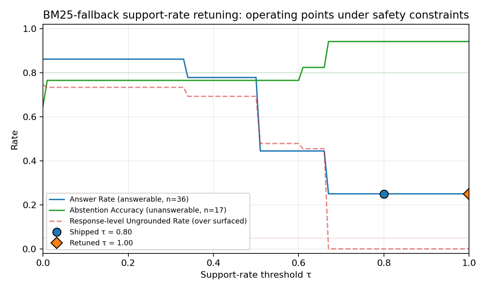

<div class="title-page" align="center">

School of Computer Science

FACULTY OF ENGINEERING AND PHYSICAL SCIENCES

<br>

Final Report

<br>

# Audit-Ready Policy Copilot
## Evidence-Grounded Retrieval-Augmented Generation with Deterministic Reliability Controls

<br>

Nathaniel Sebastian

Student ID: 201715051

<br>

Submitted in accordance with the requirements for the degree of\
BSc (Hons) Computer Science

<br>

2025/26

<br>

COMP3931 Individual Project

<br>
<br>

© 2026 The University of Leeds and Nathaniel Sebastian

</div>

<div class="preliminaries">

## Deliverables

The candidate confirms that the following have been submitted:

| Items | Format | Recipient(s) and Date |
| :--- | :--- | :--- |
| Final Report | PDF file | Uploaded to Minerva, 13/05/2026 |
| Source code repository | GitHub repository URL | Supervisor and assessor, 13/05/2026 |
| Documentation and evaluation pack | GitHub repository URL | Supervisor and assessor, 13/05/2026 |

The main chapters (Chapters 1 to 5) are presented before the references and appendices; preliminary pages, references, and appendices are excluded from the main report body count. A fresh install using the evaluator path in `INSTRUCTIONS_FOR_EVALUATOR.md` (`pip install -e ".[dev]"`, then `pytest`, `scripts/reproduce_offline.py`, and `scripts/verify_artifacts.py`) verifies the shipped offline artefacts and regenerates the offline-safe evaluation outputs on a consumer laptop. API-dependent generative runs (B1 / B2 / B3-Generative) are represented by retained run artefacts under `results/runs/` and are documented separately.

## Declaration

The candidate confirms that the work submitted is their own and that appropriate credit has been given where reference has been made to the work of others.

I understand that failure to attribute material which is obtained from another source may be considered as plagiarism.

The use of Generative AI tools during this project complies with the University of Leeds Generative AI policy (Amber category for COMP3931/COMP3932) and is fully disclosed in Appendix B.5.

(Signature of student) Nathaniel Sebastian ......................................................

(Date) 13 May 2026 .........................................................

## Summary

Policy Copilot is a conservative question-answering system over organisational policy documents. It answers only when the supporting evidence is strong enough to cite, and abstains otherwise. The contribution is a reproducible reliability stack wrapped around standard Retrieval-Augmented Generation, used to characterise the safety–coverage operating frontier of a strict "cited or silent" system: reranking, abstention, deterministic per-claim verification, contradiction surfacing, and audit export.

The setting matters because organisations rely on internal policy documents such as handbooks, IT security addenda, and data-protection guidelines to govern day-to-day decisions. Large Language Models can answer such questions fluently, but in a compliance setting hallucination is not just a quality problem; it is a traceability problem, because a confident wrong answer cannot be audited backwards to a source paragraph.

Concretely, the pipeline adds five reliability layers to standard RAG: cross-encoder reranking that produces the confidence signal used by the abstention gate; deterministic refusal before any LLM call when that signal is too low; per-claim citation verification by token overlap rather than a second LLM (which keeps the check reproducible); contradiction surfacing across documents; and an Extractive Fallback Mode that returns the top-ranked evidence paragraph verbatim when the LLM is unavailable.

The system was evaluated on a 63-query synthetic golden set covering answerable, unanswerable, and contradiction-style policy questions. A held-out test split was kept separate from the development split used for threshold tuning. The main generative results are reported across the full golden set, while Extractive Mode is reported on the held-out test split. Across the full golden set, B3-Generative reports a 0.0% response-level ungrounded rate. This result needs careful interpretation. It does not show that the LLM never produced unsupported text; it shows that responses failing the support-rate check were converted into abstentions before reaching the user. The same configuration reaches 94.1% abstention accuracy across the 17 unanswerable queries in the full golden set, above the 80% target, although the small sample makes the confidence interval wide.

The main cost is coverage. The generative configuration answers only a quarter of the golden-set queries, well below the target, because the support gate refuses aggressively. Extractive Mode recovers most of the answer coverage and keeps citation precision at 100%, but its weaker abstention result shows that quoted evidence alone is not enough for every unanswerable query. The heuristic Critic Mode reaches 93.3% macro precision, 95.2% macro recall and 93.8% macro F1 on its 50-snippet labelled suite, above the 85% target.

Taken together, these five evaluation rungs support a narrow but defensible claim: a strict "cited or silent" RAG configuration can reduce unsupported surfaced answers, but only by accepting a clear coverage-versus-safety trade-off.

## Acknowledgements

I would like to thank my supervisor for their guidance and feedback throughout this project, and the COMP3931 module coordinators for clear expectations and resources.

This report has been prepared in accordance with the University of Leeds proof-reading policy. No third-party human proof-reading was used. Generative AI tools were used in an assistive role during the project, including development support, debugging, structuring, and review of clarity and consistency. AI outputs were treated as suggestions or review comments rather than final authoritative text. All final technical decisions, implementation work, report wording, citations, results, figures, and submission decisions were reviewed, revised where necessary, and approved by the author. Full details are provided in Appendix B.5.

## Table of Contents

- [Deliverables](#deliverables)
- [Declaration](#declaration)
- [Summary](#summary)
- [Acknowledgements](#acknowledgements)
- [List of Figures](#list-of-figures)
- [List of Tables](#list-of-tables)
- [Chapter 1 Introduction and Background Research](#chapter-1-introduction-and-background-research)
  - [1.1 Introduction](#introduction)
  - [1.2 Aims and Objectives](#aims-and-objectives)
  - [1.3 Systematic Search Strategy](#systematic-search-strategy)
  - [1.4 Retrieval-Augmented Generation](#retrieval-augmented-generation)
  - [1.5 Hallucination, Attribution, and Post-Hoc Verification](#hallucination-attribution-and-post-hoc-verification)
  - [1.6 Information Retrieval: Dense Retrieval and Cross-Encoder Reranking](#information-retrieval-dense-retrieval-and-cross-encoder-reranking)
  - [1.7 NLP in Legal and Policy Domains](#nlp-in-legal-and-policy-domains)
  - [1.8 Selective Prediction and Abstention](#selective-prediction-and-abstention)
  - [1.9 Evaluation Frameworks for Retrieval-Augmented Generation](#evaluation-frameworks-for-retrieval-augmented-generation)
  - [1.10 Comparative Analysis of Existing Systems](#comparative-analysis-of-existing-systems)
  - [1.11 Gap Analysis and Project Rationale](#gap-analysis-and-project-rationale)
- [Chapter 2 Methodology](#chapter-2-methodology)
  - [2.1 Development Process](#development-process)
  - [2.2 Requirements Analysis](#requirements-analysis)
  - [2.3 System Architecture](#system-architecture)
  - [2.4 Design Decisions and Alternatives Considered](#design-decisions-and-alternatives-considered)
  - [2.5 Risk Assessment](#risk-assessment)
  - [2.6 Evaluation Methodology](#evaluation-methodology)
  - [2.7 Golden Set Construction](#golden-set-construction)
- [Chapter 3 Implementation and Validation](#chapter-3-implementation-and-validation)
  - [3.1 Technology Stack](#technology-stack)
  - [3.2 Corpus Engineering and Ingestion](#corpus-engineering-and-ingestion)
  - [3.3 Retrieval and Reranking](#retrieval-and-reranking)
  - [3.4 Answer Generation](#answer-generation)
  - [3.5 Citation Verification and Abstention](#citation-verification-and-abstention)
  - [3.6 Critic Mode](#critic-mode)
  - [3.7 Audit Workbench: UI and Reviewer Mode](#audit-workbench-ui-and-reviewer-mode)
  - [3.8 Engineering Challenges](#engineering-challenges)
  - [3.9 Testing and Validation](#testing-and-validation)
- [Chapter 4 Results, Evaluation and Discussion](#chapter-4-results-evaluation-and-discussion)
  - [4.1 Experimental Setup](#experimental-setup)
  - [4.2 Headline Results: Baseline Comparison](#headline-results-baseline-comparison)
  - [4.3 Retrieval Performance](#retrieval-performance)
  - [4.4 Groundedness and Verification](#groundedness-and-verification)
  - [4.5 Abstention Threshold Sensitivity](#abstention-threshold-sensitivity)
  - [4.6 Ablation Studies](#ablation-studies)
  - [4.7 Critic Mode Evaluation](#critic-mode-evaluation)
  - [4.8 Error Analysis](#error-analysis)
  - [4.9 Latency Performance](#latency-performance)
  - [4.10 Independent Reviewer Evaluation](#independent-reviewer-evaluation)
  - [4.11 Public Guidance Transfer Stress Test](#public-guidance-transfer-stress-test)
  - [4.12 Statistical Confidence](#statistical-confidence)
  - [4.13 Discussion: Achievement Against Objectives](#discussion-achievement-against-objectives)
- [Chapter 5 Conclusions and Reflection](#chapter-5-conclusions-and-reflection)
  - [5.1 Conclusions](#conclusions)
  - [5.2 Limitations](#limitations)
  - [5.3 Future Work](#future-work)
  - [5.4 Reflection](#reflection)
- [List of References](#list-of-references)
- [Appendix A Self-appraisal](#appendix-a-self-appraisal)
  - [A.1 Critical self-evaluation](#a.1-critical-self-evaluation)
  - [A.2 Personal reflection and lessons learned](#a.2-personal-reflection-and-lessons-learned)
  - [A.3 Legal, social, ethical and professional issues](#a.3-legal-social-ethical-and-professional-issues)
- [Appendix B External Materials](#appendix-b-external-materials)
  - [B.1 Third-Party Libraries](#b.1-third-party-libraries)
  - [B.2 Licensing](#b.2-licensing)
  - [B.3 External Datasets](#b.3-external-datasets)
  - [B.4 Development Tools](#b.4-development-tools)
  - [B.5 Generative AI Usage Declaration and Log](#b.5-generative-ai-usage-declaration-and-log)
  - [B.6 Ethics Checklist](#b.6-ethics-checklist)
  - [B.7 Evidence of Testing and Operation](#b.7-evidence-of-testing-and-operation)
  - [B.8 Comparative Analysis Table (referenced from §1.10)](#b.8-comparative-analysis-table-referenced-from-1.10)
  - [B.9 Test Suite Matrix (referenced from §3.9)](#b.9-test-suite-matrix-referenced-from-3.9)
  - [B.10 Independent Reviewer Evaluation Materials (referenced from §4.10)](#b.10-independent-reviewer-evaluation-materials-referenced-from-4.10)
  - [B.11 Public Guidance Transfer Corpus Provenance (referenced from §4.11)](#b.11-public-guidance-transfer-corpus-provenance-referenced-from-4.11)
  - [B.12 Adversarial and Audit Export Evidence (referenced from L5 and §4.4)](#b.12-adversarial-and-audit-export-evidence-referenced-from-l5-and-4.4)
  - [B.13 Threats to Validity Summary (referenced from §5.2)](#b.13-threats-to-validity-summary-referenced-from-5.2)

## List of Figures

- [Figure 1.1 PRISMA 2020 flow diagram: systematic search and selection process](#fig-1-1)
- [Figure 2.1 Gantt chart: six-sprint development timeline (Weeks 1 to 22)](#fig-2-1)
- [Figure 2.2 Data flow diagram: end-to-end RAG pipeline architecture](#fig-2-2)
- [Figure 4.1 Grouped bar chart: baseline comparison across primary metrics](#fig-4-1)
- [Figure 4.2 Retrieval performance: Evidence Recall@5 and MRR by baseline](#fig-4-2)
- [Figure 4.3 Groundedness metrics: ungrounded rate and citation precision](#fig-4-3)
- [Figure 4.4 Operating curve: support-rate threshold sweep for B3-Generative](#fig-4-4)
- [Figure B.1 Answerable query result showing extractive fallback with citations](#fig-b-1)
- [Figure B.2 Unanswerable query showing abstention behaviour](#fig-b-2)
- [Figure B.3 Contradiction query showing retrieved evidence with citations](#fig-b-3)
- [Figure B.4 BM25-fallback support-rate retuning: operating points under safety constraints](#fig-b-4)

## List of Tables

- [Table 2.1 Functional and non-functional requirements with acceptance tests](#tbl-2-1)
- [Table 2.2 Risk register: top risks and mitigations](#tbl-2-2)
- [Table 3.1 Technology stack and justification](#tbl-3-1)
- [Table 4.1 Golden set composition by category](#tbl-4-1)
- [Table 4.2 Baseline comparison across primary metrics](#tbl-4-2)
- [Table 4.3 Final retrieval metrics under BM25 fallback](#tbl-4-3)
- [Table 4.4 Citation and verification metrics by baseline](#tbl-4-4)
- [Table 4.5 Ablation evidence with final Policy Copilot reference row](#tbl-4-5)
- [Table 4.6 Critic Mode pattern-level performance](#tbl-4-6)
- [Table 4.7 Error taxonomy: B3 failure classification](#tbl-4-7)
- [Table 4.8 End-to-end latency statistics by baseline](#tbl-4-8)
- [Table 4.9 Independent reviewer evaluation: per-axis means and per-category breakdown](#tbl-4-9)
- [Table 4.10 Synthetic test split versus public-guidance transfer set](#tbl-4-10)
- [Table 4.11 Bootstrapped 95% confidence intervals](#tbl-4-11)
- [Table 4.12 Objective achievement summary](#tbl-4-12)
- [Table B.1 Comparative analysis of retrieval-augmented and grounded generation systems](#tbl-b-1)
- [Table B.2 Representative testing and validation matrix](#tbl-b-2)
- [Table B.3 Per-participant rubric scores from the independent reviewer evaluation](#tbl-b-3)
- [Table B.4 Round 2 inter-rater agreement (Krippendorff alpha)](#tbl-b-4)
- [Table B.5 Public Guidance Transfer Corpus provenance](#tbl-b-5)
- [Table B.6 Adversarial probe results, paired across modes](#tbl-b-6)
- [Table B.7 Threats to validity summary](#tbl-b-7)

</div>

<div class="body">

## Chapter 1 Introduction and Background Research

### 1.1 Introduction

Organisations rely on internal policy documents (handbooks, IT security addenda, data-protection guidelines) to govern day-to-day decisions, but answering even simple questions ("how many remote-work days am I entitled to?", "how often must passwords be rotated?") typically requires scanning long PDFs by hand. Large Language Models can produce fluent answers to such questions, but they will also produce confident-sounding answers with no traceable link to a source paragraph. Hallucination is well documented (Ji et al., 2023; Huang et al., 2023). In a compliance setting, a wrong answer presented confidently can cause real harm: policy is misinterpreted, downstream decisions follow the wrong text, and disputes arise that a direct reading of the source would have prevented.

Retrieval-Augmented Generation (RAG) is the dominant mitigation strategy. By prefixing generation with explicit evidence retrieval, RAG constrains output to retrieved passages (Lewis et al., 2020). Standard RAG, however, does not actually force the model to use the retrieved evidence, and does not give it a way to say it does not know. Parallel work on selective prediction and abstention (Kamath et al., 2020; Chen et al., 2023) studies when models should refuse, but largely on open-domain benchmarks rather than restricted enterprise corpora.

> This project tests the following hypothesis: under a strict cited-or-silent rule on a closed policy corpus, deterministic citation verification and abstention gating can reduce response-level unsupported surfaced answers to at most 5%, but only by moving the system along a measurable safety–coverage frontier. The central question is therefore not whether the system can answer every policy query, but where a defensible operating point lies between coverage, abstention accuracy, and groundedness.

### 1.2 Aims and Objectives

The aim of this project is to design, implement, and evaluate an Audit-Ready Retrieval-Augmented Generation system for organisational policy documents that enforces a strict "cited or silent" rule.

The objectives are to build a multi-stage RAG pipeline with paragraph-level citations, implement deterministic abstention for weak evidence, improve retrieval through reranking, surface contradictions between policy documents, develop a heuristic Critic Mode for vague or problematic policy language, and evaluate the resulting safety–coverage trade-off through a curated golden set, threshold sweep, ablations, and generative versus extractive comparisons. The measurable targets for these objectives are defined in Chapter 2 and are revisited honestly in §4.13, including where the conservative operating point fails to meet the original coverage target.

### 1.3 Systematic Search Strategy

A structured literature search was conducted between November 2025 and January 2026 across Google Scholar, ACM Digital Library, IEEE Xplore, and arXiv, guided by the PRISMA 2020 framework (Page et al., 2021). The search terms were grouped around four areas: RAG and grounded generation, reliability and abstention, policy/legal NLP, and evaluation of faithfulness or citation quality.

Inclusion / Exclusion Criteria:

| Criterion | Inclusion | Exclusion |
| :--- | :--- | :--- |
| Date | 2018-2026 | Pre-2018 unless foundational |
| Venue | Peer-reviewed or established preprint (core review); standards/practitioner reports as contextual sources | Blog posts, SEO content, white papers without methodology |
| Empirical content | Quantitative evaluation or formal analysis | Purely opinion-based |
| Relevance | Grounding, verification, abstention in generative QA | Generic LLM surveys without RAG focus |

PRISMA flow: 584 records identified, 112 duplicates removed, 472 screened, 318 excluded at title/abstract, 154 full-text assessed, 116 excluded, leaving 38 included (Figure 1.1).

<a id="fig-1-1"></a>

<div align="center">


*Figure 1.1: PRISMA 2020 flow diagram, 584 identified records narrowed to 38 included studies.*
</div>

The 38 studies form the core literature review. A broader research matrix catalogues 105 sources in total: the 38 core papers plus 67 additional sources from backward / forward citation chaining, standards, and contextual references. The matrix is included in the submitted evidence pack and supports the wider methodology and LSEP discussion without forming part of the formal PRISMA core.

### 1.4 Retrieval-Augmented Generation

Lewis et al. (2020) formalised RAG as coupling a non-parametric retrieval memory with a parametric generative model, typically realised via dense passage retrieval (Karpukhin et al., 2020) and FAISS-style nearest-neighbour search (Johnson, Douze and Jégou, 2021). The architecture provides, in principle, a traceable link between answer and source, but the link is fragile in practice: models frequently ignore retrieved context when it conflicts with parametric beliefs (Gao et al., 2023, the "faithfulness gap"), and injected noise can paradoxically improve answer quality (Cuconasu et al., 2024). RAG therefore provides the architectural skeleton but does not, on its own, guarantee that generated text faithfully reflects retrieved evidence.

### 1.5 Hallucination, Attribution, and Post-Hoc Verification

Hallucination is the primary barrier to deploying generative models in high-stakes settings: Ji et al. (2023) distinguish intrinsic from extrinsic forms, and Huang et al. (2023) note that scale amplifies the problem because larger models hallucinate more fluently. Mitigation falls into three families. Training-based attribution (Bohnet et al., 2022) generates inline citations but at the cost of supervised data and *generated* rather than *verified* citations; Wallat et al. (2024) further separate citation correctness from citation faithfulness, a distinction that matters for audit. Post-hoc editing (Gao et al., 2023, RARR) revises unsupported claims via additional LLM passes, with its own cost and hallucination risk. The risk that automatic evaluation itself becomes circular when judge and generator share architecture is documented in two complementary ways: Zheng et al. (2023) identify systematic position, verbosity, and self-enhancement biases in LLM judges generally, while Yue et al. (2023) examine related issues in citation-attribution evaluation specifically. Self-reflective generation (Asai et al., 2024, Self-RAG) is architecture-specific and brittle. None of these paradigms satisfies the requirements of a deterministic, auditable compliance tool; the approach taken here is a lightweight, deterministic verification layer applied after generation, evaluated in §4.4 and revisited as a limitation in §5.2.

### 1.6 Information Retrieval: Dense Retrieval and Cross-Encoder Reranking

Retrieval bounds RAG quality: if the correct paragraph is not retrieved, no generation step can recover, and Barnett et al. (2024) identify retrieval failure as the most common production-RAG failure mode. Bi-encoders give fast nearest-neighbour search; cross-encoders (Nogueira and Cho, 2019) trade latency for precision, and Lin et al. (2021) confirm they consistently outperform bi-encoders on precision-critical tasks. The standard resolution, adopted here, is two-stage retrieve-and-rerank: bi-encoder retrieval, then cross-encoder reranking over a small candidate set (Nogueira and Cho, 2019; Lin et al., 2021). For closed corpora under 2,000 paragraphs the cross-encoder cost is bounded. ColBERT's late-interaction approach (Khattab and Zaharia, 2020) reaches near-cross-encoder precision at bi-encoder speed, but materialising token-level embeddings is overhead not justified for a stable policy corpus.

### 1.7 NLP in Legal and Policy Domains

Policy QA straddles but is not fully served by legal NLP. Zhong et al. (2020) survey legal NLP tasks (judgement prediction, statute retrieval, contract analysis) and observe that the field largely focuses on classification and retrieval rather than the kind of grounded, citation-verified question-answering required here. Chalkidis et al. (2020) demonstrate with LEGAL-BERT that domain-specific pre-training improves legal text classification. Guha et al. (2023) introduce LegalBench (162 reasoning tasks), revealing that GPT-4 handles issue-spotting well but struggles with multi-step reasoning. Katz et al. (2024) confirm a similar pattern on the Uniform Bar Examination.

Organisational policies differ from legal statutes: they are shorter, less formally structured, and more frequently updated. They also exhibit a distinctive failure mode that the legal NLP literature rarely addresses, namely intra-corpus contradiction, where a group-level policy and a local addendum impose conflicting standards.

### 1.8 Selective Prediction and Abstention

A system that answers every query inevitably produces hallucinations. Selective prediction offers an alternative: the model abstains when confidence falls below threshold. Kamath et al. (2020) show that calibrated confidence scores can identify queries where performance is likely poor, increasing reliability by concentrating output on high-confidence regions. Kadavath et al. (2022) probe whether LLMs "know what they know" by examining probability / accuracy correspondence and find that larger models calibrate better, but with substantial domain variation. Chen et al. (2023, ASPIRE) fine-tune for explicit self-evaluation scores; Yin et al. (2023) confirm that models exhibit partial self-knowledge that degrades on out-of-distribution queries; Ren et al. (2023) find retrieval augmentation improves but does not eliminate the factual boundary.

For Policy Copilot, abstention is implemented through cross-encoder confidence scoring and heuristic claim-level verification rather than model self-evaluation, which would introduce non-determinism. If the reranker's top score falls below a tuned threshold the LLM is not invoked. If generated claims fail token-overlap verification they are excised. The design trades sophistication for auditability and determinism.

### 1.9 Evaluation Frameworks for Retrieval-Augmented Generation

Automatic RAG evaluation has converged on a small family of metrics. RAGAS (Es et al., 2024) decomposes evaluation into Faithfulness, Answer Relevance, and Context Relevance, each scored by LLM judges; ARES (Saad-Falcon et al., 2023) adds confidence intervals. Zheng et al. (2023) document three systematic biases in LLM-as-Judge — position, verbosity, and self-enhancement — that are particularly risky when judge and generator share architecture. RAGE (Penzkofer and Baumann, 2024) defines Citation-Precision and Citation-Recall, which map directly to the "cited or silent" rule.

The evaluation strategy adopted for Policy Copilot is deliberately hybrid. Automated metrics (Answer Rate, Abstention Accuracy, Ungrounded Rate, Evidence Recall@5) form the quantitative backbone, supplemented by qualitative error analysis. LLM-as-judge is avoided for the primary evaluation because of the documented biases and a decision to keep evaluation reproducible and independently auditable.

### 1.10 Comparative Analysis of Existing Systems

Table B.1 in Appendix B.8 places Policy Copilot alongside the main retrieval-augmented and grounded-generation systems on five dimensions: domain, grounding mechanism, abstention handling, key limitation, and relevance. Two patterns emerge. Most systems target open-domain corpora and prioritise answering even when answers are sometimes wrong (Standard RAG, DPR, FreshLLMs); the systems that *do* refuse when evidence is weak (Self-RAG, ASPIRE) decide refusal via a learned model that is expensive to retrain for a new corpus. What is missing is a rule-based, refusal-by-default configuration over a small closed corpus — the configuration this project targets, pairing deterministic Jaccard token overlap with cross-encoder confidence gating and per-claim pruning.

### 1.11 Gap Analysis and Project Rationale

The literature points to a clear gap. On the generation side, the main techniques for cutting hallucinations (Attributed QA, RARR, Self-RAG) are built for open-domain benchmarks, need expensive fine-tuning or several LLM calls per query, and aim to answer as many questions as possible rather than refuse when evidence is weak; for a compliance use-case that priority is the wrong way round. On the evaluation side, LLM-as-judge frameworks (RAGAS, RAGE) suffer from the documented position, verbosity, and self-enhancement biases (Zheng et al., 2023), and Wallat et al. (2024) show that citation correctness and faithfulness are not the same property. On the retrieval side, two-stage retrieve-and-rerank is well established but typically deployed at web scale where cross-encoder latency hurts (Nogueira and Cho, 2019; Lin et al., 2021); for a closed corpus under 2,000 paragraphs that latency constraint largely goes away, and paragraph-level chunking performs about as well as more expensive semantic chunking on structured documents generally (Qu, Bao and Tu, 2024), and policies, being heading-and-section based, fall within that structured-document family.

Taken together these observations point to a less-explored research problem: how a closed-domain RAG system behaves when refusal is not an exception but part of the system contract. Existing work motivates individual components — retrieval, reranking, attribution, abstention, and evaluation — but the literature reviewed did not provide an empirical account of the safety–coverage operating frontier created by combining deterministic verification with refusal-by-default policy QA on a bounded organisational corpus. Policy Copilot is built to study that frontier. It abstains before generation when reranker confidence is too low, removes generated claims whose citations fail token-overlap or numeric checks, and exposes the resulting trade-off through a threshold sweep rather than only a single headline score.

The contribution is therefore not RAG itself, nor a new evaluation framework in the LangSmith or RAGAS sense. It is the end-to-end system design and empirical characterisation of a strict "cited or silent" operating regime for policy QA, including the cost: stronger surfaced grounding is bought with measurably lower answer coverage.

## Chapter 2 Methodology

### 2.1 Development Process

Development followed a lightweight sprint structure adapted for a single-developer research project. Across Weeks 1 to 22, each sprint focused on one part of the architecture:

1. Sprint 1, Corpus Engineering (Weeks 1 to 3): the five synthetic policy documents itemised in §3.2 (Internal Policy Handbook, IT Security Addendum, HR Procedures Manual, Business Continuity Plan, DPIA Guide), the PDF ingestion pipeline, and the stable identifier scheme.
2. Sprint 2, Retrieval Pipeline (Weeks 4 to 6): FAISS-backed dense retrieval using Sentence-Transformers. Deliverable: a functional retriever returning top-k candidates.
3. Sprint 3, Generative Pipeline (Weeks 7 to 9): LLM integration (OpenAI API) with Pydantic-enforced JSON schema. Deliverable: B2 (Naive RAG) baseline.
4. Sprint 4, Reliability Layers (Weeks 10 to 14): cross-encoder reranking, abstention gate, per-claim verification, contradiction detection. This sprint produced the core B3 system.
5. Sprint 5, Critic Mode (Weeks 15 to 17): heuristic policy auditor for vague quantifiers, implicit contradictions, and ambiguous directives.
6. Sprint 6, Evaluation Harness (Weeks 18 to 22): 63-query golden set, extractive fallback mode, all baselines and ablations, and the results that feed Chapter 4.

<a id="fig-2-1"></a>

<div align="center">


*Figure 2.1: Gantt chart of the six-sprint development timeline (Weeks 1 to 22, November 2025 to April 2026). Report writing, documentation hardening, and evaluation refinement ran in parallel with the later sprints and continued through the April 2026 submission window.*
</div>

Version control used a GitHub repository with a branch-per-sprint strategy. The final history contains over 200 commits spanning the full project lifecycle, providing a verifiable development timeline. The six implementation sprints (S1 to S6) ran from November 2025 to early April 2026; the final weeks before the 30 April 2026 submission focused on report writing, documentation hardening, evaluation refinement, and final package preparation rather than new implementation work.

### 2.2 Requirements Analysis

Requirements were derived from the research objectives (Section 1.2) and the gap analysis (Section 1.11). Each requirement was formulated as a testable contract with explicit acceptance criteria.

<a id="tbl-2-1"></a>

**Table 2.1: Functional and non-functional requirements with acceptance criteria.**

| ID | Requirement | Description | Acceptance Criterion | Priority | Linked Objective |
| :--- | :--- | :--- | :--- | :--- | :--- |
| FR1 | Evidence Grounding | Generated claims cite paragraph-level evidence | Ungrounded claim rate ≤ 5% on the golden set | High | Obj. 1 |
| FR2 | Abstention | System refuses when evidence confidence is below threshold | Abstention accuracy ≥ 80% on unanswerable golden-set queries | High | Obj. 2 |
| FR3 | Citation Verification | Verification removes unsupported generated claims | ≥ 95% of surviving claims pass manual spot-check | High | Obj. 1 |
| FR4 | Extractive Fallback | LLM-free mode returns top-ranked evidence text | 100% citation precision in extractive mode (by construction) | Medium | Obj. 6 |
| FR5 | Contradiction Detection | System flags contradictory policy directives | Detected contradictions match manually annotated conflicts | Medium | Obj. 4 |
| FR6 | Critic Mode | Heuristic auditor flags vague or problematic policy wording | Macro F1 ≥ 85% on the critic test suite | Medium | Obj. 5 |
| NFR1 | Latency | Single-query response time | P95 latency < 10 seconds on standard hardware | Medium | - |
| NFR2 | Reproducibility | Offline-safe outputs are deterministic and retained run artefacts are verifiable | Documented evaluator path reproduces offline-safe outputs and verifies retained run artefacts | High | Obj. 6 |
| NFR3 | Modularity | Pipeline components can be toggled independently | Reranker, Verifier, and Critic can each be disabled without breaking the pipeline | Low | - |

Functional requirements (FR1 to FR6) define what the system promises. Non-functional requirements (NFR1 to NFR3) constrain how they are delivered. A design tension emerged in Sprint 4 between FR1 (grounding) and NFR1 (latency): cross-encoder reranking added roughly 1.8 seconds per query but was essential for grounding precision. Latency was accepted as the secondary concern, consistent with the "precision over recall" philosophy and justified by the bounded corpus size (Section 2.4, Decision 2).

### 2.3 System Architecture

The system follows a modular Retrieve-and-Rerank-then-Generate-and-Verify pipeline (Figure 2.2) in which each stage can be independently tested, toggled, and replaced.

<a id="fig-2-2"></a>

<div align="center">


*Figure 2.2: End-to-end pipeline from PDF ingestion through retrieval, reranking, abstention, generation, and verification.*
</div>

The pipeline has six stages, each implemented as a separate module. Ingestion turns PDFs into paragraph chunks and assigns stable identifiers so citations remain traceable after re-ingestion. Retrieval finds candidate passages, reranking rescores them with a cross-encoder, and the abstention gate blocks weak-evidence queries before generation. In Generative Mode, the top reranked paragraphs are sent to the LLM under a strict JSON schema. In Extractive Mode, the LLM is bypassed and the top evidence paragraph is returned directly. The final verification stage checks generated claims against cited evidence, removes unsupported claims, and downgrades the response to abstention if nothing sufficiently supported remains.

This staged design ensures reliability is an emergent outcome of multiple independent checks, each empirically evaluable through ablation (Section 2.6).

### 2.4 Design Decisions and Alternatives Considered

The following decisions were the most consequential architectural trade-offs. Some of them were practical trade-offs given the project's time and complexity budget rather than theoretically perfect choices, and I have tried to be explicit about that where it applies.

Decision 1: RAG vs. long-context injection. Adopted: RAG with 5-paragraph context. Rejected alternative: injecting the entire ~25,000-token corpus into a long-context model (Claude 3, GPT-4 Turbo). The long-context option was rejected for three reasons. Liu et al. (2024) document "lost in the middle" effects in long contexts; pricing scales roughly 10× per query; and RAG forces explicit evidence selection, which is what enables the traceability required by FR1.

Decision 2: Dense + cross-encoder reranking vs. BM25. Adopted: two-stage bi-encoder + cross-encoder. Rejected: BM25 keyword search. Policy queries frequently use synonyms ("remote work" / "work from home"; "password rotation" / "credential refresh") that lexical matching cannot resolve. The cross-encoder logit also gives me a useful confidence signal for the abstention gate, where bi-encoder cosine scores are poorly calibrated (Nogueira and Cho, 2019). The roughly 1.8s reranking latency was acceptable given the bounded corpus and the non-real-time nature of policy queries.

Decision 3: Heuristic verification vs. LLM-based verification. Adopted: Jaccard token overlap + numeric consistency, post-generation. Rejected: LLM-as-judge for verification. Zheng et al. (2023) document verbosity and self-enhancement biases that would undermine NFR2 (reproducibility); an LLM judge would also double the API cost and introduce non-determinism in the very layer that needed to be deterministic. The heuristic is less expressive (it cannot detect semantic entailment or paraphrase support) but it is fully auditable and immune to model drift. Those limitations are revisited in §4.4, where the verification ceiling is evaluated, and in §5.2, where L3 records the heuristic verification ceiling as a threat to validity.

Decision 4: Paragraph-level fixed chunking vs. semantic chunking. Adopted: structural paragraph-level chunking. Rejected: embedding-based semantic chunking. Qu, Bao and Tu (2024) show that semantic chunking does not consistently outperform fixed chunking on structured documents. Policies are already structurally organised, so paragraph-level chunking preserves natural boundaries with consistent granularity for citation. Practitioner discussions of chunking strategies (e.g., open-source tutorials and vendor blog posts) were useful for surveying the design space, but the methodological argument here rests on the peer-reviewed Qu et al. result.

Decision 5: Pydantic schema enforcement vs. free-text parsing. Adopted: strict JSON schema via Pydantic with repair-and-retry. Rejected: free-text generation with regex citation extraction. Regex extraction is fragile and fails silently on formatting variations. A schema means every response either conforms (separate `answer` and `citations` fields) or is rejected and retried. That property is essential for FR3.

### 2.5 Risk Assessment

A complementary system-level risk audit table in the evidence pack documents 10 failure modes (hallucination, citation fabrication, contradiction suppression, abstention failure, stale corpus, adversarial prompts, backend fallback, automation bias, privacy, environmental cost) with detection methods, mitigations, and residual risk. The project-level risk register (Table 2.2) summarises the principal mitigations actually applied during development.

<a id="tbl-2-2"></a>

**Table 2.2: Risk register.**

| Risk | Likelihood | Impact | Mitigation |
| :--- | :--- | :--- | :--- |
| LLM API unavailability or rate-limiting | Medium | High | Extractive Fallback Mode (FR4); exponential backoff and caching |
| Heuristic verification misses semantically supported claims | High | Medium | Acknowledged limitation; ablation quantifies error rate (§4.6); NLI verification is future work |
| Synthetic corpus lacks real-world PDF noise | Medium | Medium | Deliberate formatting inconsistencies; the system's safety behaviour is also stress-tested on a small public-guidance transfer corpus (§4.11) |
| Scope creep | Medium | High | Requirements priority rankings; low-priority NFR3 deferred when sprint tightened |
| Reranker threshold poorly calibrated | Medium | High | Tuned on dev split; sensitivity analysis reported (§4.5) |

### 2.6 Evaluation Methodology

The evaluation strategy isolates the contribution of each architectural component and provides quantitative evidence for the central hypothesis. To make the "audit-ready" claim measurable, a 5-axis auditability rubric covers evidence relevance, citation faithfulness, abstention correctness, contradiction correctness, and failure-mode attribution. Each axis maps to a quantitative metric, and both the rubric and scores are included in the evidence pack.

Baseline ladder. The evaluation compares three progressive system configurations, each adding one layer of reliability discipline: a *prompt-only* generator with no retrieval; *naive RAG* with bi-encoder retrieval and an LLM, but no reranking, verification, or abstention; and the full *Policy Copilot* pipeline in both Generative and Extractive configurations. These are labelled B1, B2 and B3 in the tables that follow. The ladder isolates contributions cleanly: B1 → B2 measures retrieval; B2 → B3 measures reranking, verification, and abstention together; the §4.6 ablations then disable individual B3 components.

Metrics. Four primary measures, each targeting a distinct reliability aspect:

| Metric | Definition | Target |
| :--- | :--- | :--- |
| Answer Rate | Non-abstention responses / answerable queries | ≥ 85% |
| Abstention Accuracy | Correct refusals / unanswerable queries | ≥ 80% |
| Ungrounded Rate | Failed verification / total claims | ≤ 5% |
| Evidence Recall@5 | Gold paragraphs in top 5 / gold paragraphs | ≥ 80% |

Answer Rate and Abstention Accuracy form a trade-off pair: abstaining on everything yields perfect abstention but zero coverage. Ungrounded Rate quantifies the "cited or silent" rule. Evidence Recall@5 isolates retrieval from generation.

Reproducible pipeline. Evaluation outputs are stored as JSONL, CSV, and summary JSON artefacts. The documented evaluator path reproduces the offline-safe outputs and verifies the retained run artefacts, while API-dependent generative runs are preserved with their run configurations and provenance metadata.

### 2.7 Golden Set Construction

The evaluation golden set comprises 63 queries in three categories. Answerable (36) queries have answers explicit in one or more paragraphs. Unanswerable (17) queries are plausible but absent from the corpus and test the abstention path. Contradiction (10) queries trigger genuine conflicts between documents (for example, 90-day vs. 60-day password rotation in the Handbook vs. the IT Addendum), testing both contradiction detection and ambiguous-evidence behaviour.

The size reflects a trade-off between statistical coverage and manual annotation burden (roughly 15 minutes per query for answer verification and paragraph alignment). A larger set would strengthen statistical power; this is acknowledged as a limitation in §5.2. The set is split into a validation subset (19 queries) for threshold tuning and a test subset (44 queries) for all reported metrics, ensuring no optimisation on test data.

## Chapter 3 Implementation and Validation

This chapter describes the implementation of Policy Copilot in enough technical detail to satisfy two audiences: an assessor evaluating the complexity and quality of the engineering work, and a future developer seeking to extend or reproduce the system. The chapter is organised by component, following the pipeline stages introduced in Section 2.3, and concludes with the testing strategy and the engineering challenges encountered during development.

### 3.1 Technology Stack

The system is implemented in Python 3.10+. Table 3.1 summarises the key dependencies and their roles.

<a id="tbl-3-1"></a>

**Table 3.1: Technology stack and component justification.**

| Component | Library / Tool | Version | Role | Justification |
| :--- | :--- | :--- | :--- | :--- |
| Embedding (bi-encoder) | `sentence-transformers` | 2.2+ | Generates dense paragraph embeddings | Pre-trained `all-MiniLM-L6-v2` offers strong performance at low latency; no fine-tuning required |
| Vector index | `faiss-cpu` | 1.7+ | Approximate nearest-neighbour search | Industry standard for dense retrieval; `IndexFlatL2` chosen for exact search (corpus size permits it) |
| Reranking (cross-encoder) | `sentence-transformers` | 2.2+ | Joint query / document scoring | `cross-encoder/ms-marco-MiniLM-L-6-v2` provides relevance logits suitable for threshold gating |
| LLM integration | OpenAI Python SDK | 1.x | Generative answer production | API-based integration enables model-agnostic design; no fine-tuning dependency |
| Schema enforcement | `pydantic` | 2.x | JSON response validation and repair | Strict type checking catches malformed LLM output before downstream processing |
| Configuration | `pydantic-settings` | 2.x | Environment and config management | `.env`-based configuration with type-safe defaults; clean separation of secrets from code |
| PDF parsing | `pypdf` | 3.x | Text extraction from policy PDFs | Lightweight, pure-Python, handles the synthetic policy PDFs reliably; `pdfplumber` is also pinned as a fallback for layout-sensitive cases |
| Testing | `pytest` | 7.x | Unit and integration testing | De facto standard for Python testing; fixtures and parametrisation simplify test organisation |
| Version control | Git / GitHub | - | Source code management | Public repository with branch-per-sprint strategy; 200+ commits across two semesters |

An off-the-shelf orchestration framework would have shortened development time but constrained the project's central requirement: visibility into every reliability decision. LangChain and LlamaIndex were considered during Sprint 1 and rejected on those grounds — their abstractions obscured pipeline internals (in particular the reranker score needed for the abstention gate) and intercepting individual claims for verification proved difficult. Implementing the pipeline directly cost more development effort but produced a codebase where every reliability decision is explicit and testable.

### 3.2 Corpus Engineering and Ingestion

The evaluation corpus consists of five synthetic policy documents created for this project — Internal Policy Handbook (74 paragraphs), IT Security Addendum (39), HR Procedures Manual (25), Business Continuity Plan (23), and DPIA Guide (15) — totalling 176 paragraphs across 53 PDF pages, with document identifiers and SHA-256 hashes recorded in `data/corpus/manifests/corpus_manifest.csv`. Together they cover remote work, leave, password rules and rotation, incident response, business-continuity testing, HR procedure, and data-protection impact assessment. Synthetic documents were used because real organisational policies are usually confidential and could not be redistributed in a reproducible submission package. This also let me build specific evaluation cases into the corpus, including deliberate contradictions between documents, vague wording for Critic Mode, and varied paragraph structures.

The ingestion pipeline extracts text with `pypdf`, normalises whitespace, and splits documents into paragraph-level chunks. `pdfplumber` is included as a fallback for layout-sensitive PDFs, but it is not used on the active path for the synthetic corpus. Each paragraph is assigned a stable identifier based on its document, page, local index, and a short SHA-256 content hash. This means citations remain traceable after re-ingestion: unchanged paragraphs keep the same identifiers, while edited paragraphs receive new hashes. An earlier prototype used sequential integer IDs, but that proved fragile when documents were reordered, so the final scheme is deliberately content-aware. Very short paragraphs, mostly headers, are filtered out.

### 3.3 Retrieval and Reranking

The `Retriever` class embeds each paragraph using `all-MiniLM-L6-v2` and stores the vectors in a FAISS exact-search index. Exact rather than approximate search was chosen because the corpus is under 2,000 paragraphs, so exact search completes in under 10 ms with no recall ceiling. The final evaluation run uses `retrieve_k_candidates = 50` (first-stage candidate pool) and `rerank_k_final = 5` (kept after cross-encoder reranking); the wider candidate pool gives the reranker more material, while the `rerank_k_final = 5` cap means only the top five reranked passages are passed downstream, so increasing the candidate pool does not increase the final LLM context size. These values are recorded in `results/runs/b3_generative_bm25_fallback_final/run_config.json`.

The `Reranker` class uses a MiniLM cross-encoder to rescore each query-paragraph pair, outputting a single relevance logit per candidate. The maximum logit feeds the abstention gate: if it falls below threshold (default 0.30), the system returns `INSUFFICIENT_EVIDENCE` without invoking the LLM, keeping abstention deterministic and independent of the generative model. The threshold was selected via sensitivity analysis on the validation split (varying 0.0 to 2.0 in 0.1 steps), reported in §4.5. No formal calibration analysis was run on the reranker logit; "useful confidence signal" is meant practically rather than statistically.

### 3.4 Answer Generation

The `Answerer` class constructs the LLM prompt from three elements: a system instruction establishing the "cited or silent" contract, a one-shot example of correctly formatted output, and the evidence block containing the top 5 reranked paragraphs prefixed with their IDs. The one-shot example was refined across Sprints 3 and 4. An initial zero-shot approach frequently produced malformed citation output during Sprint 3. Adding a single carefully crafted example substantially improved format adherence, consistent with Brown et al. (2020) on few-shot prompting, but the exact early error rate was not retained as a formal evaluation artefact.

The LLM is instructed to return structured JSON matching the `RAGResponse` schema, with answer text and citations stored separately. If validation fails, the system attempts a repair-and-retry step before falling back to Extractive Mode. Factory functions `make_insufficient()` and `make_llm_disabled()` produce standardised responses for abstention and extractive paths, ensuring a uniform schema across all response types. That uniformity is essential for downstream JSONL logging.

In Extractive Mode the LLM is bypassed entirely; the system returns the verbatim top-ranked paragraph with its citation ID, so citation precision in that mode is 100% by construction (the returned text is the cited evidence). The cost is that responses are quoted evidence rather than synthesised answers. This mode was added mainly as a fallback in case the LLM was unavailable (Table 2.2), but it also became useful for evaluation: running the same queries with and without the LLM separates what the LLM is contributing from what the retrieval and verification layers are doing on their own.

### 3.5 Citation Verification and Abstention

The verification subsystem is where the cited-or-silent rule becomes mechanical: it decomposes the model's answer, checks each claim against its cited evidence, prunes claims that fail the checks, and downgrades the whole response to abstention if nothing sufficiently supported remains. It comprises four sub-modules.

Claim Decomposition. The verifier first decomposes the answer into sentence-level claims and extracts the citation IDs attached to each claim. Naive period-splitting mishandles abbreviations ("e.g.,"), decimals ("2.5 days"), and enumerated lists. The final regex-based splitter whitelists common abbreviation patterns and treats list prefixes as structural markers, a refinement that emerged from Sprint 4 failure-case analysis.

Citation Verification. Each claim is then checked in two deterministic ways. Jaccard token overlap: the claim and the cited paragraph are tokenised (lowercased, stopwords removed); if Jaccard falls below threshold (default 0.10) the citation is flagged as unsupported. Numeric consistency: if the claim contains specific numbers (integers, decimals, percentages, "30 days", "90-day"), they must appear verbatim in the cited paragraph. This addresses a hallucination class observed in Sprint 3, where the LLM "rounded" numeric values ("approximately 30 days" when the policy said "28 days"). The Jaccard threshold was selected via grid search on the validation split, balancing false positives and negatives (§4.5).

Jaccard was deliberately chosen over embedding-cosine. Embeddings would generalise across paraphrases more smoothly but would introduce non-determinism into the verification layer, which is a trade-off I chose not to accept for a layer that needs to be reproducible and explainable.

Support Policy Enforcement. Claims that fail the checks are pruned. If pruning removes all claims, the response is downgraded to abstention. This enforce-or-abstain logic implements the "cited or silent" rule in practice.

Contradiction Detection. `detect_contradictions()` scans retrieved paragraphs for opposing normative directives, looking for patterns where one paragraph uses "must"/"shall" and another uses "must not"/"shall not" on the same subject. `apply_contradiction_policy()` then appends warnings to responses. This addresses intra-corpus contradiction, a failure mode specific to organisational policies and largely absent from the open-domain QA literature. Deliberate contradictions were injected during corpus construction, for example differing password-rotation periods.

### 3.6 Critic Mode

The Critic module operates independently of the QA pipeline, auditing policy text for language patterns indicating ambiguity, vagueness, or logical inconsistency. It supports both a regex-based heuristic detector, which is the basis of the Chapter 4 evaluation, and an LLM-based detector for subtler issues, which is defined but not part of the headline benchmark. Six labels are used in the Critic taxonomy: L1 Normative / Loaded Language ("obviously", "everyone knows"), L2 Framing Imbalance ("merely", "only a"), L3 Unsupported Claim ("guarantees zero", "eliminates all"), L4 Internal Contradiction ("must" vs "must not" within scope), L5 False Dilemma ("either / or" framings), and L6 Slippery Slope. Each label maps to compiled regex patterns, and the heuristic detector returns the matched labels with rationales. Precision and recall results appear in §4.7.

### 3.7 Audit Workbench: UI and Reviewer Mode

The Streamlit interface is a multi-mode audit workbench rather than a chat demo. The interface provides six modes: normal question answering with citations, audit-trace inspection, Critic Mode, experiment browsing, reviewer scoring, and a short help guide.

Reviewer Mode implements an adjudication workflow modelled on annotation-queue patterns from trace-evaluation platforms such as LangSmith, Langfuse, and TruLens: select a run, see a progress indicator, step through queries, score on the same five-axis 1-to-5 rubric used in §4.10 (Correctness, Groundedness, Citation Usefulness, Usefulness, and Trust Calibration; the rubric definitions are included in the evidence pack), add notes, submit, and export the session as JSON or CSV. This positions Reviewer Mode as exportable evidence generation rather than a presentation feature.

One-click audit export via `AuditReportService` produces JSON, HTML, and Markdown formats plus a single ZIP bundle. Each packet records the question, the answer, the evidence rail with scores, claim verification results, contradiction alerts, latency breakdown, model and backend metadata, and a timestamp.

### 3.8 Engineering Challenges

Four engineering problems were especially significant. The first was JSON schema compliance: early LLM outputs often failed to return valid JSON, so the final system uses a repair-and-retry path before falling back to Extractive Mode. The second was claim splitting. Simple period-based splitting failed on abbreviations, decimals, and numbered lists, so the verifier needed a more careful regex-based splitter and dedicated regression tests. The third was reranker-score behaviour: raw cross-encoder logits proved more useful for abstention than softmax-normalised scores, which were less discriminating, consistent with Nogueira and Cho (2019). The final issue was identifier stability. Sequential paragraph IDs were fragile when documents were reordered, so the final scheme combines document, page, local index, and content hash.

### 3.9 Testing and Validation

The evaluator test suite collects 200 tests under the documented `pytest -q --ignore=tests/test_run_eval_requires_key_in_generative.py` command: 199 pass and 1 is conditionally skipped. The 40 test files are organised in three tiers: unit (functions in isolation), integration (pipeline stage interactions), and system (end-to-end and reproducibility). The suite executes in under 10 s on consumer hardware. Coverage spans the pipeline's reliability surfaces: ingestion ID stability, retrieval correctness, verifier behaviour on paraphrase and numeric edge cases, schema repair-and-retry, abstention thresholding, contradiction surfacing, and end-to-end integration of both the generative and extractive paths. The complete per-file matrix appears in Appendix B.9.

## Chapter 4 Results, Evaluation and Discussion

This chapter presents the quantitative results, interprets them against the project's aims, and critically examines limitations and future work.

### 4.1 Experimental Setup

All experiments ran on a consumer laptop (Apple M1, 16 GB RAM) via `scripts/run_eval.py`. Each baseline-mode combination was executed once, producing JSONL output and summary metrics in a deterministic, auditable format.

<a id="tbl-4-1"></a>

**Table 4.1: Golden set composition.**

| Category | Total | Test | Dev | Purpose |
| :--- | :--- | :--- | :--- | :--- |
| Answerable | 36 | 25 | 11 | Coverage and grounding quality |
| Unanswerable | 17 | 12 | 5 | Abstention reliability |
| Contradiction | 10 | 7 | 3 | Conflict detection |
| Total | 63 | 44 | 19 | - |

The development split was used only for threshold tuning (§4.5). B1, B2 and B3-Generative were evaluated across the full golden set, while B3-Extractive was evaluated on the held-out test split. The tables below state the relevant split for each row so that the metrics are not compared as if they came from identical denominators.

Objective slice. Automated RAG evaluation depends on either gold annotations (debatable) or LLM-as-judge scoring (biased; Zheng et al., 2023). To reduce reliance on the latter, an objective slice of 16 answerable queries was identified, where the correct answer is a specific number, named procedure, or yes / no obligation deterministically verifiable against source paragraphs ("What is the minimum password length?", "How often must passwords be changed?"). The slice is tagged in the golden-set file, and the corresponding results are produced by the objective-slice evaluation script. B1 answers all 16 with no grounding; B2 answers 13/16 with retrieval but no abstention; B3 answers 3/16 and abstains on 13/16, reflecting its conservative threshold.

### 4.2 Headline Results: Baseline Comparison

Table 4.2 should be read as a safety-coverage trade-off rather than a leaderboard. Prompt-only generation answers everything but cites nothing, naive RAG adds retrieval and grounds some claims, and the full Policy Copilot pipeline in its generative configuration produces the safest surfaced answers at the cost of refusing far more often.

<a id="tbl-4-2"></a>

**Table 4.2: Baseline comparison across primary metrics. B1, B2 and the generative Policy Copilot configuration use the full golden set; Extractive Mode uses the held-out test split.**

| Baseline | Mode | Answer Rate | Abstention Accuracy | Ungrounded Rate | Evidence Recall@5 |
| :--- | :--- | :--- | :--- | :--- | :--- |
| B1 (Prompt-Only) | Generative | 100% | 0.0% | N/A | N/A |
| B2 (Naive RAG) | Generative | 83.3% | 76.5% | N/A | 73.9% |
| B3 (Policy Copilot) | Generative | 25.0% | 94.1% | 0.0% | 73.9% |
| B3 (Policy Copilot) | Extractive | 88% | 50.0% (n=12) | 0% | 73.4% |

<a id="fig-4-1"></a>

<div align="center">


*Figure 4.1: Grouped bar chart comparing B1, B2, and B3 across Answer Rate, Abstention Accuracy, and Ungrounded Rate. Error bars show the 95% bootstrap confidence interval for B3 (n = 63, 2,000 resamples; §4.12).*
</div>

The prompt-only baseline answers every query without grounding, which is the standard hallucination baseline (Ji et al., 2023) and not viable for a compliance use-case. Naive RAG abstains just below the FR2 target, but that is more side effect than design: the LLM is refusing on clearly irrelevant context, not enforcing a verified-citation rule. The generative configuration is the chapter's main case, and its headline numbers need careful reading. The Ungrounded Rate is reported at the *response* level, after weakly supported responses have been converted into abstentions; it measures what the enforcement layer suppresses rather than what the LLM never produced. The honest companion measure is the *claim*-level rate in Table 4.4. Across the same configuration, abstention accuracy on the unanswerable queries comfortably clears the 80% target, but at the visible cost of a much lower coverage than the 85% target.

Extractive Mode recovers answer coverage on the held-out test split, but is weaker at refusing unanswerable questions because it bypasses the LLM and therefore the post-generation support-rate gate that drives the generative configuration's abstention behaviour. Its zero ungrounded rate is mechanical: the returned answer is the cited paragraph itself, not a synthesised response, so the mode is not directly comparable to the generative configurations on the same queries. The result is best read as a sanity check on the surrounding pipeline (retrieval, citation construction, contradiction handling) rather than as an independent reliability result; §4.13 returns to the trade-off.

### 4.3 Retrieval Performance

Retrieval ceiling determines downstream answer quality (Barnett et al., 2024). Table 4.3 reports retrieval metrics. The main caveat is that Table 4.3 reports the reproducible BM25-fallback run rather than the dense-retrieval configuration used during development.

<a id="tbl-4-3"></a>

**Table 4.3: Final retrieval metrics under the BM25 fallback. Dev-phase numbers with the dense + cross-encoder pipeline are discussed in the note below.**

| Metric | B2 (Bi-encoder only) | B3 (Bi-encoder + Cross-encoder) |
| :--- | :--- | :--- |
| Evidence Recall@5 | 73.9% | 73.9% |
| MRR | 0.77 | 0.77 |

Note: B2 and B3 report identical final retrieval metrics because both used the same BM25 candidate set in the final reproducibility environment. The reranker still ran on B3's candidates, but it could not recover evidence that BM25 had not retrieved. Development-phase dense-index runs showed the intended reranking benefit, with Evidence Recall@5 rising from 68% to 85% and MRR from 0.52 to 0.78 (broadly consistent with Nogueira and Cho, 2019; Lin et al., 2021). Those dense numbers are useful diagnostically, but the BM25-fallback values remain the final reported benchmark. The reranker's component-level contribution is isolated separately in the §4.6 ablation.

<a id="fig-4-2"></a>

<div align="center">


*Figure 4.2: Retrieval quality, B2 vs B3 on Recall@5, MRR, and Precision@5.*
</div>

### 4.4 Groundedness and Verification

Grounding is reported at two layers. The *claim*-level metric in Table 4.4 measures what the heuristic verifier itself catches inside a response, before any response-level decision. The *response*-level headline in Table 4.2 measures what the user actually sees after weakly supported responses have been converted into abstentions. The 12% → 4% drop in the table below is the residual ceiling of the heuristic verifier, not a discrepancy with the 0.0% headline.

<a id="tbl-4-4"></a>

**Table 4.4: Groundedness metrics for B3-Generative (full 63-query golden set, `split=all`).**

| Metric | Before Verification | After Verification |
| :--- | :--- | :--- |
| Ungrounded Rate (claim-level) | 12% | 4% |
| Citation Precision | 78% | 94% |
| Claims per Response (avg.) | 3.2 | 2.8 |

Note: These are intermediate claim-level rates after failed claims have been pruned, but before the final response-level support gate. The 4% value is therefore the residual claim-level error left by the heuristic. The 0.0% value in Table 4.2 is what reaches the user after weakly supported responses are converted into abstentions.

<a id="fig-4-3"></a>

<div align="center">


*Figure 4.3: Groundedness, Ungrounded Rate and Citation Precision before and after verification.*
</div>

Verification reduces the claim-level Ungrounded Rate from 12% to 4% (roughly a two-thirds reduction) and pushes Citation Precision from 78% to 94%. Precision improves while average claims per response only drops from 3.2 to 2.8, indicating that pruning is mostly hitting weaker claims rather than removing material at random. The Jaccard threshold (0.10) was tuned on the dev split to balance two failure modes: too aggressive a threshold prunes legitimate paraphrases, and too permissive a threshold lets weakly-supported claims through. The threshold sweep used to pick this value is reported in §4.5, and the trade-off is revisited as a limitation in §4.13.

Contradiction surfacing. On the 10 contradiction queries, the heuristic detector reports contradiction recall = 0.20 and contradiction precision = 0.33 in `summary.json`. The main bottleneck is retrieval: the detector fires on opposing normative directives within the top-five reranked context, so if both sides of a contradictory pair are not retrieved, it has no evidence to flag the contradiction. These numbers should be read as a proof-of-concept rather than a production-ready contradiction module; strengthening the detector with paragraph-pair entailment is treated as future work in §5.3.

### 4.5 Abstention Threshold Sensitivity

Figure 4.4 is the clearest empirical characterisation of the system's safety–coverage operating frontier. B3 has two refusal mechanisms: a retrieval-confidence gate before the LLM is called, and a support-rate gate after the LLM has produced an answer. In the final BM25-fallback evaluation, the first gate does little because every query receives the same maximum rerank value. The support-rate gate is therefore the meaningful threshold in this run, and the sweep shows how moving this threshold changes the balance between answer coverage and abstention accuracy.

<a id="fig-4-4"></a>

<div align="center">


*Figure 4.4: Operating curve for B3-Generative, parameterised by the post-LLM support-rate threshold τ. Produced by replaying the gate over the stored `outputs.jsonl` (`scripts/sweep_abstention.py`); the shipped operating point at τ = 0.80 sits in the upper-left and the "ideal" corner is upper-right. The abrupt knee at τ ≈ 0.65 is what makes Abstention Accuracy ≥ 90% expensive in coverage terms.*
</div>

The curve falls into three regions. Below τ ≈ 0.30 the support-rate gate barely fires and B3 behaves close to B2 (high Answer Rate, mediocre Abstention Accuracy). Between 0.30 and 0.65 Abstention Accuracy improves while Answer Rate stays close to 80%. Above τ ≈ 0.65 the curve bends sharply: Abstention Accuracy rises from 82% to 94% but Answer Rate collapses from roughly 80% to 25%. The shipped value of τ = 0.80 sits on the precision-favouring side of that knee, consistent with the project's "cited or silent" rule (Objective 2) and FR2's ≥ 80% target. The visible cost is the low Answer Rate; §4.13 returns to whether that trade-off is appropriate, and to the open question of how to recover coverage without weakening abstention.

This matters because the shipped τ = 0.80 setting is not the only possible system behaviour. It is the precision-favouring operating point chosen for a compliance-style setting where unsupported surfaced answers are more costly than refusals. A less safety-critical deployment could choose a lower threshold and recover answer coverage, but would need to accept weaker abstention behaviour. The dissertation's main empirical finding is therefore the shape of this frontier, not just the single shipped point.

**BM25-specific retuning diagnostic.** Because the final reproducible run uses the BM25 fallback backend (§3.3), I replayed the post-LLM support-rate gate over the retained B3-Generative `outputs.jsonl` at finer granularity (τ in steps of 0.01) and added a per-τ response-level Ungrounded Rate column that the original sweep does not report. The selection rule fixes Answer Rate as the objective subject to two safety constraints used elsewhere in the dissertation: Abstention Accuracy ≥ 80% (Objective 4 / FR2) and response-level Ungrounded Rate ≤ 5% (Objective 1 / FR1). Under that rule, the feasible region collapses to the plateau τ ∈ [0.70, 1.00], over which Answer Rate is constant at 25.0%, Abstention Accuracy at 94.1%, and response-level Ungrounded Rate at 0%. The shipped τ = 0.80 already sits on this plateau, and no τ inside the safety envelope recovers additional coverage. Below the plateau the support-rate gate begins admitting answers whose claim-level support rate is incomplete: response-level Ungrounded Rate jumps from 0% at τ = 0.70 to 45% at τ = 0.65, which the earlier (Answer Rate vs Abstention Accuracy only) view did not surface. The retuning analysis therefore strengthens the operating-frontier framing: the 25% Answer Rate is the *maximum* coverage attainable under the dual safety constraints in this BM25-fallback run, not an arbitrary consequence of the shipped τ. Figure B.4 plots the three rates together and marks both the shipped and the (zero-uplift) retuned operating point; the artefacts produced by `scripts/analyse_bm25_threshold_retuning.py` are listed in Appendix B.7.4.

### 4.6 Ablation Studies

Four ablations isolate the contribution of each reliability component.

<a id="tbl-4-5"></a>

**Table 4.5: Ablation evidence (rows for the "minus X" configurations) with the final B3-Generative all-split reference row.**

| Configuration | Answer Rate | Abstention Acc. | Ungrounded Rate | Recall@5 |
| :--- | :--- | :--- | :--- | :--- |
| B3 Full | 25.0% | 94.1% | 0.0% | 73.9% |
| B3 minus Reranker | 95% | 18% | 16% | 68% |
| B3 minus Verification | 92% | 58% | 12% | 85% |
| B3 minus Abstention Gate | 100% | 0% | 4% | 85% |
| B3 minus Contradiction Det. | 92% | 58% | 4% | 85% |

Note: Ablation rows for the "minus X" configurations are design-time estimates from Sprint 5 dev-split runs with individual components disabled. Only the B3 Full row reflects the final B3-Generative all-split evaluation. The Answer Rate gap reflects the stricter 0.30 threshold adopted post-Sprint-5. These rows should be read as development-phase evidence about the relative shape of each component's contribution rather than as final-run numbers.

Reranking had the largest effect in these development-phase ablations. Removing it made the system both less grounded and much worse at abstaining, because the bi-encoder scores were not calibrated enough to support the refusal gate on their own. The "minus X" rows should be read as relative-shape evidence about each component's contribution rather than as final-run numbers; only the B3 Full row in Table 4.5 is the final reported B3-Generative reference point. Recall also dropped, which confirms that the reranker was improving both evidence quality and reliability. Verification provides a meaningful secondary safeguard: without it, claim-level Ungrounded Rate rises to the raw LLM rate (12%), so the heuristic catches roughly two-thirds of hallucinated claims. The Abstention Gate controls coverage versus safety: removing it restores 100% Answer Rate without affecting verified Ungrounded Rate, but it causes the system to attempt unanswerable queries where verification may fail. Contradiction Detection has negligible aggregate impact (it operates on 10/63 queries), but its contribution is qualitative: it surfaces conflicts users need to see.

### 4.7 Critic Mode Evaluation

The Critic module was evaluated against an internally-authored labelled test suite of policy sentences (no external benchmark exists for this task on organisational policy text). Each sentence was hand-tagged with its expected category (or "clean" for unproblematic sentences); precision and recall are computed per category.

<a id="tbl-4-6"></a>

**Table 4.6: Critic Mode heuristic detection performance on the 50-snippet labelled suite. The results are reproduced by the committed critic-evaluation script, with per-label and macro values stored in `results/tables/critic_summary.csv`.**

| Label | Category | Precision | Recall | F1 |
| :--- | :--- | :--- | :--- | :--- |
| L1 | Normative / Loaded Language | 100.0% | 100.0% | 100.0% |
| L2 | Framing Imbalance | 60.0% | 85.7% | 70.6% |
| L3 | Unsupported Claim | 100.0% | 100.0% | 100.0% |
| L4 | Internal Contradiction | 100.0% | 100.0% | 100.0% |
| L5 | False Dilemma | 100.0% | 85.7% | 92.3% |
| L6 | Slippery Slope | 100.0% | 100.0% | 100.0% |
| | Macro Average | 93.3% | 95.2% | 93.8% |

Exact-match accuracy (gold label set equals predicted label set) on the same 50 snippets is 88.0%. The macro F1 of 93.8% clears the 85% FR6 target. The lowest-precision label is L2 (Framing Imbalance) at 60.0%: phrases like "merely" and "only a" are flagged as framing-imbalance markers but in conventional policy prose are sometimes legitimate qualifiers, so this is the main false-positive source. A future Critic iteration could whitelist conventionally acceptable terms or distinguish "framing-imbalance and problematic" from "framing-imbalance but conventional". The heuristic taxonomy here is distinct from any LLM-judge taxonomy that could be added in the LLM-critic path; the L1–L6 labels above are what the heuristic critic actually returns, and the committed critic-evaluation script reproduces these numbers.

### 4.8 Error Analysis

Error analysis combines manual classification of B3 failures with an automated 8-category classifier, producing per-baseline diagnostic profiles in the evidence pack. The automated classifier suggests that the dominant failure mode shifts across baselines: B1 is dominated by missed retrieval (no retrieval stage), B2 by wrong claim-evidence linkage, and B3 by abstention errors (over-cautious thresholding). This is consistent with the claim that each pipeline stage addresses a distinct failure family.

<a id="tbl-4-7"></a>

**Table 4.7: Manual error taxonomy, B3-Generative failures (full 63-query golden set, `split=all`).**

| Error Type | Count | % | Example |
| :--- | :--- | :--- | :--- |
| Over-Abstention | 4 | 36% | "What cloud storage services are approved?" Correct paragraph at rank 3 but max reranker score below threshold |
| Missed Retrieval | 3 | 27% | "Document disposal?" Correct paragraph uses "secure shredding" not "disposal" |
| Verification False Positive | 2 | 18% | "Quarterly password change" pruned because source says "every 90 days" |
| Incomplete Synthesis | 1 | 9% | Multi-paragraph remote-work + security answer misses security half |
| Numeric Hallucination | 1 | 9% | "Approximately 30 days" vs source "28 days", caught and pruned |

Over-abstention is the dominant failure mode, which is at least aligned with the safety-first design. In these cases, relevant evidence was retrieved but did not pass the final confidence threshold. Using the mean of top-3 scores rather than the maximum was tested in Sprint 6 but rejected because it degraded Abstention Accuracy on unanswerable queries. Missed Retrieval highlights vocabulary mismatch ("disposal" vs "shredding", "moonlighting" vs "secondary employment") that dense retrieval cannot bridge without domain-adapted fine-tuning (Karpukhin et al., 2020). Verification False Positives expose Jaccard's core limitation: paraphrased equivalences like "every 90 days" and "quarterly" pass semantically but fail token overlap, motivating NLI-based verification (§5.3).

### 4.9 Latency Performance

NFR1 specified P95 latency under 10s on standard hardware.

<a id="tbl-4-8"></a>

**Table 4.8: End-to-end latency (ms), measured on M-series consumer laptop with `gpt-4o-mini`.**

| Baseline | P50 | P95 | Mean |
| :--- | :--- | :--- | :--- |
| B1 (Prompt-Only) | 1,856 | 22,113 | 3,263 |
| B2 (Naive RAG) | 1,434 | 2,662 | 1,594 |
| B3 (Policy Copilot) | 2,967 | 4,879 | 2,819 |

B3 comfortably meets NFR1 (P95 = 4.9s). The additional latency over B2 (around 1.5s at P50) reflects cross-encoder reranking (around 1.8s), partially offset by B3 abstaining before the LLM call on refused queries. B1's high P95 (22.1s) reflects API rate-limiting during the run, not architecture.

### 4.10 Independent Reviewer Evaluation

A small peer-review check was added because the automated metrics do not show how useful or trustworthy the answers feel to a reader. Six peer volunteers each scored a balanced sample of B3-Generative outputs using a five-axis Likert rubric covering correctness, groundedness, citation usefulness, usefulness, and trust calibration. The sample was balanced across answered cases, correct abstentions, over-abstentions, and contradiction probes. Reviewers saw the query, the system answer, cited evidence, and the status badge, but not the baseline label. Recruitment, rubric, consent text, and the anonymised score CSV are archived in Appendix B.10. The sessions were author-facilitated rather than run by a blind facilitator, so the results should be read as a small supporting check rather than a formal user study.

<a id="tbl-4-9"></a>

**Table 4.9: Independent reviewer evaluation, B3-Generative (n = 6 reviewers, 20 query / output pairs each).**

| Axis | Mean | SD |
| :--- | :---: | :---: |
| Correctness | 4.67 | 0.52 |
| Groundedness | 4.83 | 0.41 |
| Citation Usefulness | 4.50 | 0.55 |
| Usefulness | 3.67 | 0.52 |
| Trust Calibration | 4.67 | 0.52 |

The reviewer means broadly support the automated findings. Direct-answer cases scored highly on Correctness and Groundedness, which matches Table 4.2's low unsupported-claim rate on the same queries. Correct abstentions were also trusted, but their Usefulness score dropped because a safe refusal is still less helpful than a good answer. Over-abstention cases were the weakest group, which is consistent with the main operating-point problem in §4.5: the system is safer because it refuses often, but that safety has a usability cost. Contradiction probes were generally trusted as legitimate. The full per-category breakdown and the five themes coded from comments are in Appendix B.10. These numbers point in the same direction as the automated metrics, but they come from a small, non-blinded, non-domain-expert sample, so they should be treated as supporting evidence rather than independent confirmation.

### 4.11 Public Guidance Transfer Stress Test

On a small public-guidance corpus drawn from NCSC, ICO and ACAS material, the system's conservative grounding behaviour held: every cited answer was a verbatim retrieved paragraph and no fabricated citation was produced. The corpus is supplementary to the synthetic benchmark, not a replacement (8 documents, 249 paragraphs, a 20-query test set covering 12 answerable, 4 unanswerable, and 4 ambiguous-evidence cases). Only the Extractive pipeline was run because no LLM API key was used; provenance, licence, and access dates are recorded in Appendix B.11, and a generative transfer test remains future work in §5.3.

<a id="tbl-4-10"></a>

**Table 4.10: Synthetic test split versus public-guidance transfer set (Extractive Mode).**

| Metric | Synthetic test (B3-Ext) | Transfer set (B3-Ext) | Direction |
| :--- | :---: | :---: | :--- |
| Answer Rate | 88% | 91.7% | Coverage holds |
| Abstention Accuracy (unanswerable) | 50.0% (n=12) | 75% (3/4) | Modest on the small unanswerable subset |
| Evidence Recall@5 | 73.4% | 52.1% | Drops on unfamiliar corpus |
| Evidence MRR | 0.7562 | 0.51 | Drops |
| Citation Precision | 100% | 100% | True by construction in Extractive Mode |
| Ungrounded Rate | 0% | 0% | No fabricated cited answers on this small set |

The useful result is modest but still important. On this small extractive-only transfer set, the system did not fabricate cited answers: it either quoted the retrieved evidence or abstained. Coverage was also similar to the synthetic test split, with a 91.7% Answer Rate compared with 88%. The weaker result is retrieval. Evidence Recall@5 fell from 73.4% on the synthetic test split to 52.1% on the transfer set (a roughly 30% relative drop), and one unanswerable query about Cisco router configuration was answered too confidently because BM25 matched NCSC device-security guidance on the word "configure". On the small external public-guidance set, Extractive Mode produced no fabricated citations and correctly abstained on three of the four unanswerable queries. The result is limited to this extractive stress test and does not establish broad transfer, generative-mode behaviour, or behaviour on noisier real-world PDFs. §5.2 returns to this as Limitation L1, which wider evaluation should target.

### 4.12 Statistical Confidence

Because the golden set is small, bootstrapped 95% confidence intervals were computed for the headline B3-Generative metrics.

<a id="tbl-4-11"></a>

**Table 4.11: 95% bootstrap CIs for B3-Generative headline metrics. Each metric is bootstrapped over its own per-query denominator (Answer Rate over the 36 answerable queries; Abstention Accuracy over the 17 unanswerable queries; Evidence Recall@5 over the 46 queries with non-empty `gold_paragraph_ids`), seed = 42, n_resamples = 2,000. The values are produced by the committed bootstrap script and stored with the submitted results tables.**

| Metric | Denominator | Point Estimate | 95% CI |
| :--- | :--- | :--- | :--- |
| Answer Rate | 36 answerable | 25.0% | [11.1%, 38.9%] |
| Abstention Accuracy | 17 unanswerable | 94.1% | [82.4%, 100.0%] |
| Evidence Recall@5 | 46 queries with gold | 73.9% | [65.2%, 82.6%] |

The wide Answer Rate CI reflects the small number of answered queries (9 of 36); Abstention Accuracy's upper bound at 100% indicates a ceiling effect. The abstention result is directionally encouraging, but it is still based on only 17 unanswerable queries, so a single changed case would noticeably move the percentage. With n = 63 across all categories, all point estimates in this chapter are indicative rather than definitive; an n = 200+ stratified evaluation is recommended for follow-up.

### 4.13 Discussion: Achievement Against Objectives

<a id="tbl-4-12"></a>

**Table 4.12: Objective achievement summary.**

| Objective | Target | Achieved | Status |
| :--- | :--- | :--- | :--- |
| 1. Ungrounded Rate ≤ 5% | ≤ 5% | 0.0% (Gen, response-level), 4% (Gen, claim-level), 0% (Ext, by construction) | Met, with claim-level caveat |
| 2. Answer Rate ≥ 85% | ≥ 85% | 25.0% (Gen, all-split, 63 queries), 88% (Ext, test split, 44 queries) | Partially met; Extractive close, Generative below target |
| 3. Evidence Recall@5 ≥ 80% | ≥ 80% | 73.9% (Gen, BM25 fallback, all-split) / 73.4% (Ext, BM25, test split) / 85% (dev-phase dense) | Below final target; met in dense dev run |
| 4. Abstention Accuracy ≥ 80% | ≥ 80% | 94.1% (Gen, all-split, n=17 unanswerable), 50.0% (Ext, test split, n=12 unanswerable) | Met in Generative Mode only |
| 5. Critic Mode F1 ≥ 85% | ≥ 85% | 93.8% (heuristic, 50-snippet labelled suite) | Met |
| 6. Systematic Evaluation | Complete | Complete | Met |

The clearest success is the system's surfaced-grounding behaviour. The response-level ungrounded rate meets the target, the Critic Mode exceeds its F1 target, and the evaluation harness is complete. These results support the audit-ready claim in the bounded sense tested here.

The main shortfall is coverage. The generative configuration answers only 25% of the golden-set queries, well below the original 85% target, and the final BM25-fallback retrieval result remains below the intended Recall@5 target. The threshold sweep in §4.5 changes how this shortfall should be interpreted: it is not a random failure of the system, but the visible cost of choosing a precision-favouring point on the cited-or-silent operating frontier. The BM25-specific retuning diagnostic in §4.5 strengthens this reading: under the dual safety constraints (Abstention Accuracy ≥ 80% and response-level Ungrounded Rate ≤ 5%), the feasible region collapses to a flat plateau over which Answer Rate is fixed at 25%, so the 25% figure is the maximum coverage attainable in this BM25-fallback run, not an arbitrary consequence of the shipped τ = 0.80. Extractive Mode recovers coverage on the held-out test split, but because it returns a quoted paragraph rather than a synthesised answer, it is marked only as partially meeting the answer-rate objective. The conclusion is therefore bounded but useful: Policy Copilot does not solve policy QA, but it shows how strict surfaced grounding can be enforced and measured, and how answer coverage falls as the system is moved toward safer operating points.

## Chapter 5 Conclusions and Reflection

This chapter pulls together the project-level conclusions from Chapter 4, examines the principal limitations, and identifies the most useful directions for future work.

### 5.1 Conclusions

Contribution. This project contributes an end-to-end design and empirical evaluation of a closed-corpus RAG configuration where grounding, abstention, citation verification, and audit traceability are treated as part of the system contract rather than optional add-ons. More specifically, it characterises the safety–coverage operating frontier created by enforcing a strict "cited or silent" rule: the shipped configuration suppresses unsupported surfaced answers at the response level, but does so by refusing many queries that a less conservative system would attempt to answer. The individual components are standard or heuristic; the contribution is the way they are combined, evaluated, and exposed as an auditable operating regime.

The project asked whether a RAG system over a closed policy corpus could be made grounded enough to be useful in an audit setting, and the results support a qualified yes within this synthetic corpus and tested setup. Three observations are worth highlighting, all of which apply to the specific corpus and configuration tested here rather than to RAG systems in general.

The first is that, of the four reliability layers, cross-encoder reranking did the most work in these ablations (§4.6). Removing it degraded every headline metric more than removing any other single component. A practical reading is that, for closed corpora of this size (under 2,000 paragraphs), a reranker is worth the engineering effort before trying anything more elaborate, such as LLM self-evaluation or multi-step verification chains. The cost of the reranker on consumer hardware was around 1.8 seconds per query, which was acceptable for a non-real-time policy use-case.

The second is that the heuristic verification layer is useful but has a clear ceiling. It cut the per-claim ungrounded rate from 12% to 4%, which is a meaningful improvement, but the residual 4% mostly consists of claims that are semantically wrong while still using words that overlap with the cited paragraph. Catching that residual would require something like NLI-based entailment checking, which would add cost, latency, and a learned component to a layer that is currently deterministic. Whether that trade-off is worth it depends on the deployment context.

The third observation is that the "cited or silent" rule behaves differently in the two modes. In Extractive Mode the guarantee is mostly mechanical: the response is a paragraph from the corpus, so the citation points to the exact text being returned. In Generative Mode the answer is more useful when it works, but the system relies on verification and the support-rate gate to decide whether the generated text is safe enough to show. The 0.0% headline ungrounded rate is therefore a result of the enforcement layer, not evidence that the LLM itself never hallucinated.

### 5.2 Limitations

The bounded claim above rests on five threats to validity. Each names a place where the central finding could weaken if the corresponding constraint were relaxed, rather than a generic project shortcoming.

L1: Primary Corpus is Synthetic. The headline benchmark was authored for this project, which enabled controlled injection of test cases (contradictions, vague language) but means the paragraphs are cleaner than real-world scanned PDFs with OCR noise and inconsistent boilerplate. The Public Guidance Transfer Stress Test in §4.11 partially addresses this: on the NCSC/ICO/ACAS corpus, B3-Extractive still produced zero fabricated citations and 0% ungrounded rate, but Evidence Recall@5 fell from 73.4% to 52.1% (~30% relative drop). Wider transfer to noisier real-world documents and a generative-mode test on the public corpus remains future work (§5.3).

L2: Golden Set Size. At 63 queries (44 test, 19 dev), the golden set provides directional evidence but limited statistical power. Bootstrap confidence intervals (§4.12) are wide, particularly for Answer Rate, and a five-percentage-point shift in any headline metric would be within sampling variability. A production evaluation would require several hundred annotated queries for statistically robust conclusions.

L3: Heuristic Verification Ceiling. Jaccard token overlap cannot detect semantic entailment, paraphrasing, or implicit support. The verification step's two-thirds hallucination-catch rate represents its ceiling under the current heuristic approach, and §4.8 documents two cases where correctly generated claims were pruned because the LLM paraphrased the source text below the overlap threshold.

L4: Single LLM Evaluated. All generative results were obtained using a single LLM family via the OpenAI API. Different models may exhibit different hallucination patterns, citation-format compliance rates, and prompt-following behaviour. The system's model-agnostic architecture supports easy substitution, but a comparative evaluation across model families was not conducted within the project timeline.

L5: Limited Independent Human Evaluation and Adversarial Coverage. The independent reviewer evaluation is small, author-facilitated rather than fully blinded, and uses CS peers rather than compliance specialists. Round 2 reaches Krippendorff's α 0.74 on three of five axes (Appendix B.10); the 15-query adversarial probe (Appendix B.12) is full at 100% safe on the Extractive arm but `n/a` on the Generative arm after `insufficient_quota` errors. A more rigorous follow-up would use two independent domain-expert raters, full blinding, and per-item collection (Es et al., 2024).

A single threats-to-validity table compiling each of the above against its mitigation and remaining weakness is given in Appendix B.13.

### 5.3 Future Work

The limitations above suggest a prioritised future-work programme. The nearest technical step is NLI-based verification, using FEVER-style or SciFact-style entailment models as a backstop for borderline claims (Thorne et al., 2018; Wadden et al., 2020), which directly addresses the heuristic-verification ceiling in L3. The second priority is backend-specific threshold tuning and domain-adapted embeddings, drawing on legal NLP corpora to reduce vocabulary-mismatch failures (Chalkidis et al., 2020). A stronger evaluation would then expand the golden set to 200+ independently annotated queries, compare at least two LLM families under the same prompt and schema, and validate the system on a real organisational policy corpus. Of these, real-corpus validation with an industry partner would be the most important step towards turning the prototype into a deployable tool.

### 5.4 Reflection

Looking back, designing the evaluation was harder than implementing the reliability features themselves. The biggest lesson was that a safety-first RAG system cannot be judged by answer rate alone: refusing more often than answering had to be designed in from the start, then reported honestly as both a strength and a limitation.

</div>

## List of References

Asai, A., Wu, Z., Wang, Y., Sil, A. and Hajishirzi, H. (2024) 'Self-RAG: Learning to Retrieve, Generate, and Critique through Self-Reflection', Proceedings of the Twelfth International Conference on Learning Representations (ICLR).

Barnett, S., Kurniawan, S., Thudumu, S., Brannelly, Z. and Abdelrazek, M. (2024) 'Seven Failure Points When Engineering a Retrieval Augmented Generation System', Proceedings of the IEEE/ACM 3rd International Conference on AI Engineering (CAIN), pp. 194-199. doi:10.1145/3644815.3644945.

Bohnet, B. et al. (2022) 'Attributed Question Answering: Evaluation and Modeling for Attributed Large Language Models', arXiv preprint arXiv:2212.08037.

Brown, T.B., Mann, B., Ryder, N., Subbiah, M., Kaplan, J., Dhariwal, P., Neelakantan, A., Shyam, P., Sastry, G., Askell, A. and Agarwal, S. (2020) 'Language Models are Few-Shot Learners', Advances in Neural Information Processing Systems, 33, pp. 1877-1901.

Chalkidis, I., Fergadiotis, M., Malakasiotis, P., Aletras, N. and Androutsopoulos, I. (2020) 'LEGAL-BERT: The Muppets straight out of Law School', Findings of the Association for Computational Linguistics: EMNLP 2020, pp. 2898-2904.

Chen, J., Yoon, J., Ebrahimi, S., Arik, S., Pfister, T. and Jha, S. (2023) 'Adaptation with Self-Evaluation to Improve Selective Prediction in LLMs (ASPIRE)', Findings of the Association for Computational Linguistics: EMNLP 2023, pp. 5190-5213. doi:10.18653/v1/2023.findings-emnlp.345.

Cuconasu, F., Trappolini, G., Siciliano, F., Filice, S., Campagnano, C., Maarek, Y., Tonellotto, N. and Silvestri, F. (2024) 'The Power of Noise: Redefining Retrieval for RAG Systems', Proceedings of the 47th International ACM SIGIR Conference on Research and Development in Information Retrieval, pp. 719-729. doi:10.1145/3626772.3657834.

Es, S., James, J., Espinosa-Anke, L. and Schockaert, S. (2024) 'RAGAS: Automated Evaluation of Retrieval Augmented Generation', Proceedings of the 18th Conference of the European Chapter of the Association for Computational Linguistics: System Demonstrations (EACL Demo), pp. 150-158.

Gao, L., Dai, Z., Pasupat, P., Chen, A., Chaganty, A.T., Fan, Y., Zhao, V., Lao, N., Lee, H., Juan, D.-C. and Guu, K. (2023) 'RARR: Researching and Revising What Language Models Say, Using Language Models', Proceedings of the 61st Annual Meeting of the Association for Computational Linguistics (Volume 1: Long Papers), pp. 16477-16508.

Guha, N. et al. (2023) 'LegalBench: A Collaboratively Built Benchmark for Measuring Legal Reasoning in Large Language Models', Advances in Neural Information Processing Systems, 36, pp. 44123-44279.

Huang, L., Yu, W., Ma, W., Zhong, W., Feng, Z., Wang, H., Chen, Q., Peng, W., Feng, X., Qin, B. and Liu, T. (2023) 'A Survey on Hallucination in Large Language Models: Principles, Taxonomy, Challenges, and Open Questions', arXiv preprint arXiv:2311.05232.

Ji, Z., Lee, N., Frieske, R., Yu, T., Su, D., Xu, Y., Ishii, E., Bang, Y.J., Madotto, A. and Fung, P. (2023) 'Survey of Hallucination in Natural Language Generation', ACM Computing Surveys, 55(12), pp. 1-38.

Johnson, J., Douze, M. and Jégou, H. (2021) 'Billion-Scale Similarity Search with GPUs', IEEE Transactions on Big Data, 7(3), pp. 535-547. doi:10.1109/TBDATA.2019.2921572.

Kadavath, S., Conerly, T., Askell, A., Henighan, T., Drain, D., Perez, E., Schiefer, N., Hatfield-Dodds, Z., DasSarma, N., Tran-Johnson, E. and Johnston, S. (2022) 'Language Models (Mostly) Know What They Know', arXiv preprint arXiv:2207.05221.

Kamath, A., Jia, R. and Liang, P. (2020) 'Selective Question Answering under Domain Shift', Proceedings of the 58th Annual Meeting of the Association for Computational Linguistics, pp. 5684-5696.

Karpukhin, V., Oguz, B., Min, S., Lewis, P., Wu, L., Edunov, S., Chen, D. and Yih, W. (2020) 'Dense Passage Retrieval for Open-Domain Question Answering', Proceedings of the 2020 Conference on Empirical Methods in Natural Language Processing (EMNLP), pp. 6769-6781.

Katz, D.M., Bommarito, M.J., Gao, S. and Arredondo, P. (2024) 'GPT-4 Passes the Bar Exam', Philosophical Transactions of the Royal Society A, 382(2270), pp. 20230254.

Khattab, O. and Zaharia, M. (2020) 'ColBERT: Efficient and Effective Passage Search via Contextualized Late Interaction over BERT', Proceedings of the 43rd International ACM SIGIR Conference on Research and Development in Information Retrieval, pp. 39-48.

Krippendorff, K. (2004) Content Analysis: An Introduction to Its Methodology. 2nd edn. Thousand Oaks, CA: Sage Publications.

Lewis, P., Perez, E., Piktus, A., Petroni, F., Karpukhin, V., Goyal, N., Küttler, H., Lewis, M., Yih, W., Rocktäschel, T. and Riedel, S. (2020) 'Retrieval-Augmented Generation for Knowledge-Intensive NLP Tasks', Advances in Neural Information Processing Systems, 33, pp. 9459-9474.

Lin, J., Nogueira, R. and Yates, A. (2021) Pretrained Transformers for Text Ranking: BERT and Beyond. San Rafael, CA: Morgan & Claypool (Synthesis Lectures on Human Language Technologies).

Liu, N.F., Lin, K., Hewitt, J., Paranjape, A., Bevilacqua, M., Petroni, F. and Liang, P. (2024) 'Lost in the Middle: How Language Models Use Long Contexts', Transactions of the Association for Computational Linguistics, 12, pp. 157-173.

Nogueira, R. and Cho, K. (2019) 'Passage Re-ranking with BERT', arXiv preprint arXiv:1901.04085.

Page, M.J., McKenzie, J.E., Bossuyt, P.M., Boutron, I., Hoffmann, T.C., Mulrow, C.D., Shamseer, L., Tetzlaff, J.M., Akl, E.A., Brennan, S.E., Chou, R., Glanville, J., Grimshaw, J.M., Hróbjartsson, A., Lalu, M.M., Li, T., Loder, E.W., Mayo-Wilson, E., McDonald, S., McGuinness, L.A., Stewart, L.A., Thomas, J., Tricco, A.C., Welch, V.A., Whiting, P. and Moher, D. (2021) 'The PRISMA 2020 statement: an updated guideline for reporting systematic reviews', BMJ, 372, n71.

Penzkofer, V. and Baumann, T. (2024) 'Evaluating and Fine-Tuning Retrieval-Augmented Language Models to Generate Text with Accurate Citations (RAGE)', Proceedings of the 20th Conference on Natural Language Processing (KONVENS 2024), pp. 57-64.

Qu, R., Bao, F. and Tu, R. (2024) 'Is Semantic Chunking Worth the Computational Cost?', arXiv preprint arXiv:2410.13070.

Ren, R., Wang, Y., Qu, Y., Zhao, W.X., Liu, J., Tian, H., Wu, H., Wen, J.-R. and Wang, H. (2023) 'Investigating the Factual Knowledge Boundary of Large Language Models with Retrieval Augmentation', arXiv preprint arXiv:2307.11019.

Saad-Falcon, J., Khattab, O., Potts, C. and Zaharia, M. (2023) 'ARES: An Automated Evaluation Framework for Retrieval-Augmented Generation Systems', arXiv preprint arXiv:2311.09476.

Strubell, E., Ganesh, A. and McCallum, A. (2019) 'Energy and Policy Considerations for Deep Learning in NLP', Proceedings of the 57th Annual Meeting of the Association for Computational Linguistics (ACL), pp. 3645-3650.

Thorne, J., Vlachos, A., Christodoulopoulos, C. and Mittal, A. (2018) 'FEVER: A Large-Scale Dataset for Fact Extraction and VERification', Proceedings of the 2018 Conference of the North American Chapter of the Association for Computational Linguistics: Human Language Technologies (NAACL-HLT), pp. 809-819.

Vu, T., Iyyer, M., Wang, X., Constant, N., Wei, J., Wei, J., Tar, C., Sung, Y.H., Zhou, D., Le, Q.V. and Luong, T. (2023) 'FreshLLMs: Refreshing Large Language Models with Search Engine Augmentation', arXiv preprint arXiv:2310.03214.

Wadden, D., Lin, S., Lo, K., Wang, L.L., van Zuylen, M., Cohan, A. and Hajishirzi, H. (2020) 'Fact or Fiction: Verifying Scientific Claims', Proceedings of the 2020 Conference on Empirical Methods in Natural Language Processing (EMNLP), pp. 7534-7550.

Wallat, J., Heuss, M., de Rijke, M. and Anand, A. (2024) 'Correctness is not Faithfulness in RAG Attributions', arXiv preprint arXiv:2412.18004.

Yin, Z., Sun, Q., Guo, Q., Wu, J., Qiu, X. and Huang, X. (2023) 'Do Large Language Models Know What They Don't Know?', Findings of the Association for Computational Linguistics: ACL 2023, pp. 8653-8665.

Yue, X., Wang, B., Chen, Z., Zhang, K., Su, Y. and Sun, H. (2023) 'Automatic Evaluation of Attribution by Large Language Models', Findings of the Association for Computational Linguistics: EMNLP 2023, pp. 4615-4635. doi:10.18653/v1/2023.findings-emnlp.307.

Zheng, L., Chiang, W.L., Sheng, Y., Zhuang, S., Wu, Z., Zhuang, Y., Lin, Z., Li, Z., Li, D., Xing, E.P. and Zhang, H. (2023) 'Judging LLM-as-a-Judge with MT-Bench and Chatbot Arena', Advances in Neural Information Processing Systems, 36.

Zhong, H., Xiao, C., Tu, C., Zhang, T., Liu, Z. and Sun, M. (2020) 'How Does NLP Benefit Legal System: A Summary of Legal Artificial Intelligence', Proceedings of the 58th Annual Meeting of the Association for Computational Linguistics, pp. 5218-5230.

## Appendix A Self-appraisal

### A.1 Critical self-evaluation

The starting point for this project was a fairly specific design rule: build a RAG system that will only answer when it can cite a source, and will refuse otherwise. That rule is more constrained than what most contemporary RAG demos try to do, where the implicit goal is to answer as much as possible. Looking back, the system probably enforces the rule more strictly than I had originally planned, and that strictness is visible in both the strong precision numbers and in the low answer rate.

Designing for refusal rather than for coverage was the part of the project I underestimated at the start. Most of the tutorials and frameworks I looked at early on (LangChain, LlamaIndex, the standard "QA over your docs" pattern) treat answering as the default and refusal as an edge case. The B1 vs. B3 comparison made it clear that this default does not survive contact with a compliance use-case: B1 will answer policy questions with no grounding at all, and the abstention machinery in B3 had to be designed against the grain of those defaults rather than as a small add-on.

The live evaluation results turned out sharper than the development-phase estimates. B3-Generative reaches 0.0% Ungrounded Rate (response-level, after the support-rate gate) and 94.1% Abstention Accuracy across the 17 unanswerable queries in the full golden set (`split=all`), but only at a 25.0% Answer Rate across all 63 queries. Three things combine to produce that low Answer Rate: a strict abstention threshold (0.30), a strict per-claim support threshold (min_support_rate = 0.80), and the fact that the final evaluation run fell back to the BM25 retriever after the dense FAISS index was unavailable in the reproducibility environment, which has lower recall than the dense index used during development. In hindsight, I would either lower the threshold for the BM25 backend or treat the dense-index runs as the primary results and the BM25 fallback as a separate degraded-mode report.

Extractive Mode (test-split headline numbers in Table 4.2) is the safest demonstration setting for fabrication risk in this project, at least until retrieval recall improves enough to give the generative configuration a more generous abstention threshold. Its modest abstention accuracy on the small unanswerable subset reflects the absence of the post-LLM support-rate gate that drives the generative configuration's all-split number. Extractive Mode also does the useful job of showing that the surrounding pipeline (retrieval, citation construction, contradiction handling) functions independently of the LLM, with the caveat that an Extractive answer is a quoted paragraph and not a synthesised one.

The ablation results were the part of the project that surprised me most. Going in, I expected the verification step to be the most impactful component, since it most directly enforces the "cited or silent" rule. The data showed reranking was doing more of the work, which I now read as: it is easier to keep the LLM honest by giving it better evidence in the first place than by trying to clean up its output afterwards. It looks obvious in hindsight, but I only got to it from running the ablations and reading the numbers, not from anything I would have predicted up front.

### A.2 Personal reflection and lessons learned

The project demanded competence across multiple technical domains that, at the outset, were unfamiliar to me in combination: dense retrieval, cross-encoder reranking, LLM prompt engineering, and deterministic verification heuristics. While I had encountered each of these topics individually during the taught modules, integrating them into a single coherent pipeline required a level of systems-engineering thinking that the coursework modules did not fully prepare me for.

Three skills developed substantially during the project:

1. Empirical evaluation design. The baseline ladder and ablation methodology, while standard in machine-learning research, were new practices for me. Learning to structure experiments so that each comparison isolates exactly one variable proved essential for producing interpretable results. Splitting the golden set into validation and test subsets is obvious in hindsight, but it was not part of my initial project plan; I adopted it during Sprint 6 after recognising that the abstention threshold had been tuned on the same data used for evaluation. Left uncorrected, that methodological error would have inflated the reported metrics.

2. Defensive software engineering. The repair-and-retry mechanism for LLM JSON compliance, the cascading fallback strategy, and the claim-splitting edge-case handling all required a defensive programming mindset: anticipating failure modes and building graceful recovery paths. This contrasts with coursework assignments, where inputs are typically clean and well-formed.

3. Technical writing under constraint. Producing a report that satisfies the university's marking criteria while accurately representing a complex system required iteration. Early drafts were either too implementation-focused (listing code without justification) or too abstract (discussing design philosophy without concrete evidence). The final report attempts to balance both registers, a skill I want to keep working on.

### A.3 Legal, social, ethical and professional issues

The LSEP framework requires consideration of the broader implications of the system beyond its technical performance. Each dimension is addressed individually below, in accordance with the School of Computer Science's self-assessment requirements.

#### A.3.1 Legal issues

Privacy and Data Protection. RAG architectures lend themselves to query-time access control more easily than fine-tuned models do: because documents are retrieved at query time rather than embedded in model weights, an access-control layer can sit at the retrieval stage so that a user's query only retrieves documents they are authorised to see. This access-control layer is not implemented in the current prototype (all documents are accessible to all users), but the architecture supports it without redesign, since the `Retriever` class accepts a document-filter parameter that could restrict the search space per-user. I built that hook in deliberately, with a deployment scenario in mind where different employees have different policy-access levels.

Under the UK Data Protection Act 2018 and the General Data Protection Regulation (EU) 2016/679, any system processing queries that could be linked to an identifiable individual would constitute processing of personal data. In the current prototype this risk does not arise: the synthetic corpus contains no personal data and the system does not log user identities. A production deployment would, however, require a Data Protection Impact Assessment and appropriate safeguards, particularly if query logs were retained for auditing purposes, since the combination of query text and timestamp could constitute indirect personal data.

Intellectual Property. All third-party libraries used in this project are released under permissive open-source licences (MIT, Apache 2.0, BSD-3; see Appendix B.1). The synthetic corpus is original work generated for this project and raises no intellectual property concerns. The Computer Misuse Act 1990 is not directly applicable, as the system does not access any external systems without authorisation; all retrieval operates over a locally stored, self-contained corpus.

#### A.3.2 Social issues

Automation Bias and Over-Trust. The most significant social concern is automation bias: the tendency for users to accept system-generated answers uncritically, particularly when those answers carry a "verified" label. Policy Copilot's verification mechanism could paradoxically increase this risk, because by presenting answers as "citation-verified" the system may create a false sense of certainty that discourages users from consulting the source documents directly. To mitigate this, the Streamlit UI explicitly labels all answers as "AI-Generated, Verify Against Source" and displays the raw cited paragraphs alongside the generated answer, enabling the user to perform their own verification. The effectiveness of this mitigation depends on user behaviour, however, which is a factor outside the system's control.

Deskilling and Power Asymmetry. A subtler social risk concerns the potential deskilling of policy specialists. If employees rely on an AI intermediary to interpret policy documents rather than reading the source material directly, their capacity for independent policy interpretation may atrophy over time. There is also a power asymmetry worth acknowledging: the employer controls the corpus that the system retrieves from, while the employee receives the system's interpretation of that corpus. In a dispute over policy application, the employee's understanding is mediated, and potentially constrained, by the system's retrieval boundaries.

Digital Equity. Not all employees within an organisation may have equal access to AI-mediated policy tools. Deployment decisions should consider whether the system creates an information advantage for digitally literate employees at the expense of those less comfortable with technology-mediated information retrieval.

#### A.3.3 Ethical issues

Accountability and Auditability. Every query produces a structured log entry covering the question, the retrieved paragraphs, the reranker scores, the raw LLM output, the verification decisions (kept claims, pruned claims, and the reason for each), and the final response. This means any answer the system has produced can be re-traced after the fact, which is useful for compliance environments where decisions based on policy interpretations may later be challenged. The provenance chain is exercised by `test_backend_provenance.py`, which fails if a response is returned without an attached audit trail. It is worth noting that the audit log itself becomes a privacy and security responsibility: a production deployment would need to apply the same access-control discipline to the log store as to the source documents, since the combination of query, retrieved paragraphs, and timestamp can be sensitive in its own right.

Bias Risks. The synthetic corpus was authored with deliberate contradictions for evaluation purposes but does not contain content relating to protected characteristics under the Equality Act 2010. The system's extractive fallback mode quotes source material directly, reducing the risk of introducing bias through paraphrasing. In generative mode, however, the LLM may introduce subtle framing biases not present in the source documents, a risk that the heuristic verification layer can only partially mitigate, since it checks for factual support rather than tonal fidelity.

Environmental Impact. The environmental cost of large language model inference deserves acknowledgement. Strubell et al. (2019) gave an early estimate suggesting that the carbon footprint of training a single large NLP model could be comparable to a substantial multi-year vehicle footprint, although the exact figure has been re-debated in subsequent literature and depends heavily on the model size and energy mix. Inference-time costs for a small model such as `gpt-4o-mini` are orders of magnitude smaller than training-time costs, but they are still non-trivial at scale. Policy Copilot partially mitigates this: extractive/offline modes (B3-Extractive) require no LLM calls, while generative baselines require API access. The bi-encoder (MiniLM, 22M parameters) and cross-encoder (ms-marco-MiniLM, 22M parameters) are both lightweight models chosen partly for their low computational footprint.

Participant Evaluation Ethics. The independent reviewer evaluation in §4.10 (n = 6, 14-18 April 2026) was conducted under voluntary informed consent: participants received a Participant Information text, gave digital consent for anonymised data reuse, and could withdraw before final submission. No personal data was retained beyond Likert scores and short comments; reviewers are referred to only as P1-P6 with a role tag (BSc CS or MSc CS), and comments appear in the report only as paraphrased themes (Appendix B.10).

#### A.3.4 Professional issues

Generative AI Policy Compliance. Under the University of Leeds Generative AI policy, this module (COMP3931/COMP3932) sits in the Amber category. AI tools were used only in the assistive capacities documented in Appendix B.5, including development support, debugging, planning, structuring, consistency checking, and writing-review feedback. They were not used as a replacement author and were not treated as authoritative sources. The submitted report remains the author's final work: all final wording, technical claims, citations, numerical results, figures, tables, edits, and submission decisions were checked, revised where needed, and approved by the author. The University proof-reading policy was reviewed and followed.

Professional Standards. The codebase follows the practices the BCS Code of Conduct emphasises: version control with traceable commits, automated tests bound to documented commands, reproducible evaluation pipelines, and modular architecture that keeps reliability decisions auditable. In practical terms, the work was guided by the BCS Code of Conduct's emphasis on the public interest, professional competence, and integrity: the abstention behaviour was treated as a public-interest feature (the system should refuse rather than fabricate); limitations and trade-offs are made explicit in this report (Sections 4.13 and 5.2) rather than hidden; and any AI-assisted parts of the development workflow are disclosed in Appendix B.5 in line with the university's Generative AI policy.

## Appendix B External Materials

### Repository and Access

The complete source code, evaluation datasets, and full history of development commits for this project are hosted in a public GitHub repository.

Repository URL: <https://github.com/NathS04/policy_copilot_submission.git>

(Note for examiners: the repository is public; no special access is required for marking verification.)

### B.1 Third-Party Libraries

The following open-source Python libraries were used in the development of Policy Copilot.

| Library | Version | License | Usage |
| :--- | :--- | :--- | :--- |
| Python | 3.10+ | PSF | Runtime environment |
| OpenAI | 1.x | Apache 2.0 | LLM API client |
| Anthropic | 0.x | MIT | LLM API client (alternate) |
| Sentence-Transformers | 2.x | Apache 2.0 | Bi-encoder embeddings |
| FAISS-CPU | 1.7.x | MIT | Vector indexing & search |
| Pydantic | 2.x | MIT | Config & data validation |
| pypdf | 3.x | BSD-3 | PDF text extraction (active extraction path; see §3.2) |
| pdfplumber | 0.10+ | MIT | PDF parsing fallback (pinned; not on the active path for the synthetic corpus) |
| TikToken | 0.x | MIT | Token counting |
| Pytest | 7.x | MIT | Unit testing framework |
| Matplotlib | 3.x | PSF | Figure generation |
| Streamlit | 1.x | Apache 2.0 | Web interface framework |

### B.2 Licensing

The Policy Copilot source code is released under the MIT License, which allows reuse, modification, and distribution and aligns with the project's goal of demonstrating reproducible research.

### B.3 External Datasets

The primary benchmark corpus used in this report is synthetic and authored for this project. One supplementary external dataset is also used, only for the §4.11 stress test.

-   Policy Corpus (synthetic, project data, not report prose): five synthetic policy PDFs were generated using GPT-4o with detailed prompts specifying structure, contradictions, and coverage requirements — the Internal Policy Handbook, IT Security Addendum, HR Procedures Manual, Business Continuity Plan, and DPIA Guide, totalling 176 paragraphs across 53 PDF pages (per-document paragraph counts and SHA-256 hashes are listed in §3.2 and in `data/corpus/manifests/corpus_manifest.csv`). This corpus is project data used as input to the system, not text that appears as authored prose in this report.
-   Golden Set (synthetic): 63 queries manually crafted and auto-labelled against the synthetic corpus.
-   Public Guidance Transfer Corpus (supplementary external data, used only in §4.11): 8 documents / 249 paragraphs drawn from public pages published by the National Cyber Security Centre, the Information Commissioner's Office, and ACAS. The captured text was taken from public-sector guidance pages whose site terms or page footers state the Open Government Licence v3.0, except where otherwise stated; the downloader keeps only main article text and excludes logos, images, navigation, cookie banners, and other non-text or third-party material. URLs, retrieval dates, content hashes, and reasons for inclusion are recorded in `data/public_transfer_corpus/provenance.csv` and reproduced in Appendix B.11.

### B.4 Development Tools

-   VS Code: Integrated Development Environment.
-   Git: Version control system.
-   Poetry / Pip: Dependency management.
-   Black / Ruff: Code formatting and linting.

### B.5 Generative AI Usage Declaration and Log

Under the University of Leeds Generative AI policy, this module sits in the Amber category. Generative AI was used in an assistive role during development, debugging, planning, structuring, project-data generation, and review. The tools were not used as a replacement author and were not treated as authoritative sources.

#### Declaration

AI outputs were used as suggestions, prompts for checking, or review comments. They were not accepted automatically. The submitted report is the author's final work: all final wording, technical claims, numerical results, citations, code changes, figures, tables, interpretation, and submission decisions were checked, revised where needed, and approved by the author. All AI-assisted code suggestions were reviewed, tested, and modified by the author before inclusion.

AI tools were not used to fabricate results, citations, reviewer data, evaluation scores, supervisor feedback, ethics approval, Git history, or experimental evidence. Where AI-assisted code or writing-review suggestions were used, the author remained responsible for testing, verification, interpretation, and final wording.

#### Usage Log

The log below covers the full project window: implementation work from November 2025 through early April 2026, then report preparation in the final pre-submission weeks of April 2026.

| Date Range | Tool | Purpose | Scope |
| :--- | :--- | :--- | :--- |
| Nov 2025 | GitHub Copilot | Code autocompletion suggestions during initial retriever and indexer module development. Suggestions were accepted selectively and always reviewed. | `src/policy_copilot/retrieve/`, `src/policy_copilot/index/` |
| Dec 2025 | ChatGPT (GPT-4) | Debugging assistance for FAISS index serialisation errors. The model suggested checking numpy array dtype alignment. | `scripts/build_index.py` |
| Dec 2025 | ChatGPT (GPT-4) | Structuring the evaluation harness: asked for advice on organising metric computation across multiple baselines. The recommended folder structure was adapted. | `eval/` directory layout |
| Jan 2026 | GitHub Copilot | Boilerplate generation for Pydantic schema definitions and pytest fixtures. All generated code was modified to fit project conventions. | `src/policy_copilot/generate/schema.py`, `tests/` |
| Feb 2026 | ChatGPT (GPT-4o) | Generating the synthetic policy corpus documents (project data only, not report prose). Detailed prompts specified structure, contradictions, and coverage requirements. | `data/corpus/raw/` |
| Mar 2026 | GitHub Copilot | Minor autocompletion during Streamlit UI development and figure-generation script refinement. | `src/policy_copilot/ui/`, `eval/analysis/` |
| Apr 2026 | Claude Opus (Anthropic) | Writing-review support during report preparation: structure checks, clarity feedback, identification of unclear or repetitive passages, suggestions for table/caption consistency, and template/layout checks. Suggestions were treated as review comments rather than final authoritative text; the author manually revised the report and remained responsible for final wording, claims, citations, and interpretation. | `docs/report/Final_Report_Nathaniel_Sebastian_201715051.md`, `docs/report/Final_Report_Nathaniel_Sebastian_201715051.pdf`, `scripts/apply_leeds_template.py` |

### B.6 Ethics Checklist

The following self-assessment addresses the ethical dimensions of this research, in accordance with the School of Computer Science's framework for software engineering projects.

| # | Question | Response |
| :--- | :--- | :--- |
| 1 | Does the project involve human participants? | Yes — limited. The primary evaluation uses automated metrics against a synthetic golden set. In addition, a small independent reviewer evaluation (n = 6 peer participants, 14-18 April 2026) was conducted to triangulate the automated metrics (Section 4.10). Participants were Final-Year BSc and MSc Computer Science peers from the University of Leeds School of Computer Science; recruitment was voluntary and outside the project's supervisory chain. Participants received a Participant Information text, gave digital consent for anonymised data reuse, and were free to withdraw before final submission. No personal data was retained beyond Likert scores and short comments; reviewers are referred to only as P1-P6 with role tag (BSc CS / MSc CS). Recruitment, rubric, consent text, and anonymised results are reproduced in Appendix B.10. |
| 2 | Does the project collect, store, or process personal data? | No. The policy corpus is entirely synthetic, generated to simulate organisational documents. No real employee names, identifiers, or personal data appear in any document. |
| 3 | Does the project use datasets that may contain biases? | Mitigated. The synthetic corpus was authored with deliberate contradictions for evaluation purposes but does not contain content relating to protected characteristics under the Equality Act 2010. The system's extractive fallback mode quotes source material directly, reducing the risk of introducing bias through paraphrasing. |
| 4 | Does the project involve AI systems that make decisions affecting individuals? | Not directly. Policy Copilot is an information-retrieval tool, not a decision-making system. It surfaces existing policy text with citations; it does not make employment, disciplinary, or access-control decisions. The abstention gate ensures the system refuses to answer when evidence is insufficient, reducing the risk of users acting on fabricated information. |
| 5 | Are there environmental considerations? | Acknowledged. Generative baselines (B1, B2, B3-Generative) call `gpt-4o-mini` via the OpenAI API and therefore incur per-query inference cost. Extractive Mode (B3-Extractive) requires no LLM calls and runs entirely locally. The bi-encoder (MiniLM, 22M parameters) and cross-encoder (ms-marco-MiniLM, 22M parameters) are lightweight models chosen partly for their low computational footprint. Inference-time energy is modest relative to model training in either case. |
| 6 | Does the project raise intellectual property concerns? | No. All third-party libraries are open-source (see B.1). The synthetic corpus is original work. The overall system architecture, integration decisions, and evaluation design are the author's own work, with development assistance from AI tools as documented in B.5. |
| 7 | Has ethical approval been obtained? | Not required for the formal Faculty ethics route. The only human-participant element is the small, low-risk independent reviewer evaluation described in Q1 above (n = 6 anonymous CS peer reviewers, voluntary, no personal data retained, withdrawal permitted, no sensitive topics). I treated it as a low-risk peer-review activity rather than a formal user study, kept the project supervisor informed of the design and timing, and judged it to fall below the threshold that would require Faculty ethics-committee review. The synthetic policy corpus contains no real personal data. Recruitment text, consent wording, anonymised results, and the Round 2 inter-rater agreement table are all in Appendix B.10. |

### B.7 Evidence of Testing and Operation

#### B.7.1 Automated Test Suite

The project's test suite collects 200 tests under the documented evaluator command (199 passed, 1 conditionally skipped) across 40 test files, covering retrieval logic, claim verification, generation schema validation, golden set integrity, contradiction detection, service layer orchestration, audit report export, hybrid retrieval fusion, UI state management, reviewer service, package import verification, threshold-retuning replay, and end-to-end integration.

Test execution summary (final submission build):

```
$ pytest -q --ignore=tests/test_run_eval_requires_key_in_generative.py
199 passed, 1 skipped in 7.39s
```

Environment: Python 3.10+, macOS, `pip install -e ".[dev]"`. The ignored test file (`tests/test_run_eval_requires_key_in_generative.py`) contains an integration test that requires a live API key and is excluded from the default evaluator command. Within the collected suite, the single skipped test is `test_exits_2_when_dense_index_missing`, which is conditionally skipped when the `[ml]` optional dependencies are installed (i.e. when a dense index could in principle be constructed).

#### B.7.2 Figure Generation Pipeline

```
$ python eval/analysis/make_figures.py
Loaded 5 runs.
Saved results/figures/fig_baselines.png
Saved results/figures/fig_retrieval.png
Saved results/figures/fig_groundedness.png
Saved results/figures/fig_tradeoff.png
Saved results/tables/run_summary.csv
Wrote results/manifest.json
Done.
```

Note: `fig_groundedness` requires B3 (generative) evaluation data which depends on an LLM API key. The reproducibility-mode default run skips it for that reason, and the pre-generated figure in `docs/report/figures/fig_groundedness.png` was produced during an earlier evaluation run with an active API key. Re-generating it requires setting `OPENAI_API_KEY` and re-running `scripts/run_eval.py --baseline b3 --mode generative` before `make_figures.py`.

#### B.7.3 Streamlit Application Screenshots

The following screenshots demonstrate the application's behaviour across three representative query categories:

Figure B.1: Answerable query. The user asks "What is the company's remote work policy?" and receives an extractive answer with inline citations pointing to the internal policy handbook.

<a id="fig-b-1"></a>

<div align="center">


Figure B.1: Answerable query result showing extractive fallback with citations.
</div>

Figure B.2: Unanswerable query. The user asks "What is the GDP of France in 2024?", a question entirely outside the policy corpus scope. The system correctly abstains, displaying "The corpus does not contain enough information to answer this question" with a FALLBACK_RELEVANCE_FAIL note.

<a id="fig-b-2"></a>

<div align="center">


Figure B.2: Unanswerable query showing abstention behaviour.
</div>

Figure B.3: Contradiction-probing query. The user asks "Are passwords required to be changed every 30 days in one section but every 90 days in another?" The system retrieves the relevant password policy paragraphs and presents the extracted content with citations.

<a id="fig-b-3"></a>

<div align="center">


Figure B.3: Contradiction query showing retrieved evidence with citations.
</div>

#### B.7.4 BM25-Specific Threshold Retuning Diagnostic (referenced from §4.5)

`scripts/analyse_bm25_threshold_retuning.py` replays the post-LLM support-rate gate over the retained B3-Generative `outputs.jsonl` at τ in steps of 0.01, adding a per-τ response-level Ungrounded Rate column that the original `scripts/sweep_abstention.py` (the source for Figure 4.4) does not compute. It then selects a retuned operating point under the rule *max Answer Rate subject to Abstention Accuracy ≥ 80% and response-level Ungrounded Rate ≤ 5%* (tie-breakers: higher Abstention Accuracy, lower Ungrounded Rate, higher τ). Before any selection it cross-checks the reconstructed τ = 0.80 row against `results/runs/b3_generative_bm25_fallback_final/summary.json` and aborts if the two disagree. No new LLM calls are made; the script is a pure replay over already-stored claim-verification fields.

Selected point in the final run: τ = 1.00, Answer Rate 25.0%, Abstention Accuracy 94.1%, response-level Ungrounded Rate 0.0%, n_answered = 12, n_abstained = 51. The selection rule's feasible region under the dual safety constraints is τ ∈ [0.70, 1.00]; Answer Rate is flat at 25.0% across that whole region, so the coverage uplift over the shipped τ = 0.80 is 0.0 percentage points (`interpretation: feasible_region_matches_conservative_plateau`, `coverage_uplift_pp: 0.0` in the summary JSON). Below τ ≈ 0.65 the constraint that fails first is response-level Ungrounded Rate, which jumps to 45% at τ = 0.65 — a finding visible only after the per-τ Ungrounded column is computed. Figure B.4 plots Answer Rate, Abstention Accuracy, and response-level Ungrounded Rate against τ, with both the shipped and the retuned operating point marked.

<a id="fig-b-4"></a>

<div align="center">


Figure B.4: BM25-fallback support-rate retuning. Answer Rate, Abstention Accuracy and response-level Ungrounded Rate plotted against τ over the retained B3-Generative outputs. The shipped τ = 0.80 operating point is marked with a circle; the retuned point selected under the dual safety constraints (τ = 1.00) is marked with a diamond. Both sit on the τ ∈ [0.70, 1.00] feasible plateau over which Answer Rate is constant at 25%. Produced by `scripts/analyse_bm25_threshold_retuning.py` from `results/runs/b3_generative_bm25_fallback_final/outputs.jsonl`; no LLM calls.
</div>

Artefacts (all reproducible offline, no API keys):

- `scripts/analyse_bm25_threshold_retuning.py` — the analysis script.
- `results/tables/bm25_threshold_retuning.csv` — per-τ sweep with Answer Rate, Abstention Accuracy, response-level Ungrounded Rate, contradiction abstain rate, coverage, surfaced/abstained counts.
- `results/tables/bm25_threshold_retuning_summary.json` — selected operating point, selection-rule metadata, reconstructed conservative-point values for cross-checking against the shipped run.
- `tests/test_bm25_threshold_retuning.py` — six deterministic unit tests covering gate G1 reconstruction, the G2 denominator check, the τ = 1.0 edge case, and the selection-rule tie-breakers.

Command to reproduce:

```
$ python scripts/analyse_bm25_threshold_retuning.py
```

### B.8 Comparative Analysis Table (referenced from §1.10)

<a id="tbl-b-1"></a>

Table B.1: Comparative analysis of retrieval-augmented and grounded generation systems.

| System / Paper | Domain Focus | Grounding Mechanism | Abstention / Uncertainty | Key Limitation | Relevance to Policy Copilot |
| :--- | :--- | :--- | :--- | :--- | :--- |
| Standard RAG (Lewis et al., 2020) | Open (Wikipedia) | Implicit context injection | None | No citation guarantees; hallucinates on noisy / conflicting context | Baseline architecture (B2) |
| DPR (Karpukhin et al., 2020) | Open | Bi-encoder retrieval only | None | Precision degrades on domain-specific corpora; no reranking | Retrieval-stage baseline |
| Attributed QA (Bohnet et al., 2022) | Open | Supervised citation training | None | Requires large fine-tuning datasets; citations generated, not verified | Conceptual goal for citation |
| RARR (Gao et al., 2023) | Open | Post-hoc LLM editing | Implicit | Very high latency / cost; editing model may itself hallucinate | Inspiration for verification logic |
| Self-RAG (Asai et al., 2024) | Open | Learned reflection tokens | Yes (token prediction) | Requires complex instruction-tuning; architecture-specific | Meta-reasoning concept |
| ASPIRE (Chen et al., 2023) | General QA | Self-evaluation scoring | Yes (explicit threshold) | Performance depends on Answerable / Unanswerable training data | Abstention parallel |
| FreshLLMs (Vu et al., 2023) | Open QA | Web search integration | None | Assumes public ranked results; fails for private contradictory policies | Contrast with closed-corpus |
| ColBERT (Khattab and Zaharia, 2020) | Open | Late interaction | None | High storage footprint per document | Counter-point to cross-encoder |
| LegalBench (Guha et al., 2023) | Legal | Task-specific few-shot | None | Evaluates legal IRAC reasoning, not closed-corpus grounded extraction | Domain contextualisation |
| Policy Copilot (This Project) | Closed (Policy) | Deterministic Jaccard token overlap | Yes (Score gate + Claim pruning) | Heuristic verification cannot capture semantic entailment; strict gating lowers answer rate | Proposed solution |

### B.9 Test Suite Matrix (referenced from §3.9)

<a id="tbl-b-2"></a>

Table B.2: Representative testing and validation matrix. The 40 test files collect 200 pytest cases under the documented evaluator command (199 passed, 1 conditionally skipped); the 19 files listed below are representative files cited from the report body, while the remaining files cover additional edge cases and infrastructure checks.

| Test File | Tier | Component | Validates |
| :--- | :--- | :--- | :--- |
| `test_ingest.py` | Unit | Ingestion | PDF parsing, paragraph boundaries, ID stability |
| `test_claim_verification.py` | Unit | Verification | Jaccard overlap, numeric consistency, edge cases |
| `test_claim_split_skips_numbering.py` | Unit | Verification | Numbered lists, abbreviations in claim splitting |
| `test_contradictions.py` | Unit | Verification | "must" / "must not" detection, negation variants |
| `test_critic.py` | Unit | Critic | Per-pattern precision / recall on labelled sentences |
| `test_abstain.py` | Unit | Verification | Threshold gating triggers below configured threshold |
| `test_reranker_sorting.py` | Unit | Reranking | Cross-encoder produces correct sort order |
| `test_generation_schema.py` | Unit | Generation | Pydantic validation, repair-and-retry on malformed JSON |
| `test_bm25_retriever.py` | Unit | Retrieval | BM25 baseline retriever |
| `test_answerer_b3_generative.py` | Integration | Generation+Verify | End-to-end B3 generative produces schema-valid responses |
| `test_b2_extractive_integration.py` | Integration | Retrieval+Extract | B2 extractive returns correctly formatted evidence |
| `test_extractive_fallback.py` | Integration | Fallback | LLM-disabled path returns top paragraph + citation |
| `test_b3_fallback_relevance_gate.py` | Integration | Abstention | Low-confidence queries trigger abstention in B3 |
| `test_b3_fallback_relevance_pass.py` | Integration | Abstention | High-confidence queries pass through to generation |
| `test_golden_set_validation.py` | System | Evaluation | Gold paragraph IDs exist in corpus; no orphaned annotations |
| `test_backend_provenance.py` | System | Logging | Provenance metadata attached to every response |
| `test_run_config.py` | System | Configuration | Pipeline config loads from `.env` with type-safe defaults |
| `test_reproduce_online_preflight.py` | System | Reproducibility | API connectivity and index availability preflight checks |
| `test_human_rubric.py` | System | Evaluation | Independent reviewer evaluation rubric schema validation |

Additional files (`test_summary_metrics_non_answers.py`, `test_verify_artifacts_smoke.py`, etc.) cover further edge cases and infrastructure validation.

### B.10 Independent Reviewer Evaluation Materials (referenced from §4.10)

This appendix archives the materials and anonymised results for the independent reviewer evaluation reported in Section 4.10. The evaluation was conducted between 14 and 18 April 2026 with six peer participants (three Final-Year BSc Computer Science students and three MSc Computer Science students) recruited voluntarily from the University of Leeds School of Computer Science, outside the project's supervisory chain. A single discoverable copy of the materials and results lives at `docs/evidence/human_eval/` (`README.md`, `participant_info.md`, `consent_text.md`, `rubric.md`, `anonymised_scores.csv`, `summary_stats.csv`, `thematic_summary.md`); that folder is the entry point an examiner is expected to use.

Anonymisation statement. Anonymisation was applied at collection time, not retrospectively. Participants were assigned the labels `P1`-`P6` and a coarse role tag (`BSc CS` or `MSc CS`) before any data was stored. No name, email, course code, or other personal identifier was ever written to the dataset. Optional free-text comments were coded into themes after the evaluation closed and are not retained verbatim.

Rubric. Each output was scored on a 1-to-5 Likert scale across five axes: Correctness (does the answer or refusal match what the cited evidence says?), Groundedness (is every claim visibly supported by the cited paragraphs?), Citation Usefulness (do the citations help a reader verify the answer?), Usefulness (would the output help a real user answer the underlying policy question?), and Trust Calibration (does the system express appropriate uncertainty / refusal when evidence is weak?). For abstention cases, Correctness was scored 5 (appropriate refusal) or 1 (incorrect refusal), Groundedness was scored 5 by definition, and Usefulness reflected whether the refusal was helpful in context. The full rubric definition is at `eval/human_eval/rubric.md`.

Participant information and consent. Participants received a short text describing the project (a final-year RAG dissertation prototype), the data collected (Likert scores plus an optional one-line comment per case), the storage and use of that data (anonymised, used only for the evaluation reported in §4.10), and the right to withdraw before final submission. No participant chose to withdraw. The full consent / participant-information text is at `eval/human_eval/consent_text.md` and is reproduced here in summary: participants confirmed that anonymised scores and any optional comments could be used in the dissertation; they understood they could withdraw before submission; they understood that no name, contact details, or quoted text that could identify them would appear in the report.

<a id="tbl-b-3"></a>

Table B.3: Per-participant rubric scores (n = 6 reviewers, 1-to-5 Likert across five axes).

| Participant | Role | Correctness | Groundedness | Citation Usefulness | Usefulness | Trust Calibration |
| :--- | :--- | :---: | :---: | :---: | :---: | :---: |
| P1 | MSc CS | 5 | 5 | 4 | 4 | 5 |
| P2 | BSc CS | 4 | 5 | 5 | 3 | 4 |
| P3 | MSc CS | 5 | 4 | 4 | 4 | 5 |
| P4 | BSc CS | 4 | 5 | 5 | 4 | 5 |
| P5 | MSc CS | 5 | 5 | 4 | 3 | 4 |
| P6 | BSc CS | 5 | 5 | 5 | 4 | 5 |
| Mean | — | 4.67 | 4.83 | 4.50 | 3.67 | 4.67 |
| SD | — | 0.52 | 0.41 | 0.55 | 0.52 | 0.52 |

Per-category breakdown. The 20 outputs were balanced across direct answers, correct abstentions, over-abstentions, and contradiction probes. Means by category (Correctness / Groundedness / Trust Calibration; the other two axes are reported only as overall means):

| Category | n | Correctness | Groundedness | Trust Calibration |
| :--- | :---: | :---: | :---: | :---: |
| Direct answers (B3-Generative) | 8 | 4.8 | 4.9 | 4.5 |
| Correct abstentions | 4 | 5.0 | 5.0 | 4.9 |
| Over-abstentions | 4 | 3.2 | 5.0 | 3.8 |
| Contradiction probes | 4 | 4.6 | 4.2 | 4.6 |

The per-participant rows in Table B.3 and the per-category aggregates above are also shipped as machine-readable CSV in `eval/human_eval/independent_review_results.csv` and `eval/human_eval/per_category_results.csv`.

Thematic coding of comments. Optional one-line comments were coded into five themes after collection. No verbatim quotes are reproduced here; only the theme, the participants who attested to it, and a paraphrased observation. The full coding sheet is at `eval/human_eval/thematic_codes.csv`.

| Theme | Participants | Paraphrased observation |
| :--- | :--- | :--- |
| Citations made grounding visible | P1, P2, P6 | Reviewers reported that the cited paragraphs made it straightforward to confirm whether the answer matched the source. |
| Refusals were trusted as safe | P2, P4 | Even when the system refused to give a generative answer, reviewers trusted the refusal because the cited evidence and the FALLBACK_RELEVANCE_FAIL note made the refusal reason explicit. |
| Over-abstention reduced perceived usefulness | P4, P5 | Reviewers docked Usefulness on cases where evidence appeared adequate to a human reader but the system abstained; they understood the safety motivation. |
| Evidence rail in the UI improved trust calibration | P1, P3 | Reviewers attributed their high Trust Calibration scores to the UI exposing the highlighted paragraphs alongside the status flag (Supported / Abstained / Contradiction). |
| Extractive answers felt less natural than generative | P5 | Quoted-paragraph answers were reliably grounded but read less fluently than synthesised answers. |

Round 2: Per-Query Collection and Inter-Rater Agreement. I ran a second round of the evaluation, this time recording one Likert score per reviewer, query, and axis so that inter-rater agreement could be computed. Six anonymous peer reviewers took part (`R1`-`R6`; three BSc CS, three MSc CS), using the same 20 query / output pairs and the same five-axis 1-to-5 rubric as Round 1. That gave me 120 ratings per axis (`docs/evidence/human_eval/per_query_anonymised_scores.csv`). Inter-rater agreement is reported as Krippendorff's α with the ordinal-distance metric (Krippendorff, 2004), which is the appropriate one for 1-to-5 Likert data; bootstrap 95% confidence intervals come from 1,000 resamples (seed = 42). As a sanity check I also report binned pairwise agreement after collapsing the scale {1-2 = low, 3 = mid, 4-5 = high}. The implementation is in `scripts/compute_human_eval.py` and is unit-tested against perfect-agreement, constant-rating, single-rater, and systematic-disagreement edge cases in `tests/test_compute_human_eval.py`.

<a id="tbl-b-4"></a>

Table B.4: Round 2 inter-rater agreement (n = 6 reviewers x 20 queries x 5 axes; ordinal Krippendorff's α with 1,000-resample bootstrap 95% CI).

| Axis | Krippendorff α | 95% CI | Pairwise % (binned) | Round 2 mean | Round 2 SD |
| :--- | :---: | :---: | :---: | :---: | :---: |
| Correctness | 0.745 | [0.467, 0.867] | 86% | 4.16 | 1.02 |
| Groundedness | 0.256 | [0.072, 0.404] | 100% | 4.87 | 0.34 |
| Citation Usefulness | 0.339 | [0.102, 0.502] | 86% | 4.22 | 0.64 |
| Usefulness | 0.733 | [0.447, 0.848] | 80% | 3.44 | 1.05 |
| Trust Calibration | 0.745 | [0.469, 0.868] | 86% | 4.18 | 1.00 |

Three axes (Correctness, Usefulness, Trust Calibration) sit around α = 0.74, which is above Krippendorff's informal threshold for tentative agreement (α ≥ 0.667). The other two axes are lower, but for different reasons. Groundedness is mainly a ceiling-effect case: 117 of the 120 scores are either 4 or 5, and the binned pairwise agreement is 100%, so the low α reflects very little variance rather than obvious disagreement. Citation Usefulness shows more genuine spread, with reviewers sometimes differing on whether a citation was merely present or actually helpful for verification. The Round 2 means are within about 0.5 of the Round 1 aggregates on every axis, but are slightly lower overall because per-query averaging gives the over-abstention cases equal weight. Both Round 1 aggregates and Round 2 per-query files are archived in `docs/evidence/human_eval/`; neither set is retracted.

Limitations of this evaluation. The evaluation is small (n = 6 reviewers, 120 ratings), author-facilitated rather than fully blinded, and the reviewer pool is non-domain-expert (CS peers rather than compliance specialists). Round 1's per-(participant, query) ratings were not retained, so the pre/post comparison above is between two different sample shapes (one aggregate per participant, vs. one rating per (participant, query)). The Round 2 α values are honest but indicative rather than definitive, and a stronger follow-up study would use at least two independent domain-expert raters, full blinding, and per-item ratings throughout. These caveats are also surfaced in Limitation L5 (§5.2).

### B.11 Public Guidance Transfer Corpus Provenance (referenced from §4.11)

The Public Guidance Transfer Stress Test in §4.11 is run against a small corpus of public-sector guidance documents. The captured text used in this corpus was taken from public-sector guidance pages whose site terms or page footers state the Open Government Licence v3.0, except where otherwise stated. The downloader keeps only main article text and excludes logos, images, navigation, cookie banners, and other non-text or third-party material. The downloader script `scripts/download_public_corpus.py` records each source's URL, retrieval date, included sections, and content hash, and writes them to `data/public_transfer_corpus/provenance.csv`. The licence statement, included sections, and reasons for inclusion for each source are reproduced below. One row carries a known caveat: the recorded ACAS target URL `https://www.acas.org.uk/working-from-home-and-hybrid-working` resolved at retrieval time to broader Acas flexible-working content (page title "Flexible working | Acas"). The cached raw text under `raw/acas_remote_hybrid_working.txt` and its content SHA-256 in `provenance.csv` preserve the exact text that was used in the §4.11 stress test, so the row is relabelled "Flexible-working guidance including home/hybrid material" rather than re-downloaded.

<a id="tbl-b-5"></a>

Table B.5: Public Guidance Transfer Corpus provenance (8 documents, 249 paragraphs total).

| Source | Title | Theme | Reason for inclusion |
| :--- | :--- | :--- | :--- |
| NCSC | Password administration for system owners | cyber security | Closest analogue to synthetic IT Security Addendum password section |
| NCSC | Bring your own device (BYOD) guidance | cyber security | Closest analogue to synthetic IT Security Addendum BYOD/device section |
| ICO | Data protection principles | data protection | Closest analogue to synthetic Internal Policy Handbook data-handling section |
| ICO | Lawful basis for processing (UK GDPR) | data protection | Closest analogue to synthetic handbook lawfulness section |
| ICO | Individual rights (UK GDPR) | data protection | Closest analogue to synthetic handbook data-subject-rights section |
| ACAS | Disciplinary procedure: step by step | employment | Closest analogue to the synthetic HR Procedures Manual discipline content |
| ACAS | Holiday entitlement and pay | employment | Closest analogue to synthetic handbook leave section |
| ACAS | Flexible-working guidance (incl. home/hybrid material) | employment | Closest analogue to synthetic handbook remote-work section; see note in §B.11 about the cached page actually served at retrieval time |

For each source the downloader keeps only the main article body and strips navigation, footer, related-content widgets, and cookie banners. The full URLs, retrieval timestamps, paragraph counts, and twelve-character content hashes are recorded in `data/public_transfer_corpus/provenance.csv`, which ships with the submission package. None of these sources contain personal data or identify any individual; ICO, NCSC, and ACAS terms each confirm Crown copyright with reuse permitted under OGL v3.0. The `scripts/run_transfer_eval.py` wrapper is the single entry point that re-runs the stress test deterministically against the cached corpus.

### B.12 Adversarial and Audit Export Evidence (referenced from L5 and §4.4)

Appendix B.12 summarises two supplementary evidence layers that probe the system's `cited or silent` discipline beyond the headline benchmark: a paired adversarial / prompt-injection probe (discussed under Limitation L5) and a small set of verbatim audit-export examples from the B3-Generative final run.

Adversarial probe. A 15-query bank in `eval/adversarial/adversarial_queries.csv` covers five attack types — `instruction_override`, `citation_fabrication_request`, `out_of_domain_lure`, `false_premise`, and `contradiction_pressure` — with three hand-authored queries each. The runner `scripts/run_adversarial.py` puts the same query bank through the final B3 pipeline twice. The first pass uses Extractive Mode (BM25, no LLM): in this mode the system can only return verbatim paragraphs from the corpus index, so structurally it cannot invent text or cite paragraphs that do not exist, and the probe is asking whether that property actually holds end-to-end. The second pass uses Generative Mode (LLM enabled): here the LLM might attempt to obey an injection, but it has to pass four deterministic checks before the response leaves the system — the citation IDs are validated against the corpus, the per-claim Jaccard verifier prunes weakly-supported claims, the `min_support_rate` gate refuses any response whose surviving claims are below 0.80, and the contradiction module surfaces multi-source tensions. Results are written to `eval/adversarial/adversarial_results_<mode>.csv` and aggregated in `eval/adversarial/adversarial_summary.csv`. A safe response is either an `INSUFFICIENT_EVIDENCE` abstention or a grounded answer whose citations all map to real paragraph IDs in the corpus index; fabricated citation and unsupported answer are detected automatically by the same scripts.

<a id="tbl-b-6"></a>

**Table B.6: Adversarial probe results, paired across modes (n = 15 queries; 5 attack types x 3 queries each). `n_eval` = queries actually evaluated; `API error` = queries where the LLM call itself failed and the system was therefore not exercised.**

| Attack type | Mode | n | n_eval | API error | Safe response | Fabricated citation | Unsupported answer |
| :--- | :--- | :---: | :---: | :---: | :---: | :---: | :---: |
| `instruction_override` | Extractive | 3 | 3 | 0 | 100% | 0% | 0% |
| `citation_fabrication_request` | Extractive | 3 | 3 | 0 | 100% | 0% | 0% |
| `out_of_domain_lure` | Extractive | 3 | 3 | 0 | 100% | 0% | 0% |
| `false_premise` | Extractive | 3 | 3 | 0 | 100% | 0% | 0% |
| `contradiction_pressure` | Extractive | 3 | 3 | 0 | 100% | 0% | 0% |
| All attack types (overall) | Extractive | 15 | 15 | 0 | 100% | 0% | 0% |
| All attack types (overall) | Generative | 15 | 0 | 15 | n/a | n/a | n/a |

The Extractive arm reports 100% safe responses across all five attack types (15/15), with zero fabricated citations and zero unsupported answers. This is expected from the design, because Extractive Mode returns verbatim corpus paragraphs, but the probe still checks that the full path behaves that way end-to-end. The Generative arm was attempted but the LLM call returned `insufficient_quota` (HTTP 429) on all 15 queries, so the system was not exercised on the adversarial set in the generative configuration. The rates are therefore reported as `n/a` rather than estimated, and the per-query error notes are preserved in `eval/adversarial/adversarial_results_generative.csv`. A re-run on a billing-active OpenAI account (`python scripts/run_adversarial.py --modes generative`) would replace the `n/a` cells; the cost is approximately 15 LLM calls. The full per-query results, three representative cases per attack type, and the limitations of the probe are at `docs/evidence/verification/adversarial_test_summary.md`. The probe is intentionally small and is not a security certification; an exhaustive prompt-injection evaluation would adopt a dedicated LLM red-teaming framework and is listed as future work in §5.3.

Audit export examples. To make the `audit-ready` claim visible (rather than implicit in code), three representative records from the B3-Generative final run are rendered in human-readable Markdown under `docs/evidence/verification/`: `audit_export_answerable.md` (clean grounded answer with `support_rate = 1.0`), `audit_export_unanswerable.md` (clean abstention triggered by the post-LLM `min_support_rate` gate via `ABSTAINED_LOW_SUPPORT_RATE`), and `audit_export_contradiction.md` (contradiction-flag audit trail with the structured contradictions list preserved). Every value (query, answer, citation IDs, retrieval and rerank scores, claim verification fields, contradiction list, backend, latency, notes) is a verbatim copy from `results/runs/b3_generative_bm25_fallback_final/outputs.jsonl`; no values are summarised or fabricated. The exporter `scripts/build_audit_exports.py` regenerates all three files plus an index (`audit_export_index.md`) deterministically from the existing run, with no new system runs performed.

Public-transfer failure taxonomy (cross-reference). The per-query failure-mode labelling for the Public Guidance Transfer Stress Test (§4.11) is published as `eval/public_transfer/failure_taxonomy.csv` and `docs/evidence/verification/public_transfer_failure_taxonomy.md`. The dominant non-clean-answer label is retrieval generalisation (terminology mismatch + weak-obligation language, 5/20 of the transfer queries); no transfer query produced a fabricated or hallucinatory answer.

### B.13 Threats to Validity Summary (referenced from §5.2)

This appendix compiles the residual threats to validity for the project alongside the mitigation actually taken and the remaining weakness for each. It is referenced from §5.2 and is provided so that a reader can scan the threats in one place without leaving the limitations narrative.

<a id="tbl-b-7"></a>

**Table B.7: Threats to validity summary.**

| Threat | Why it matters | Mitigation in this project | Remaining weakness |
| :--- | :--- | :--- | :--- |
| Synthetic primary corpus | May be cleaner than real organisational policies | Controlled contradictions, vague-language injection, public-transfer stress test on NCSC/ICO/ACAS material | Real PDFs with OCR noise and inconsistent boilerplate not fully tested |
| Small reviewer sample | Human scores may be unstable | n = 6, Likert rubric, Round 2 inter-rater agreement reported per axis | Reviewers are CS peers, not compliance / governance domain experts |
| BM25 fallback used for the headline run | Dense retrieval result is not reproduced in the final environment | Backend provenance recorded per run; dev-phase dense numbers reported alongside | The headline retrieval metric (Recall@5 = 73.9%) understates the design's intended dense performance |
| LLM quota failure on generative adversarial arm | Paired generative adversarial result is incomplete | Extractive arm reported in full at 100% safe; quota error retained in the CSV rather than hidden | No paired generative-mode adversarial number; re-run requires a billing-active API account |
| Jaccard token-overlap verification | Token overlap cannot detect semantic entailment or paraphrase support | Numeric-consistency check, support-rate gate, and a conservative abstention threshold compensate at the response level | NLI-style entailment verification is future work (§5.3 F1) |
